# τ-ARGUS 4.1: complete Markdown manual and agent reference

<a id="document-provenance"></a>

## Document provenance and how to use this file

**Primary source:** Statistics Netherlands (CBS), *τ-ARGUS Version 4.1 User's Manual*, cover dated November 2014, 128 PDF pages. Contributors named on the cover: Peter-Paul de Wolf, Anco Hundepool, Sarah Giessing, Juan-José Salazar, and Jordi Castro. [Original PDF](https://research.cbs.nl/casc/Software/TauManualV4.1.pdf). The PDF file metadata reports a creation date of 8 January 2015; this does not replace the cover date.

**Scope:** this document describes the version and behavior documented in that PDF. It is not a claim about the latest τ-ARGUS release, current solver licensing, current SPSS integration, or present operating-system support. The source includes material inherited from earlier versions. Those inconsistencies are recorded below rather than silently resolved.

**Two complementary parts:**

1. **Part I: agent reference.** An original, task-oriented synthesis with definitions, workflows, file schemas, command references, restored mathematical expressions, validation guidance, and explicit source ambiguities. Operational recommendations are identified as such.
2. **Part II: source manual.** A page-by-page Markdown transcription of the PDF's extractable text, including its table of contents, examples, references, and index. Layout-sensitive blocks are preserved as preformatted text. All 77 image placements extracted from the PDF are included as figure assets. Supplementary figure OCR is clearly distinguished from authoritative source text.

**Citation convention:** `manual p. N` means the page number printed in the manual. For the numbered body, PDF viewer page = printed page + 1. For example, manual p. 26 is PDF page 27. Source transcription pages have stable explicit anchors such as `pdf-page-027`; original sections have anchors such as `source-5-7`.

**Portability:** keep this Markdown file beside the `tau-argus-4.1-assets/` directory and `TauManualV4.1.pdf`. Images use relative links. The accompanying ZIP contains the same structure. The text and agent reference remain usable without loading the images; image-only equations central to CTA have been transcribed in Part I.

**Attribution and reuse:** source material is attributed to Statistics Netherlands. CBS states that website content is reusable under CC BY 4.0 unless a separate copyright restriction is stated; no separate restriction was found in this PDF. See the [CBS website reuse policy](https://www.cbs.nl/en-gb/about-us/website/copyright) and [CC BY 4.0](https://creativecommons.org/licenses/by/4.0/). Formatting, navigation, synthesis, restored equations, and OCR were added for this adaptation. The original wording and examples in Part II belong to the source. This adaptation is independent and does not imply CBS endorsement. Software licensing is a separate matter.

**Verification boundary:** source-page coverage, extracted figures, links, and structural consistency were checked. This conversion does not install or execute τ-ARGUS, and the adapted input/batch examples below have not been executed in the application. OCR is fallible, especially for numbers and mathematical notation; use the source figures and PDF for exact visual details.

<a id="navigation"></a>

## Navigation

- [Agent operating rules](#agent-rules)
- [Purpose and mental model](#mental-model)
- [Terms and variable roles](#terms)
- [Inputs, limits, and dependencies](#inputs)
- [Primary sensitivity rules](#primary-rules)
- [Protection levels, bounds, and audit](#protection-and-audit)
- [Choosing and understanding protection methods](#methods)
- [Microdata workflow](#workflow-microdata)
- [Pre-tabulated input workflow](#workflow-table)
- [Linked-table workflow](#workflow-linked)
- [Interface and menus](#interface)
- [Metadata and auxiliary file formats](#file-formats)
- [Batch language and command reference](#batch-reference)
- [Output formats, status codes, and export options](#outputs)
- [Troubleshooting and acceptance checks](#validation)
- [Source inconsistencies and limits](#source-ambiguities)
- [Suggested retrieval map](#retrieval-map)
- [Part II: complete source transcription](#source-manual)

<a id="agent-rules"></a>

## Part I: agent reference

### Agent operating rules

The following rules synthesize the manual's constraints and add operational guidance for an agent. They are not executable application settings.

1. Establish whether input is microdata, one pre-tabulated table, or a linked set of tables. The available operations depend on this choice.
2. Establish whether the release is a magnitude table or a frequency table. Contributor dominance and the p% rule are inappropriate for an ordinary frequency count table.
3. Obtain the actual confidentiality policy and parameter values. Numbers shown in the manual and in this reference are examples, not recommended universal thresholds.
4. Separate response, shadow, cost, weight, request, and holding roles. A variable can determine the published statistic without being the variable used to assess disclosure risk.
5. Treat category codes as strings. Preserve leading zeros, significant spaces, case, and the total code. Code labels do not define the hierarchy.
6. Check additivity before protecting pre-tabulated data. Include all required totals and subtotals. Do not assume missing-total computation preserves sensitivity information.
7. For holding-level protection, arrange records from the same holding consecutively before import. τ-ARGUS does not search the entire file to reunite separated groups.
8. Identify shared cells and overlapping releases before choosing independent protection. Building several tables in one pass does not by itself coordinate their suppressions.
9. Respect documented dimension and hierarchy limits. In particular, the Network method is restricted to a two-dimensional table with only one hierarchy, in the first specified dimension.
10. Do not label a heuristic or a time-limited solution globally optimal without evidence. Method names do not certify the outcome of a particular run.
11. Treat manual status changes as changes to the confidentiality specification. Setting a cell safe is not a protection method. Record why each override is justified.
12. Prefer a high suppression cost to a hard `Protected` status when preservation is a preference. Hard protection can make the suppression problem infeasible. This preference does not influence GHMITER through the ordinary user cost variable.
13. Account for singletons and the enabled singleton rules. The ordinary audit does not automatically test every attack using a respondent's knowledge of its own singleton contribution.
14. For suppression, inspect audit results and compare realized feasibility intervals with required protection intervals. Hierarchical subtable protection can be insufficient under the full set of equations.
15. For GHMITER, inspect report messages about reductions of the sliding protection ratio and any suppressed frozen/protected cells.
16. Keep a publication export distinct from an internal export that contains original values plus statuses, original and adjusted values, protection levels, or audit bounds.
17. Inspect generated batch files before relying on them. The manual contains examples with syntax mistakes and contradictory special cost codes.
18. Specify critical defaults explicitly where the source disagrees, especially the logfile, solver choice, and rounding time limit.
19. Do not invent batch commands for recoding, auditing, or linked-table configuration. Section 5.7 does not document such commands. Use the GUI, a version-specific verified interface, or an inspected application-generated batch file.
20. Record the version/build, input and metadata provenance, policy, method, solver, overrides, audit findings, and output options for each release. The manual's HTML report and logbook provide part of this evidence.

<a id="mental-model"></a>

### Purpose and mental model

τ-ARGUS applies statistical disclosure control (SDC) to tabular data. It helps reduce the risk that published tables disclose information about individual respondents, businesses, or holdings. It is the tabular counterpart to μ-ARGUS, which protects microdata. Reading microdata in τ-ARGUS is a way to construct tables and the contributor statistics required for tabular protection; it is not a microdata anonymization release workflow.

An aggregate can be sensitive because too few respondents contribute, a few contributors dominate, a competitor can estimate another contribution, a respondent has requested protection under an applicable rule, or a manually defined confidentiality requirement applies. Simply deleting sensitive cell values is often insufficient. Published totals, subtotals, other cells, and nonnegativity or other bounds may reveal a deleted value or constrain it to an unacceptably narrow interval.

The core sequence is:

```text
input data + metadata
    -> define table dimensions and response
    -> define sensitivity rules and protection requirements
    -> construct or read the table
    -> identify primary sensitive cells
    -> optionally redesign categories when supported
    -> choose a protection method
       -> secondary suppression -> audit
       -> controlled rounding
       -> controlled tabular adjustment
    -> inspect results
    -> write release table + report
```

The source's functional diagram on manual p. 33 also shows iteration back to table redesign. A useful table balances confidentiality and retained information; it is not necessarily the most detailed original table with every sensitive value suppressed.

Version 4.1 is described as the first open-source generation following the older development at CBS. The interface was rewritten in Java, C++ components were adapted, CTA was added, and free solvers were introduced alongside commercial solvers. Historical remarks about platform independence are development context, not a complete installation specification. See source §§1.1, 1.4-1.7 and 2.16.

<a id="terms"></a>

### Terms and variable roles

| Term | Meaning and consequence |
| --- | --- |
| Spanning / explanatory variable | Categorical variable defining a table dimension, for example Region, Industry, Size, or Year. |
| Response variable / cell item | Numeric variable aggregated to form the published cell value. Selecting the built-in `<freq>` produces a frequency table. |
| Shadow variable | Variable on which sensitivity rules and largest-contributor information are based. Defaults to the response; may be a different proxy such as turnover. |
| Cost variable | Defines the information loss associated with suppressing a cell. Defaults to the response; other variables, frequency, unity, or a Modular distance function can be used. |
| Weight variable | Sampling weight used when the `Apply Weights` option is enabled. Affects table values and sensitivity-rule calculations. |
| Holding indicator | Identifier that groups reporting units into a higher-level contributor. Records must be consecutive by holding. |
| Request indicator | Variable with one or two codes identifying respondents requesting protection; links to request-rule parameter sets. |
| Frequency | Number of observations contributing to a cell. Distinguish reporting-unit frequency, holding frequency, and a published count statistic. |
| Top-N / maximum score | Ordered largest contributions to the shadow total. Needed for applicable dominance and p% calculations from tabular input. |
| Primary sensitive / primary unsafe | Cell that fails a rule or is manually designated confidential. Requires protection. |
| Secondary suppressed | Additional cell withheld to protect primary cells against reconstruction or overly precise estimation. |
| Protected / frozen | Cell that may not be selected for secondary suppression. This is a publication constraint, not a claim that suppressing it has protected someone. |
| Singleton | Cell with exactly one contributor. That contributor knows its own value and can potentially undo protection of other cells. |
| Empty cell | Cell with no contributing records. Empty is distinct from a nonempty cell whose total equals zero. Source output distinguishes empty categories. |
| Zero-valued nonempty cell | Cell with contributors whose values sum to zero; the source's `Zero Unsafe` discussion specifically considers contributions that are all zero. |
| Marginal cell / subtotal / total | Additive aggregates connecting other cells. They create the equations exploited by an attacker and used by protection algorithms. |
| Hierarchy | Tree of category aggregations, derived from code segments or an explicit `.HRC` file. |
| Trivial hierarchy level | Parent with only one child; different displayed cells can therefore represent exactly the same value. |
| Lower / upper protection level | Required distance below / above the true value that an attacker must not be able to exclude. These are positive distances, not absolute endpoints. |
| Protection interval | Interval around the true cell value implied by those required distances. |
| Feasibility interval | Minimum and maximum cell values compatible with published values, additive relations, and attacker-known bounds. |
| Linked tables | Tables sharing information, typically identical cells, that must be protected consistently. |
| Cover table | Theoretical table spanning all dimensions of a linked set and covering their hierarchies. |
| Apriori file | External instructions changing specified cell statuses, costs, or protection levels before secondary suppression. |
| JJ file | Intermediate optimization representation consisting of cell records and linear relations. |
| Logbook | Appended execution log, useful for progress and failure diagnosis, especially in batch processing. |

<a id="inputs"></a>

### Inputs, limits, and dependencies

| Input | Supported structure in this manual | Important limits |
| --- | --- | --- |
| Fixed-format microdata | ASCII records with positions and widths described in `.RDA`; typical data extension `.ASC`. | Only needed fields must be specified. Numeric missing values must be resolved beforehand. |
| Free-format microdata | Delimited fields; `.RDA` starts with `<SEPARATOR>`. | Variable order follows the input fields; starting positions are omitted. |
| SPSS system file | SPSS supplies basic metadata and exports required data to a fixed-format temporary file. | The documented workflow assumes a valid SPSS license; extra SDC metadata is still required. |
| One pre-tabulated table | One cell per delimited record, with dimension codes and response, plus optional cell information. | Global table redesign is not available as described for microdata input; contributor-dependent rules need sufficient supplied statistics. |
| Linked pre-tabulated tables | `File \| Open Table Set`, with corresponding metadata files. | Match shared dimension names, values, status, and protection information; consistent metadata must be ready before opening the set. |

The manual says up to six spanning variables can be specified. Five- and six-dimensional tables can only be protected through Hypercube within the documented limits. Optimization-based suppression is limited to four dimensions. A linked set's cover table must have no more than four dimensions. Network protection requires two dimensions and only one hierarchy, in the first variable. Do not assume these statements establish every CTA or rounding limit; inspect the relevant installed version for method-specific behavior.

Microdata and pre-tabulated input modes cannot be mixed simultaneously in one session. Multiple tables can be computed in a single microdata pass, but are protected independently unless the linked-table procedure is used.

Modular, Optimal, and audit require an LP solver. `Help | Options` chooses CPLEX, Xpress, or a free solver. Network uses bundled Dijkstra/PPRN approaches in the implementation described. The source says controlled rounding is available with Xpress or the free solver and describes a historical CPLEX licensing restriction. These are historical application integration statements, not a general statement about the mathematical capabilities of those products.

The source names `XPAUTH.XPR` in the program directory for Xpress and a configurable license-file location for CPLEX. It also states options persist in the registry. Treat those paths and persistence details as version-era behavior.

<a id="primary-rules"></a>

### Primary sensitivity rules

#### Dominance / (n,k) rule

Let contributions be sorted `x1 >= x2 >= ... >= xc`, with cell total `T`. For the positive-contribution setting discussed in the manual, the rule identifies a cell as sensitive when the largest `n` contributors together account for more than `k%` of `T`:

```text
sum(x_i, i = 1..n) > (k / 100) * T  -> unsafe
```

For example, the manual uses choices such as `n=3, k=70` or `k=75`. The exact comparison at equality should be verified against the installed implementation when it affects a release. The source uses differing prose descriptions of the threshold.

#### p% rule and coalition parameter

For one intruder, the second-largest contributor knows its own value and may estimate the largest contributor. The source expresses the non-disclosive condition as:

```text
sum(x_i, i = 3..c) >= (p / 100) * x1
```

Thus the total remaining after excluding the largest two must be large enough to obscure the largest contribution. For the common one-intruder case, use `n=1` in τ-ARGUS, not `n=2`. The `n` parameter counts intruders in a coalition; it does not count all excluded contributors. The batch form is `P(p,n)` with `n` defaulting to 1.

Example: contributions `700, 200, 60, 40, 10`, with `p=10` and one intruder. The remaining `60+40+10=110` is at least `70`, so the cell passes this particular p% condition. The holding-level example below shows why unit definitions matter.

The manual fixes the prior-posterior rule's `q` parameter to 100. To represent a prior-posterior rule with parameters `p0` and `q0 < 100`, it gives:

```text
p = (p0 / q0) * 100
```

Dominance and p% parameters allow protection ranges to be derived automatically. The source prefers the p% rule over the traditional dominance rule for targeting individual contributors; this is the manual's methodological position, not an agent-selected replacement for an established policy.

#### Combining rules

The interface allows two dominance rules and two p% rules per table. A cell must satisfy all specified applicable rules to be non-disclosive. Minimum frequency, zero, request, missing-code, and holding options further affect classification. Batch rule occurrences have level/order semantics described under [Batch reference](#batch-reference).

#### Minimum frequency

If contributor count is below the selected minimum, the cell is unsafe. This can be the only rule. Because a threshold does not automatically determine a suppression protection interval, specify a `Frequency-range` percentage. Batch form: `FREQ(MinFreq,FrequencySafetyRange)`.

The manual warns that a simple threshold is not a complete theory of frequency-table protection. Group disclosure, including 100% cells, can require additional consideration. Dominance and p% rules are not useful for ordinary frequency counts.

#### Request rule

This applies in settings such as foreign trade statistics where protection depends on a respondent's request and a specified share of a cell. Metadata identifies one or two request codes. Those codes correspond to two percentage thresholds; a safety margin is supplied. Batch form: `REQ(Percent1,Percent2,SafetyMargin)`.

A requesting respondent can also trigger sensitivity when cell frequency is below the threshold, even if that respondent is not the largest contributor. Without that behavior, a large non-requesting contributor could reveal the smaller requesting contributor.

#### Holding-level rules

Reporting units can be aggregated by holding before sensitivity is assessed. This changes both contributor counts and largest-contributor values.

In the manual's example, reporting-unit values `700,200,60,40,10` become holding values `900,60,40,10` because the first two reporting units share a holding. With one-intruder p%=10:

- Reporting-unit condition: `60+40+10 = 110 >= 70`, passes.
- Holding-level condition: `40+10 = 50 < 90`, fails.

Rules may be applied differently at the reporting-unit and holding levels. Do not infer holding safety from reporting-unit safety. Records sharing a holding identifier must be consecutive.

#### Weights

`Apply Weights` changes aggregation and sensitivity assessment. The source's example has contribution 100 with weight 4 and contribution 10 with weight 7. The cell total is `4*100 + 7*10 = 470`. For sensitivity calculations, the source describes an expanded interpretation with four contributions of 100 and seven of 10, so the largest two are 100 and 100. It states a simple extension is used for noninteger weights without specifying that extension in full.

Do not substitute largest weighted totals `400` and `70` for the source's described rule interpretation. The batch switch is `WGT(0)` or `WGT(1)`.

#### Zero, missing codes, manual unsafe, and negative values

- `Zero Unsafe` treats the relevant zero-total cells as sensitive. Its protection range is an absolute amount in cell-item units, not a percentage. Batch form: `ZERO(ZeroSafetyRange)`.
- `Missing = safe` makes a cell safe when at least one spanning code is a declared missing value, regardless of ordinary sensitivity-rule results. Batch form: `MIS(1)`; `MIS(0)` uses ordinary rules.
- A manually unsafe cell needs a manual safety percentage because τ-ARGUS cannot infer its required interval. Batch form: `MAN(ManualSafetyMargin)`; the batch reference gives a default of 20.
- Numeric missing values in response/cell-item variables are not a missing-value imputation workflow. The manual says they must be dealt with before τ-ARGUS.
- The source says dominance, p%, and request rules do not make sense when a cell contains both positive and negative contributions. A method's capacity to handle negative cell totals does not solve this risk-definition issue.

Relevant source: §§2.2-2.3, 3.1.4, 4.4.4-4.4.5, 5.7.

<a id="protection-and-audit"></a>

### Protection levels, bounds, and audit

For true cell value `a`, lower protection distance `LPL`, and upper protection distance `UPL`, required endpoints are:

```text
lower protection endpoint = a - LPL
upper protection endpoint = a + UPL
```

These distances differ from external lower and upper bounds on possible cell values. The latter are assumptions available to an attacker, such as nonnegativity; they constrain the attacker's feasible solutions.

For suppression, the attacker knows published cells and equations such as totals = sum of component cells. Audit minimizes and maximizes each suppressed cell subject to those equations and bounds. If its realized interval is `[a_min,a_max]`, adequate coverage of the requested protection interval requires:

```text
a_min <= a - LPL
a_max >= a + UPL
```

The source's small audit example yields `[3,6]` for cell `(1,1)`. Audit should consider the full hierarchical table relations, not only the subtable currently processed by a heuristic. Additional full-table constraints can narrow the interval and expose insufficient protection.

`Audit` becomes active after secondary suppression. The manual describes solving two LPs for each unsafe cell, including primary and secondary suppressions, and displaying realized bounds plus a list/highlighting of problems. Bounds can also be exported through intermediate output.

**Singleton limitation:** the standard audit checks required protection levels, not every additional singleton attack. The source suggests a diagnostic experiment: temporarily set a particular singleton safe before auditing, representing the singleton contributor's knowledge of its own value. Operational recommendation: perform such diagnostics on a copy and record the altered threat model; do not confuse the diagnostic status change with a release decision.

**Scope limitation:** audit can only check the relations and assumptions supplied to it. Operational recommendation: assess whether other published tables or releases create equations beyond the audited table/set. The manual's audit result is not a proof about unknown external information.

Relevant source: §§2.5, 2.15, 4.2.1, 4.2.6.

<a id="methods"></a>

### Choosing and understanding protection methods

| Method | What changes | Suitable/documented structure | Main caveat |
| --- | --- | --- | --- |
| Global recoding / table redesign | Categories are merged and cell contents aggregated. | Microdata-derived tables; nonhierarchical recodes or hierarchy collapse. | Less classification detail; ready-made tables lack the documented redesign flexibility. |
| Hypercube / GHMITER | Secondary cell values are suppressed. | Hierarchical tables and linked sets; documented route for 5D/6D tables. | Heuristic; ordinary user costs are ignored; report protection-ratio reductions. |
| Modular / HiTaS | Secondary cell values are suppressed. | Hierarchical tables decomposed into simple subtables; extended linked-table approach. | Subtable optimum is not a global optimum; full-table audit can find insufficient intervals. |
| Optimal | Secondary cell values are suppressed using one whole-table model. | Tables supported by the optimization integration, up to the documented 4D limit. | May take substantial time; interruption can produce a feasible result without proof of optimality. |
| Network | Secondary values are suppressed via network-flow/shortest-path heuristics. | Two dimensions; only one hierarchy, in the first variable. | Feasible heuristic solution, not necessarily optimal; primary ordering matters. |
| CTA | Sensitive and selected safe values are changed while preserving additive relations. | General-table adjustment framework in the source; standard and expert modes. | Protection means adjustment away from true sensitive values, not a suppression interval. |
| Controlled rounding | Values become multiples of a base while preserving additivity. | Particularly frequency tables; source supports hierarchical tables. | Base, steps, partitions, and stopping rule affect quality; RAPID can substantially distort margins. |

#### Global recoding

Combining rows, columns, or hierarchy categories can reduce sensitivity and the need for secondary suppression. Reassess the result against the rules. Nonhierarchical recodes use `new_code: old_code_set`; hierarchical recoding collapses a tree. Recoding starts from original codes; refining an already applied recoding is not supported in the described workflow, so define a complete new recoding or undo the old one.

Recoding is distinct from changing the displayed slice or collapsing a display tree. Presentation alone does not change the protected table.

#### Hypercube / GHMITER

In a simple n-dimensional table, suppressing nonzero cells at all corners of a hypercube containing a target primary prevents exact reconstruction under the described criterion. Hierarchical tables are split into simple subtables and processed iteratively, starting at higher levels. Suppressions shared with other subtables are propagated; the same iterative idea supports linked sets.

Selection first minimizes the number of additional suppressions, then uses internal logarithmic costs and marginal penalties to break ties. The user's selected cost variable does not affect GHMITER. A sufficient hypercube criterion need not identify the globally best suppression pattern; the method can over-suppress and cannot simply add the protection of multiple hypercubes.

The `Protection against inferential disclosure required` option requires sufficiently large suppression intervals, rather than merely preventing exact reconstruction. Disabling it can underprotect cells against close estimation.

Singleton protection normally ensures a single-respondent cell is a corner of at least two hypercubes. The option can be disabled, but the manual explains why it exists.

If GHMITER cannot confirm the sliding protection ratio, the source describes reducing it for affected cases: division by 2 through 10, then an extremely large divisor, then zero. Report counts can count a cell repeatedly across subtables. At the zero-ratio step, even frozen cells may become eligible; τ-ARGUS then reports an inconsistency. The affected cells are listed in `frozen.txt` in the temporary directory. Inspect these messages rather than treating completion alone as adequate protection. The source says zero cells are also considered frozen by Hypercube and that the method can handle negative cell values.

Memory parameters in the source:

| Setting | Max sub-codelist size | Max sub-table size |
| --- | --- | --- |
| Normal | 200 | 6000 |
| Large | 250 | 25000 |

Each must exceed the respective required maximum. A sub-codelist maximum is the largest number of sibling categories under a parent; the subtable requirement depends on the product across dimensions. The manual recommends a more useful hierarchy/restructured table over simply choosing the large setting.

#### Modular / HiTaS

Process hierarchy levels from top to bottom. Protect a higher-level simple table, transfer its interior suppressions to lower-level margins, fix those margins while protecting the lower-level interior, and repeat. Empty cells can require backtracking because an interior-only solution may be infeasible. On a nonhierarchical table the approach reduces to the original mixed-integer approach; on a hierarchy it minimizes subtable loss rather than necessarily minimizing global loss.

Three optional extra protections are described:

1. Two singleton primaries in a row/column, with no other primary suppressions.
2. One singleton and one multiple-contributor primary in a row/column.
3. Two primary cells that must not protect one another because their combined frequency is still unsafe.

The newer implementation uses a virtual cell equal to the sum of the two target cells, marked primary unsafe with a small protection interval. This forces another suppression without the older approach's unnecessarily large cross-dimensional protection level. The same idea is implemented in Optimal. In Modular, virtual-cell treatment concerns true primary suppressions; a secondary temporarily treated as primary in another subtable is not the same case.

The manual also describes shifting negative-valued subtable cells so the lowest becomes positive, and recalculating margins, to accommodate an optimization component's nonnegative requirement. This algorithmic transformation should not be read as permission to apply the positive-contribution sensitivity rules to arbitrary mixed-sign data.

#### Optimal

Model the complete table's cells and relations. The source describes branch-and-cut / branch-and-cut-and-price methods with dynamically generated inequalities, preprocessing, heuristic feasible patterns, and lower bounds from LP relaxations.

Allow a maximum computation time; at designated checkpoints the interactive application can ask whether to extend it. A feasible heuristic pattern can be returned before proof of optimality. Report what was actually established: feasibility, elapsed/time-limited outcome, and whether optimality was proved.

#### Network

Uses a sequence of shortest-path subproblems for a 1H2D table. The manual's implementation uses Dijkstra and PPRN without an additional commercial license. The GUI section calls Dijkstra `Dykstra`; this is recorded as a source spelling discrepancy. Three primary-ordering options are mentioned, but their detailed selection labels are shown in the source figure rather than defined in the prose. Ordering can change the resulting feasible pattern.

#### Controlled Tabular Adjustment (CTA)

CTA finds a close additive table by moving each sensitive value sufficiently far in a chosen direction and minimally changing other values to retain relations. Let:

- `a` = original vector of all cell values.
- `x` = adjusted values.
- `A a = b` = table's linear relationships.
- `l, u` = external bounds.
- `P` = sensitive-cell set.
- `w_i >= 0` = perturbation weights.
- `lpl_p, upl_p` = lower and upper protection distances for primary `p`.

The source's image-only formulation (1), manual p. 26, is transcribed here:

```text
minimize_x  ||x - a||_{ell(w)}
subject to A x = b
           l <= x <= u
           x_p <= a_p - lpl_p OR x_p >= a_p + upl_p, for p in P
```

With `z = x-a`, `l_z = l-a`, and `u_z = u-a`, formulation (2) is:

```text
minimize_z  ||z||_{ell(w)}
subject to A z = 0
           l_z <= z <= u_z
           z_p <= -lpl_p OR z_p >= upl_p, for p in P
```

For weighted L1 distance, define nonnegative positive/negative parts `z_i = z_i_plus - z_i_minus`. A binary `y_p=1` selects upper protection and `y_p=0` selects lower protection. Formulation (3), manual p. 27, is:

```text
minimize  sum_i w_i * (z_i_plus + z_i_minus)
subject to
    A (z_plus - z_minus) = 0
    0 <= z_i_plus  <= u_z_i                  for i not in P
    0 <= z_i_minus <= -l_z_i                 for i not in P
    upl_i*y_i <= z_i_plus <= u_z_i*y_i       for i in P
    lpl_i*(1-y_i) <= z_i_minus <= -l_z_i*(1-y_i)  for i in P
    y_i in {0,1}                            for i in P
```

The manual reports `|P|` binary variables, `2n` continuous variables, and `m + 4|P|` constraints in this representation. Bound notation follows the source; these counts describe its formulation, not every solver's internal presolved model.

Example from manual pp. 25-26: sensitive `(M2,P3)=40`, with lower and upper distances 5. Lower-direction protection publishes at most 35; upper-direction protection publishes at least 45. The example keeps the same margins while changing four interior cells. The underlying adjustments are:

| Cell | Original | Lower-direction example | Upper-direction example |
| --- | --- | --- | --- |
| M1,P1 | 20 | 15 | 25 |
| M1,P3 | 28 | 33 | 23 |
| M2,P1 | 38 | 43 | 33 |
| M2,P3 | 40 | 35 | 45 |

All other cells remain the values shown in the source example. Standard CTA runs without extra questions. Expert CTA exposes solver/type settings and refers the user to separate detailed CTA documentation. Section 5.7 documents only `CTA(TabNo)`; do not invent an expert batch parameter schema.

#### Controlled rounding

Rounding is controlled across the entire table so rounded internal values add to rounded totals and subtotals. It minimizes the sum of absolute changes over all cells, including margins. It is particularly suited to frequency tables; its interpretation includes uncertainty about zeros.

For nonnegative original integer `z`, base `b`, `u=floor(z/b)`, and remainder `r=z-u*b`:

```text
Zero-restricted (K=0):
    if r=0: rounded value a = u*b
    otherwise: a is either u*b or (u+1)*b

K-step relaxation:
    if r=0: a = max(0,u+j)*b, j = -K..K
    otherwise: a = max(0,u+j)*b, j = -K..(K+1)
```

Example: rounding 7 to base 5 allows 5 or 10 with zero steps; one step additionally permits 0 or 15. Increasing allowed steps does not require their use if a zero-restricted solution exists.

The objective is `minimize sum_i |z_i-a_i|`. Stopping modes:

- **First Rapid:** conventional rounding of interiors, then margins recomputed by addition. Can move margins many jumps away; the source urges care.
- **First feasible:** stop at the first solution satisfying the chosen step restrictions, without proving the minimum loss.
- **Optimal:** continue for a proven optimal controlled-rounding solution, subject to application timing behavior.

Settings include base, permitted steps, computation time, partitioning, and stopping rule. The GUI gives a default time of 20 minutes; the batch reference gives 10. Specify it explicitly and verify units in the installed build.

The GUI's minimum base is the maximum of the minimum frequency threshold and twice the highest relevant protection level. If no rule is specified, the minimum is 1. A choice of base is a protection-policy decision, not merely a display setting.

For large tables, the manual recommends considering partitioning above approximately 150,000 cells. The first variable must be nonhierarchical in this version. Choose it so each subtable has a suitable size and the number of partitions remains manageable.

Single-cell existence intervals in the source (not a substitute for assessing all table information):

```text
K=0:
    if a=0: z in [0, b-1]
    otherwise: z in [a-b+1, a+b-1]

K steps, as printed in the manual:
    if a < (K+1)*b: z in [0, (K+1)*b-1]
    if a >= (K+1)*b:
        z in [a-(K+1)*b+1, a+(K+1)*b-1]
```

For `b=5, K=1, a=15`, the source gives `[6,24]`. The first K-step branch appears questionable for a positive rounded value smaller than `(K+1)*b`; see the explicit [source ambiguity](#source-ambiguities) rather than using it uncritically.

Relevant source: §§2.4, 2.8-2.14, 4.2.2-4.2.5.

<a id="workflow-microdata"></a>

### Microdata workflow

1. Use `Help | Options` to choose the solver, logfile, and relevant computation settings. Ensure output and temporary directories are writable.
2. Open data with `File | Open Microdata`; select optional existing metadata. `.ASC` / `.RDA` are conventions, not mandatory extensions. If a same-base-name metadata file exists, the application can suggest it.
3. Use `Specify | Metafile` to assign positions/field widths for fixed data, or separator/order for free data. Assign roles, decimals, missing codes, totals, hierarchies, labels, holding/request identifiers, and optional distance costs.
4. In `Specify | Specify Tables`, select dimensions, response, optional shadow and cost, weights, sensitivity rules, and protection ranges. Register each table in the list before computing.
5. `Compute Tables` scans the source and constructs the specified tables with needed frequencies and largest contributions. It shows the first table.
6. Inspect primary statuses, contributor information, and required protection levels. Recode categories if appropriate and reassess the resulting table.
7. Apply apriori instructions or recorded manual overrides if the release specification requires them.
8. Choose suppression, CTA, or rounding with settings appropriate to the structure and policy. Use linked processing where relevant.
9. For suppression, run audit and inspect any interval failures or singleton concerns. Review the method report and log.
10. Inspect `Output View`, summary statistics, all relevant hierarchy levels/slices, and output options.
11. Save the release and retain the HTML report. Store internal evidence exports separately when needed.

The source tour uses `tau_testW.asc` in the installation's `DATA` directory. It warns that this directory may not be writable; save results elsewhere. See Chapter 3 and §§4.3.1, 4.4.1, 4.4.4.

<a id="workflow-table"></a>

### Pre-tabulated input workflow

1. Prepare one delimited record per cell, with dimension codes and response. Include all required subtotals and totals, identified by the metadata's total codes.
2. Verify strict additivity and supply the best available cell information: frequency, status, cost, shadow, ordered Top-N contributions, and lower/upper protection levels.
3. Open with `File | Open Table`. Create or edit tabular metadata using `Specify | Metafile`.
4. In `Specify | Specify Tables`, choose provided statuses or applicable safety rules. Available options depend on the supplied information. Without top1/top2, the source says the p% rule cannot be used.
5. If only status is supplied, unsafe cells are treated as manually unsafe and receive the manual safety margin unless the relevant protection information is provided/configured. If no frequency field exists, each cell is assumed to have one observation.
6. Avoid emergency missing-total computation for a release that relies on supplied safety information. The manual says this computation ignores that information.
7. Proceed through protection, checking, audit for suppression, and export.

Global recoding/table redesign is not available in the same way as for microdata-derived tables. Do not infer new Top-N statistics by merely adding corresponding Top-N columns across cells: contributor identity and ordering can change. See §§2.2, 4.3.2, 4.4.3, 4.4.5, 5.1.4.

<a id="workflow-linked"></a>

### Linked-table workflow

The documented linked-table option requires at least one shared spanning variable and the same response variable. Shared dimension names must be identical even when tables use different levels of detail. For example, province and municipality breakdowns of one geography should have the same dimension name so τ-ARGUS can recognize the link.

Prepare a consistent set:

- Each same logical cell has the same value, status, and relevant protection information.
- Metadata and safety-rule inputs are compatible across tables. A status-only table and a Top-N-based table cannot share one uniform parameter specification as described.
- Hierarchies are coverable. The theoretical cover table must fit within four dimensions.
- For each cover-table dimension, one input table must contain the covering codelist/hierarchy. All other versions must be subsets of it.

For microdata, define the required tables and use `Modify | Linked Tables`. For ready-made tables, first validate them individually, then use `File | Open Table Set` with their `.RDA` files. Metadata cannot be modified after opening the set in the described workflow; the table/rule choices are applied to every table.

Choose linked Hypercube or extended Modular. Modular assembles a cover table, processes only subtables belonging to the specified releases, and transfers the suppression pattern back to originals. An extra τ-ARGUS batch run is used internally. Diagnose failures in the logbook. Hypercube prepares its linked inputs; inconsistencies can be reported in `PROTO002` in the temporary directory.

After success, close linked processing, inspect the protected individual tables, and save them. Independent suppression patterns that look safe separately can conflict when shared information is combined. See §§2.7, 2.11, 4.3.3, 4.5.2.

<a id="interface"></a>

### Interface and menus

| Menu | Items | Purpose |
| --- | --- | --- |
| File | Open Microdata; Open Table; Open Table Set; Open Batch Process; Exit | Select input mode, run a batch, or end the session. |
| Specify | Metafile; Specify Tables | Describe input variables and table/rule definitions. |
| Modify | Select Table; Linked Tables | Select the active table or coordinate linked protection. |
| Output | Save Table; View Report; Generate apriori; Write Batch File | Export tables/evidence and reuse instructions. |
| Help | Contents; News; Options; About | Documentation, version news, solver/display/log settings, and version information. |

Many items are enabled only when their prerequisites exist. `Select Table` is unavailable when only one table exists. Audit is available only after suppression. Some methods depend on the selected solver or input information.

The main table is a spreadsheet-like view. Default colors: safe black, primary unsafe red, secondary blue. Colors are configurable, so prefer status text/codes over color alone. Empty cells are shown as `-`. `Output View` replaces suppressed values with `X`, without distinguishing primary and secondary suppressions.

Only two dimensions are shown at a time. For higher-dimensional tables, remaining dimensions have selector boxes choosing a slice. `Select View` selects row/column dimensions or transposes a 2D table. Large hierarchy displays start with the top two levels; plus/minus controls and horizontal/vertical level options change the display.

Clicking a cell shows its value, status, cost, shadow total, frequency, largest shadow contributions, applicable protection levels, and holding/request information. Hover information can show distances and percentages. `Change Status` can set safe, unsafe, protected, or a cost; record the implications.

`Table summary` reports `Freq` = number of cells in each status group, `# rec` = number of observations, `Sum resp` = response sum, and `Sum cost` = cost sum. These are different from an individual cell's contributor frequency. `3 dig separator` changes numeric display, not data values.

`Generate apriori` takes a saved code/value table with added status, maps dimensions to the target apriori format, and selects an action for each input status. It can coordinate recurring suppressions by changing costs. That is a preference mechanism, not by itself a proof of joint confidentiality across time.

Relevant source: §§4.1-4.7.

<a id="file-formats"></a>

### Metadata and auxiliary file formats

#### RDA: fixed-format microdata

One main line describes each variable; subsequent angle-bracket options belong to it:

```text
VariableName StartingPosition FieldWidth [MissingCode1 [MissingCode2]]
  <OPTION> [arguments]
```

Positions are described as character positions beginning with position 1 in the source examples. Only variables used in τ-ARGUS need be described in fixed-format input. Optional missing codes chiefly matter for explanatory variables; numeric missing-value handling must occur upstream.

| Keyword | Meaning |
| --- | --- |
| `<RECODEABLE>` | Explanatory/spanning variable; can be recoded. |
| `<NUMERIC>` | Numeric cell-item variable. |
| `<DECIMALS> n` | Number of decimal places. Verify representation against the source record format; do not add implied decimals twice. |
| `<WEIGHT>` | Sampling-weight role. |
| `<TOTCODE> code` | Total category code; source gives `Total` as default for microdata. |
| `<CODELIST> file` | Optional labels, usually `.CDL`. |
| `<HIERARCHICAL>` | Hierarchical dimension. |
| `<HIERLEVELS> widths...` | Hierarchy derived from code segments. Segment widths sum to total code width; some examples have trailing zero widths. |
| `<HIERCODELIST> file` | External hierarchy definition, usually `.HRC`. |
| `<HIERLEADSTRING> string` | Indentation token defining hierarchy depth. |
| `<REQUEST> code1 [code2]` | One/two request categories. Other codes mean no request. |
| `<HOLDING>` | Group/holding identifier. |
| `<DISTANCE> costs...` | Up to five distance-related costs; used for the Modular distance function. |

Illustrative schema, adapted from the source. Record positions and filenames must match actual inputs:

```text
Region 1 2 "99"
  <RECODEABLE>
  <TOTCODE> "Total"
  <CODELIST> "region.cdl"
  <HIERARCHICAL>
  <HIERCODELIST> "region.hrc"
  <HIERLEADSTRING> "@"
Value 3 10
  <NUMERIC>
  <DECIMALS> 2
Weight 13 4
  <WEIGHT>
  <DECIMALS> 1
Group 17 4
  <HOLDING>
Request 21 1
  <REQUEST> "1" "2"
```

For a code of width 5, `<HIERLEVELS> 3 1 1` means top category from the first three characters, then a four-character category, then full five-character detail. This describes hierarchy structure, not five independent spanning variables.

#### RDA: free-format microdata

Start with `<SEPARATOR> ","` (or the actual delimiter). Variable lines omit starting position and retain field width and optional missing codes. Other role options work as in fixed format. Describe the fields in order.

```text
<SEPARATOR> ","
Region 2 "99"
  <RECODEABLE>
  <TOTCODE> "Total"
Value 10
  <NUMERIC>
  <DECIMALS> 2
```

#### RDA: SPSS

Starts with `<SPSS>`. Initially SPSS metadata supplies names, widths, missing values, and related attributes; select required variables and add SDC roles/hierarchies. Names, widths, and decimals sourced from SPSS cannot simply be changed because the metadata must remain applicable. Save the extended `.RDA` for reuse. τ-ARGUS exports a temporary fixed-format ASCII file through SPSS before computing tables.

#### RDA: tabular data

Input is free format. Variable declarations correspond to cell-record fields, not fixed-record positions. Specify separator, status representations if used, explanatory total codes, response, and optional fields:

| Keyword/role | Meaning |
| --- | --- |
| `<RECODEABLE>` with `<TOTCODE>` | Table dimension and its total category. |
| `<NUMERIC>` | Response. |
| `<NUMERIC>` with `<SHADOW>` | Shadow total. |
| `<NUMERIC>` with `<COST>` | Suppression cost. |
| `<NUMERIC>` with `<LOWERPL>` | Lower protection distance. |
| `<NUMERIC>` with `<UPPERPL>` | Upper protection distance. |
| `<FREQUENCY>` | Contributor count; absent field means one observation assumed per cell. |
| `<MAXSCORE>` | Ordered contributor values: first declared is largest, second next largest, etc. |
| `<STATUS>` | Cell status field. |
| `<SAFE> code`, `<UNSAFE> code`, `<PROTECT> code` | Codes representing supplied safe, unsafe, protected statuses. |

Illustrative status-based tabular metadata:

```text
<SEPARATOR> ","
<SAFE> s
<UNSAFE> u
<PROTECT> p
Region
  <RECODEABLE>
  <TOTCODE> T
Size
  <RECODEABLE>
  <TOTCODE> T
Value
  <NUMERIC>
Frequency
  <FREQUENCY>
Status
  <STATUS>
```

Illustrative additive cell records matching that field order:

```csv
T,T,100,10,s
T,Small,40,4,s
T,Large,60,6,s
North,T,30,3,s
North,Small,10,1,u
North,Large,20,2,s
South,T,70,7,s
South,Small,30,3,s
South,Large,40,4,s
```

This example is illustrative arithmetic, not a validated confidentiality pattern or a tested τ-ARGUS import. Status `u` requires a configured protection interval before suppression. A header line is not included; match the input format actually configured in the application.

#### HRC: hierarchy file

One category per line. Repeating the configured lead string indicates depth. The source example uses `@`. A child follows its parent. Do not put the overall total into the `.HRC`; total handling is defined separately. Preserve spaces in fixed-width codes.

```text
North
@N1
@N2
South
@S1
@S2
```

An additional depth would use another repetition of the lead string, for example `@@N1a`, with a matching code scheme. The hierarchy is a tree of additive relationships. Do not substitute a label-only codelist for it.

#### CDL: codelist labels

`code,label` on each line. Labels improve presentation; the observed data codes still determine the working coding scheme. A missing label is not an import failure; a code listed only in `.CDL` and absent in the data is ignored.

```csv
N1,Northern area 1
N2,Northern area 2
North,North total
S1,Southern area 1
S2,Southern area 2
South,South total
```

#### GRC: global recoding

`new_code: old_codes_or_ranges`, with comma-separated members, inclusive ranges, and optional open endpoints. The colon is required. The source treats comparisons as alphanumeric/string comparisons, so numeric-looking ranges require careful code padding and validation.

```text
1: 01,02
2: 03,04
3: 05-07
4: 08,09,10
```

The source also permits mixed lists/ranges such as `1: 02-06,09`. `01`, ` 1`, and `1` are not interchangeable; `aaa` differs from `AAA`. Open endpoints mean every code at or below/above the specified endpoint under string ordering. The source's unpadded 1..182 example should not be copied as a numeric-range parser specification. A new `.CDL` can supply labels for new codes. Unrecoded source codes can trigger a warning rather than being silently collapsed.

#### Apriori file

Dimension codes, action, and optional parameters, separated by the configured delimiter. Although §5.6 describes semicolons, its examples use commas and the GUI/batch permits choosing a separator.

| Action | Arguments | Effect |
| --- | --- | --- |
| `S` / `s` | None | Make safe, subject to applicable status-change restrictions. |
| `U` / `u` | None | Make manually unsafe. |
| `P` / `p` | None | Protected from secondary suppression. |
| `C` / `c` | New positive cost | Low cost favors suppression; high cost discourages it for cost-sensitive methods. |
| `PL` / `pl` | Lower distance, upper distance | Override protection distances; explicit two-value example is in §4.2.1. |

```text
North,Small,u
South,Large,c,1
North,Large,pl,100,200
```

`Expand trivial levels` applies a change to every logically equivalent cell at one-child hierarchy levels, avoiding conflicting statuses. `IgnoreError` allows erroneous lines to be ignored; operational recommendation: inspect the reported changes and do not let ignored lines silently remove required protections. The source restricts some transitions, for example primary unsafe to protected, and requires positive costs/protection distances.

#### JJ: optimization intermediate format

Space-delimited structure:

```text
0
number_of_cells
cell_id value cost status lower_bound upper_bound lower_PL upper_PL sliding_PL
... one record per cell ...
number_of_relations
0 number_of_terms : total_id (-1) child_id (1) child_id (1) ...
... one record per relation ...
```

JJ statuses: `s` safe; `m` secondary suppressed; `u` primary unsafe; `z` protected or empty. These are not the numeric export statuses or SBS status letters. Sliding protection level is described as unused by τ-ARGUS in this format.

The relation expresses `-total + sum(children) = 0`. A three-term example with one total and two children:

```text
0 3 : 0 (-1) 1 (1) 2 (1)
```

Identifiers are sequence numbers, not original category codes. The source begins its example at 0. Preserve the cell count, relation count, and coefficient signs exactly. See §§5.1-5.6.

<a id="batch-reference"></a>

### Batch language and command reference

#### Invocation and execution order

The manual documents an invocation of the following form:

```text
Taupath\TAUARGUS batch_file [logfile [temp_directory]]
```

This is historical executable notation. Locate the executable/launcher actually installed; the PDF does not provide a complete modern Java-launcher installation recipe. The first argument is the batch file, the second the optional logfile, and the third the optional temporary directory.

Interactive entry point: `File | Open Batch Process`. `Output | Write Batch File` records commands leading to the current state. The manual explicitly advises inspecting generated batch files.

Commands use angle-bracket names. `//` marks comments; the manual's example says text after `//` is ignored. Quote filenames and variable names as shown. Dimension names in `SPECIFYTABLE` are adjacent quoted strings, with no commas between them; pipes separate role fields.

```text
open data
open metadata
specify table 1
specify its safety rules
specify table 2, if needed
specify its safety rules
read/compute input
apply apriori changes, if needed
protect each required table
write each required output
optionally enter GUI
```

Table numbers in the source examples start at 1. Match the registration order. `CLEAR` resets the session for another input.

#### Complete documented command inventory

| Command | Parameters | Meaning / caveat |
| --- | --- | --- |
| `<LOGBOOK>` | Logfile name | Explicit log destination. |
| `<OPENMICRODATA>` | Data filename | Open microdata source. |
| `<OPENTABLEDATA>` | Table filename | Open pre-tabulated source. |
| `<OPENMETADATA>` | RDA filename | Open metadata. |
| `<SPECIFYTABLE>` | Dimensions and role fields | Register a table, details below. |
| `<CLEAR>` | None | Clear all and start a new session. |
| `<SAFETYRULE>` | Pipe-separated rule specifications | Define primary sensitivity/protection settings. |
| `<READMICRODATA>` | None | Read microdata and compute registered tables. |
| `<READTABLE>` | Optional `1` | Read table; `1` requests missing-total computation, default does not. |
| `<APRIORI>` | Filename, table number, separator, IgnoreError, ExpandTrivial | Apply external cell modifications. |
| `<SUPPRESS>` | Method expression | Secondary suppression, rounding, or CTA. |
| `<SOLVER>` | `CPLEX`, `XPRESS`, or `FREE` | Select solver; installation/license details must already be configured as required. |
| `<WRITETABLE>` | `(TabNo,P1,P2,Filename)` | Export according to format and option string. |
| `<GOINTERACTIVE>` | None | Continue in GUI after executing preceding commands. |

#### SPECIFYTABLE

```text
<SPECIFYTABLE> "ExpVar1""ExpVar2""ExpVar3"|"RespVar"|"ShadowVar"|"CostVar"|Lambda
```

Shadow, cost, and lambda are optional. Shadow and cost default to response; lambda defaults to 1. Use the exact dimension count required; three names above are illustrative.

Section 5.7's command table assigns special cost selections:

- `-1`: frequency.
- `-2`: unity.
- `-3`: distance.

The comment in the later example reverses `-1` and `-2`. Verify via the installed GUI/generated batch before using either. Using a named cost variable avoids that ambiguity. Distance costs apply only to Modular in the source.

The source describes a simplified Box-Cox-like transformation: `x^lambda`, with square root for `lambda=0.5` and a logarithmic transform when `lambda=0`. Do not implement `x^0=1` as the special log case. The exact application treatment of zero or negative costs is not completely specified here.

#### SAFETYRULE

```text
<SAFETYRULE> P(p,n)|NK(n,k)|ZERO(range)|FREQ(minfreq,range)|REQ(percent1,percent2,margin)|WGT(0or1)|MIS(0or1)|MAN(margin)
```

This line illustrates the available specifications; it does not prescribe using all of them together.

| Specifier | Parameters and meaning |
| --- | --- |
| `P(p,n)` | p% rule; optional coalition size `n`, default 1. |
| `NK(n,k)` | Dominance rule: coalition size `n`, percentage `k`. |
| `ZERO(ZeroSafetyRange)` | Absolute zero-cell protection range; only one occurrence per safety rule. |
| `FREQ(MinFreq,FrequencySafetyRange)` | Contributor threshold and percentage range. |
| `REQ(Percent1,Percent2,SafetyMargin)` | Request thresholds and range. |
| `MIS(0)` / `MIS(1)` | Normal rule handling / always safe for missing spanning codes; default 0. |
| `WGT(0)` / `WGT(1)` | Do not apply / apply weights to computation and rules; default 0. |
| `MAN(ManualSafetyMargin)` | Percentage for manual/status-input unsafe cells; source default 20. |

The source says the first two P/NK occurrences are at individual level and the following two at holding level; first FREQ/REQ is individual and second holding. The wording does not fully formalize arbitrary mixed P/NK occurrence order. For a complex mixed or holding-level specification, obtain and inspect a GUI-generated batch rather than inventing an ordering.

#### SUPPRESS

| Expression | Parameters and source defaults |
| --- | --- |
| `GH(TabNo,AprioriBoundsPercentage,ModelSize,ApplySingleton)` | ModelSize 0 normal, 1 large. ApplySingleton 1 yes, 0 no; default yes if frequency information is available, no otherwise. |
| `MOD(TabNo,MaxTimePerSubtable,SingleSingle,SingleMultiple,MinFreq)` | Last three arguments enable the three extra protections when 1; disable when 0. `MinFreq` here is an option switch, not the primary threshold value. |
| `OPT(TabNo,MaxComputingTime)` | Whole-table optimization with a time limit. |
| `NET(TabNo)` | Network method; additional GUI choices are not documented as arguments here. |
| `RND(TabNo,RoundingBase,Steps,MaxTime,Partitions,StopRule)` | Steps default 0; MaxTime batch default 10; partitions 0 no (default), 1 yes. StopRule 1 Rapid, 2 first feasible, 3 optimal (default). |
| `CTA(TabNo)` | Standard CTA invocation; expert parameters not specified here. |

The source gives abbreviated calls such as `GH(1,75)` and `MOD(1)`. It does not clearly define every omitted parameter/default or every time unit. Use explicit, verified settings for critical production choices.

#### WRITETABLE

```text
<WRITETABLE> (TabNo,OutputType,OptionString,"OutputFilename")
```

Output types: 1 conventional CSV; 2 pivot-table CSV; 3 code/value; 4 SBS; 5 intermediate; 6 JJ. The source typo `CVS` for type 1 does not denote a seventh format.

The option string contains two-letter option codes with `+` or `-`. Examples in the PDF use unquoted tokens such as `AS+`. Multiple options form one series; the source does not fully specify every lexer detail. Confirm the serialization via the installed application before relying on a complex combination. Unsupported options are silently ignored according to the manual.

#### Illustrative adapted microdata batch

Paths, variable names, rule choices, solver availability, and output destinations must be adapted. This is based on source command syntax and has not been executed.

```text
// Explicit data, metadata, and log destinations
<LOGBOOK> "C:\TauWork\run.log"
<SOLVER> FREE
<OPENMICRODATA> "C:\TauWork\tau_testW.asc"
<OPENMETADATA> "C:\TauWork\tau_testW.rda"
// Size x Region; explicit response, shadow, and named cost
<SPECIFYTABLE> "Size""Region"|"Var2"|"Var2"|"Var2"
// Example policy values only
<SAFETYRULE> P(10,1)|FREQ(3,20)|MAN(20)|WGT(0)|MIS(0)
<READMICRODATA>
<SUPPRESS> MOD(1)
// Publication-style code/value export: masked suppressed values
<WRITETABLE> (1,3,AS-,"C:\TauWork\safe-table.txt")
// Continue in the GUI to inspect and audit before releasing the file
<GOINTERACTIVE>
```

Saving a file does not itself establish release readiness. Section 5.7 does not document a batch audit command; inspect/audit the result through a verified route before releasing it.

#### Illustrative adapted tabular batch

```text
<LOGBOOK> "C:\TauWork\table-run.log"
<SOLVER> FREE
<OPENTABLEDATA> "C:\TauWork\input-table.tab"
<OPENMETADATA> "C:\TauWork\input-table.rda"
<SPECIFYTABLE> "Region""Size"|"Value"|"Value"|"Value"
// Supplied statuses; a manual margin is explicitly provided
<SAFETYRULE> MAN(20)
<READTABLE>
<SUPPRESS> MOD(1)
<WRITETABLE> (1,3,AS-,"C:\TauWork\safe-table.txt")
<GOINTERACTIVE>
```

This assumes compatible status-based metadata and the intended use of given statuses; validate that selection and the generated batch in the installed build. Do not use `READTABLE 1` unless emergency total computation and its information-loss implications are intended.

Relevant source: §§4.3.4, 4.6.4, 5.7-5.8.

<a id="outputs"></a>

### Output formats, status codes, and export options

| Type | Format | Use |
| --- | --- | --- |
| 1 | CSV table layout | Conventional table-shaped export, readily imported into Excel with the intended delimiter. |
| 2 | CSV for pivot table | One cell per record, convenient for reshaping/pivoting; status optional. |
| 3 | Code/value text | One cell per record with dimension codes, value or suppression marker, optional status. |
| 4 | SBS | Eurostat-oriented cell records with hierarchy information, value, frequency, status, dominance percentage when available. |
| 5 | Intermediate | Reusable/internal cell information, including bounds and protection information; can be read back as table input. |
| 6 | JJ | Cell records and additive equations for optimization exchange. |

An HTML report is produced when saving a table. `Output | View Report` opens it later. It records important settings, applied rules, recodes, and status information. Not every export option is available for every input or method.

#### Numeric cell statuses

| Code | Source meaning |
| --- | --- |
| 1 | Safe |
| 2 | Safe (manual) |
| 3 | Unsafe |
| 4 | Unsafe (request) |
| 5 | Unsafe (Freq) |
| 6 | Unsafe (Zero cell) |
| 7, 8 | No longer used; numbering retained for backward compatibility. |
| 9 | Unsafe (manual) |
| 10 | Protected |
| 11 | Secondary |
| 12 | Secondary (from man.) |
| 13 | Empty (non-struct.) |
| 14 | Empty |

The manual calls this a 14-status range, but 7 and 8 are unused. Preserve the gaps rather than renumbering. Do not infer a full formal definition of the two empty categories beyond the source's labels.

SBS status letters are separate: `A` frequency unsafe; `B` dominance unsafe with one contributor; `C` dominance unsafe with two contributors; `D` secondary unsafe; `V` safe. The source's dominance percentage is based on the two largest contributors when both are available, otherwise on the largest one. SBS export requires enough contributor information; status-only input cannot provide all such detail.

#### Batch export flags

| Flag | Effect |
| --- | --- |
| `AR` | Add audit results to intermediate output. |
| `AS` | Add status alongside actual value instead of masking unsafe values. For CTA/rounding, write original and modified values. |
| `FL` | Write variable names on the first line. |
| `HI` | Include holding-level information in intermediate output. |
| `HL` | Include hierarchical levels in SBS output. |
| `QU` | Quote codes. |
| `SE` | Suppress/omit empty cells from output. This is not secondary suppression of sensitive cells. |
| `SO` | Write only status in intermediate output. |
| `TR` | Remove trivial hierarchy levels. |

Append `+` to enable and `-` to disable, as in `AS-` or `QU+`. The meaning of `AS+` is especially important: a file containing original unsafe values plus labels is not a masked publication. Likewise, original-plus-modified CTA/rounding output exposes the original values. Operational recommendation: inspect actual file contents, not only the selected flag string, before releasing.

Relevant source: §§4.6.1-4.6.3 and 5.7.

<a id="validation"></a>

### Troubleshooting and acceptance checks

These checks are operational recommendations derived from the documented failure modes.

| Symptom | Likely issue / useful next action |
| --- | --- |
| p% option disabled for a ready-made table | Required top1/top2 information was not supplied or correctly assigned. |
| Unexpectedly many unsafe cells | Wrong unit/holding definition, overly detailed classification, incorrect weights, or an unintended policy parameter. Inspect definitions before weakening policy. |
| Recoding reports missing codes or leaves codes unchanged | Code spelling/spacing/case differs, ranges use string ordering, or not all original codes were included. |
| Protected cells make suppression infeasible | Hard publication constraints leave no sufficient secondary candidates. Consider justified soft cost preferences instead. |
| GHMITER reports range reductions | It could not confirm the requested sliding ratio for some processing cases. Inspect report counts and audit under the intended requirements. |
| GHMITER suppresses frozen cells | Zero-ratio fallback may have selected protected cells. Inspect the warning and `frozen.txt`; reconcile the specification. |
| Modular appears successful but audit finds failures | Full hierarchy equations can narrow intervals beyond those guaranteed locally. Revisit method/pattern/settings. |
| Linked-table import/protection fails | Shared dimension names, cell values, status/protection information, or hierarchies are inconsistent. Inspect logbook and `PROTO002` as applicable. |
| Output has true values for unsafe cells | Added status (`AS+`) or an internal export was selected. Produce and inspect the intended masked/adjusted release export. |
| Rounding gives large marginal changes | RAPID or permissive steps/partition choices may be involved. Review quality, stopping rule, base, and constraints. |
| Saving fails under installation DATA | Directory may not be writable; use a designated writable result directory. |
| No useful batch progress visible | Inspect the explicit logbook and temporary-directory diagnostics. Confirm input and output commands executed. |
| Batch behavior differs from example | Source examples have stale/default/syntax discrepancies; inspect a GUI-generated batch for the installed build. |

Before accepting a suppressed release:

- Confirm table input, dimensions, total codes, hierarchy, units, decimals, and additivity.
- Confirm the chosen rules, reporting/holding levels, weights, request codes, and required protection distances.
- Confirm all relevant linked tables are represented or the scope limitation is explicitly documented.
- Confirm intended primary and secondary statuses, enabled singleton options, and method outcome.
- Check the full-table audit and investigate each failure; separately address singleton side information where required.
- Inspect the actual release values/markers, hierarchy levels, and slices.
- Preserve the HTML report and relevant execution log. Keep internal original-value exports in the intended internal location.

Before accepting a CTA/rounded release:

- Verify the selected method and solver completed with the reported solution quality.
- Check additivity and applicable bounds.
- For CTA, check sensitive cells moved at least the specified lower or upper distance in the selected direction.
- For rounding, check multiples of the base, chosen step/stopping policy, and distortion of totals/margins.
- Check that publication output contains the intended adjusted values without accidental original-value fields.

Suggested run record (agent-designed, not a τ-ARGUS file format):

```yaml
tool: tau-argus
version_and_build: "record the actual installed value"
manual_basis: "4.1, November 2014"
input_mode: "microdata | table | linked-table-set"
input_files: []
metadata_files: []
table_dimensions: []
response: ""
shadow: ""
cost_and_transform: ""
weights: ""
holding_definition: ""
safety_rules_and_parameters: []
protection_requirements: ""
manual_or_apriori_overrides: []
method_and_parameters: ""
solver: ""
solution_quality: "feasible | optimal-proven | other reported outcome"
audit_result_and_scope: ""
singleton_review: ""
output_format_and_flags: ""
publication_file: ""
internal_evidence_files: []
report_file: ""
log_file: ""
unresolved_issues: []
```

<a id="source-ambiguities"></a>

### Source inconsistencies and limits

Preserve the original evidence in Part II; use the following notes to avoid accidental interpretation as a precise executable specification.

| Source issue | Evidence | Agent handling |
| --- | --- | --- |
| Version identifiers differ | Cover says 4.1; some footer/text references say 4.0; source logs show a 4.0.1 beta build. | Treat the document as the 4.1 manual with inherited examples. Check installed build. |
| Free-solver statements differ | Intro and menus include free solvers; older §2.9 text says commercial solvers are required and free replacement is future work. | Prefer version-specific interface/reference sections; confirm actual solver support. |
| Special cost codes conflict | §5.7 command table: -1 frequency, -2 unity; example comment reverses them. | Verify with GUI-generated batch or installed parser; use a named variable in adapted examples. |
| Rounding time defaults conflict | GUI §4.2.5 says 20 minutes; batch §5.7 says 10. | Specify time explicitly and verify units. |
| Logfile defaults conflict | Various sections give LOGBOOK.TXT, Logbook.txt, or TAULOGBOOK.TXT. | Set an explicit file and verify it. |
| Tabular metadata typo | §5.1.4 example uses `<RECODABLE>`; main definitions and other examples use `<RECODEABLE>`. | Use verified `<RECODEABLE>`; do not silently treat typo as supported alias. |
| Broken tabular batch example | Missing opening quote in OPENMETADATA; WRITETABLE example uses a numeric option field inconsistent with its documented option string. | Do not copy literally; adapt to a verified generated batch. |
| Inconsistent tutorial missing-code explanation | Tutorial Year declaration shows `" x"` while prose says missing 99. | Let actual metadata and data determine codes; keep the original discrepancy visible. |
| Singleton example has inconsistent arithmetic | Manual p. 21 gives column X1 total 73 but entries 52 and 24 sum to 76; other totals use 227/81. | Do not use that table as an additivity test fixture. The virtual-cell point is illustrated by 15+17=32. |
| Singleton relation typo | Manual p. 22 prints `c10=c11+c12+c13+c04`; row A's last interior cell is `c14`. | Intended row relation uses `c14`; retain source wording in the transcription. |
| K-step existence-interval expression questionable | On manual p. 30, first branch uses `[0,(K+1)b-1]` for all `a<(K+1)b`. | Do not generalize this uncritically. With b=5,K=1, a=5, original z=14 can round to 5 under the stated allowed-step rule, but 14 is excluded by the printed interval [0,9]. This is an arithmetic inference from the source's own rules, not a verified erratum. |
| Unpadded recode range vs string comparison | Source gives ranges for codes 1..182 while also requiring lexical comparison. | Preserve padding and inspect actual recoding; do not assume numeric range semantics. |
| Distance function detail incomplete | Metadata allows up to five step costs; detailed numeric behavior and batch edge cases are not fully formalized. | Verify on the installed version when needed. |
| Network name spelling differs | Theory: Dijkstra; GUI section: Dykstra. | Recognize the source discrepancy; match available option labels. |
| Exact sensitivity equality not uniformly phrased | Dominance threshold prose alternates formulations. | Verify implementation when equality matters. |
| Mixed rule occurrence order underspecified | §5.7 states individual then holding P/NK occurrences without a full mixed grammar. | Use generated/verified syntax for complex combinations. |
| All export flags not valid everywhere | §5.7 says unavailable options are ignored. | Verify actual output columns and values; absence of error is insufficient. |
| Batch command set does not cover all GUI operations | No explicit audit/recode/linked-setup command in §5.7's inventory. | Do not invent commands or assert unattended coverage based only on this manual. |
| Advanced CTA not fully documented here | Expert interface refers to separate documentation. | This manual alone cannot establish all expert parameter semantics. |
| Numerical/visual extraction limits | Some mathematical expressions are image-only; OCR may confuse punctuation/numbers. | Use restored core equations, original images, and PDF cross-checks. |

<a id="retrieval-map"></a>

### Suggested retrieval map

For an agent using retrieval, keep the agent reference as an orientation chunk and index source paragraphs with their original section and printed/PDF page metadata. Keep file and batch examples together rather than cutting a command's arguments across chunks. This is an ingestion recommendation, not a τ-ARGUS setting.

| Question | First relevant source |
| --- | --- |
| What does the tool do? | §§1.1, 2.1, 2.16; manual pp. 5, 9, 33. |
| Why is secondary suppression necessary? | §§2.2, 2.5; manual pp. 9-12. |
| How are cells declared sensitive? | §§2.2-2.3, 4.4.4; manual pp. 9-11, 88-94. |
| What do response/shadow/cost mean? | §§3.1.4, 4.4.4; manual pp. 40-42, 88-91. |
| How do holdings and weights work? | §§4.4.1, 4.4.4, 5.1.1; manual pp. 83, 89-94, 110-113. |
| Which suppression method fits a structure? | §§2.8-2.12, 4.2.3; manual pp. 13-24, 63-67. |
| How does CTA work? | §§2.13, 4.2.4; manual pp. 25-27, 68-69. |
| How does controlled rounding work? | §§2.14, 4.2.5; manual pp. 28-30, 69-72. |
| What does audit prove/check? | §§2.15, 4.2.6; manual pp. 30-32, 73-74. |
| How do I operate the GUI? | Chapter 3 and §§4.1-4.2.7; manual pp. 34-76. |
| How do I import ready-made tables? | §§4.3.2, 4.4.3, 4.4.5, 5.1.4; manual pp. 78-80, 86-87, 95, 114-116. |
| How do linked tables work? | §§2.11, 4.3.3, 4.5.2; manual pp. 23-24, 81, 96-100. |
| How do I construct metadata/hierarchies/recodes? | §§5.1-5.4; manual pp. 110-118. |
| How do apriori adjustments work? | §§4.2.1, 4.6.3, 5.6; manual pp. 58, 105-106, 119-121. |
| How do I automate a run? | §§4.3.4, 4.6.4, 5.7; manual pp. 81-82, 107, 121-125. |
| What are the export status codes? | §4.6.1; manual pp. 101-103. |
| What are WRITETABLE flags? | §5.7; manual p. 124. |
| Where are diagnostics written? | §§4.5.2, 4.7.3, 5.8; manual pp. 98-100, 107-108, 125-126. |

---

<a id="source-manual"></a>

## Part II: complete source manual transcription

The following text is from the original manual, with page markers, Markdown formatting, and image/OCR supplements added. Original spelling, inconsistent examples, historical paths, and apparent errors are retained. The notes in Part I explain consequential ambiguities. A `text` fence preserves a layout-sensitive source block; it does not certify executable syntax. Source diagrams may appear after the extracted prose for the same page rather than at the exact original position.

### Original section index

The TOC page is retained from the original contents list; the transcription link points to the actual section heading. Some original TOC entries differ from the page where the heading begins.

| Section | Original title | Manual page in original TOC | Actual PDF page / transcription |
| --- | --- | --- | --- |
| [1](#source-1) | Introduction | 5 | [PDF page 6](#pdf-page-006) |
| [1.1](#source-1-1) | Preface | 5 | [PDF page 6](#pdf-page-006) |
| [1.2](#source-1-2) | About the name ARGUS | 6 | [PDF page 7](#pdf-page-007) |
| [1.3](#source-1-3) | Contact | 6 | [PDF page 7](#pdf-page-007) |
| [1.4](#source-1-4) | Open Source | 6 | [PDF page 7](#pdf-page-007) |
| [1.5](#source-1-5) | Acknowledgments | 7 | [PDF page 8](#pdf-page-008) |
| [1.6](#source-1-6) | Latest improvements | 8 | [PDF page 9](#pdf-page-009) |
| [1.7](#source-1-7) | The structure of this manual | 8 | [PDF page 9](#pdf-page-009) |
| [2](#source-2) | Producing Safe tables | 9 | [PDF page 10](#pdf-page-010) |
| [2.1](#source-2-1) | Introduction | 9 | [PDF page 10](#pdf-page-010) |
| [2.2](#source-2-2) | Sensitive cells in magnitude tables | 9 | [PDF page 10](#pdf-page-010) |
| [2.3](#source-2-3) | Sensitive cells in frequency count tables | 11 | [PDF page 12](#pdf-page-012) |
| [2.4](#source-2-4) | Table redesign | 11 | [PDF page 12](#pdf-page-012) |
| [2.5](#source-2-5) | Secondary cell suppression | 11 | [PDF page 12](#pdf-page-012) |
| [2.6](#source-2-6) | Information loss in terms of cell costs | 12 | [PDF page 13](#pdf-page-013) |
| [2.7](#source-2-7) | Series of tables | 12 | [PDF page 13](#pdf-page-013) |
| [2.8](#source-2-8) | The Hypercube/GHMITER method | 13 | [PDF page 14](#pdf-page-014) |
| [2.8.1](#source-2-8-1) | The hypercube method | 13 | [PDF page 14](#pdf-page-014) |
| [2.8.2](#source-2-8-2) | The ARGUS implementation of GHMITER | 14 | [PDF page 15](#pdf-page-015) |
| [2.9](#source-2-9) | Optimisation models for secondary cell suppression | 17 | [PDF page 18](#pdf-page-018) |
| [2.10](#source-2-10) | The Modular approach | 19 | [PDF page 20](#pdf-page-020) |
| [2.11](#source-2-11) | The modular approach for linked tables | 23 | [PDF page 24](#pdf-page-024) |
| [2.12](#source-2-12) | Network solution for large 2 dimensional tables with one hierarchy | 24 | [PDF page 25](#pdf-page-025) |
| [2.13](#source-2-13) | Controlled Tabular Adjustment | 25 | [PDF page 26](#pdf-page-026) |
| [2.14](#source-2-14) | Controlled rounding | 28 | [PDF page 29](#pdf-page-029) |
| [2.15](#source-2-15) | Audit | 30 | [PDF page 31](#pdf-page-031) |
| [2.16](#source-2-16) | Functional design of τ-argus | 33 | [PDF page 34](#pdf-page-034) |
| [3](#source-3) | A tour of τ-ARGUS | 34 | [PDF page 35](#pdf-page-035) |
| [3.1](#source-3-1) | Preparation | 34 | [PDF page 35](#pdf-page-035) |
| [3.1.1](#source-3-1-1) | First steps | 35 | [PDF page 36](#pdf-page-036) |
| [3.1.2](#source-3-1-2) | Open a microdata file | 35 | [PDF page 36](#pdf-page-036) |
| [3.1.3](#source-3-1-3) | Specify metafile | 36 | [PDF page 37](#pdf-page-037) |
| [3.1.4](#source-3-1-4) | Specify tables | 40 | [PDF page 41](#pdf-page-041) |
| [3.2](#source-3-2) | The process of disclosure control | 42 | [PDF page 43](#pdf-page-043) |
| [3.2.1.1](#source-3-2-1-1) | Cell information | 43 | [PDF page 44](#pdf-page-044) |
| [3.2.1.2](#source-3-2-1-2) | Recode | 45 | [PDF page 46](#pdf-page-046) |
| [3.2.1.3](#source-3-2-1-3) | Secondary Suppression | 48 | [PDF page 49](#pdf-page-049) |
| [3.2.1.4](#source-3-2-1-4) | Summary Window | 50 | [PDF page 51](#pdf-page-051) |
| [3.3](#source-3-3) | Save the safe table | 51 | [PDF page 52](#pdf-page-052) |
| [4](#source-4) | Reference Section - Description of the Menu Items | 53 | [PDF page 54](#pdf-page-054) |
| [4.1](#source-4-1) | Menu structure | 53 | [PDF page 54](#pdf-page-054) |
| [4.2](#source-4-2) | Viewing the table | 55 | [PDF page 56](#pdf-page-056) |
| [4.2.1](#source-4-2-1) | A priori info | 58 | [PDF page 59](#pdf-page-059) |
| [4.2.2](#source-4-2-2) | Global recoding | 59 | [PDF page 60](#pdf-page-060) |
| [4.2.3](#source-4-2-3) | Secondary suppression | 63 | [PDF page 64](#pdf-page-064) |
| [4.2.3.1](#source-4-2-3-1) | Hypercube | 63 | [PDF page 64](#pdf-page-064) |
| [4.2.3.2](#source-4-2-3-2) | Modular | 65 | [PDF page 66](#pdf-page-066) |
| [4.2.3.3](#source-4-2-3-3) | Optimal | 65 | [PDF page 66](#pdf-page-066) |
| [4.2.3.4](#source-4-2-3-4) | Network | 66 | [PDF page 67](#pdf-page-067) |
| [4.2.3.5](#source-4-2-3-5) | After the suppression | 67 | [PDF page 68](#pdf-page-068) |
| [4.2.4](#source-4-2-4) | Controlled Tabular Adjustment | 68 | [PDF page 69](#pdf-page-069) |
| [4.2.5](#source-4-2-5) | Controlled rounding | 69 | [PDF page 70](#pdf-page-070) |
| [4.2.6](#source-4-2-6) | The audit procedure | 73 | [PDF page 74](#pdf-page-074) |
| [4.2.7](#source-4-2-7) | The Options at the Bottom of the table | 75 | [PDF page 76](#pdf-page-076) |
| [4.3](#source-4-3) | The File menu | 77 | [PDF page 78](#pdf-page-078) |
| [4.3.1](#source-4-3-1) | File \| Open Microdata | 77 | [PDF page 78](#pdf-page-078) |
| [4.3.2](#source-4-3-2) | File \| Open Table | 79 | [PDF page 79](#pdf-page-079) |
| [4.3.3](#source-4-3-3) | File \| Open Table Set | 81 | [PDF page 82](#pdf-page-082) |
| [4.3.4](#source-4-3-4) | File \| Open Batch Process | 82 | [PDF page 82](#pdf-page-082) |
| [4.3.5](#source-4-3-5) | File \| Exit | 82 | [PDF page 83](#pdf-page-083) |
| [4.4](#source-4-4) | The Specify menu | 82 | [PDF page 83](#pdf-page-083) |
| [4.4.1](#source-4-4-1) | Specify \| Metafile [for microdata] | 82 | [PDF page 83](#pdf-page-083) |
| [4.4.2](#source-4-4-2) | Specify \| Metafile [SPSS System files] | 85 | [PDF page 86](#pdf-page-086) |
| [4.4.3](#source-4-4-3) | Specify \| Metafile [for tabular data] | 87 | [PDF page 87](#pdf-page-087) |
| [4.4.4](#source-4-4-4) | Specify \| Specify Tables [for microdata] | 88 | [PDF page 89](#pdf-page-089) |
| [4.4.5](#source-4-4-5) | Specify \| Specify tables [for tabular data] | 95 | [PDF page 96](#pdf-page-096) |
| [4.5](#source-4-5) | The Modify menu | 96 | [PDF page 97](#pdf-page-097) |
| [4.5.1](#source-4-5-1) | Modify \| Select Table | 96 | [PDF page 97](#pdf-page-097) |
| [4.5.2](#source-4-5-2) | Modify \| Linked Tables | 97 | [PDF page 97](#pdf-page-097) |
| [4.6](#source-4-6) | The Output menu | 101 | [PDF page 102](#pdf-page-102) |
| [4.6.1](#source-4-6-1) | Output \| Save Table | 101 | [PDF page 102](#pdf-page-102) |
| [4.6.2](#source-4-6-2) | Output \| View Report | 103 | [PDF page 104](#pdf-page-104) |
| [4.6.3](#source-4-6-3) | Output \| Generate apriori | 105 | [PDF page 106](#pdf-page-106) |
| [4.6.4](#source-4-6-4) | Output \| Write Batch File | 107 | [PDF page 108](#pdf-page-108) |
| [4.7](#source-4-7) | The Help menu | 107 | [PDF page 108](#pdf-page-108) |
| [4.7.1](#source-4-7-1) | Help \| Contents | 107 | [PDF page 108](#pdf-page-108) |
| [4.7.2](#source-4-7-2) | Help \| News | 107 | [PDF page 108](#pdf-page-108) |
| [4.7.3](#source-4-7-3) | Help \| Options | 107 | [PDF page 108](#pdf-page-108) |
| [4.7.4](#source-4-7-4) | Help \| About | 108 | [PDF page 109](#pdf-page-109) |
| [5](#source-5) | Further descriptions | 110 | [PDF page 111](#pdf-page-111) |
| [5.1](#source-5-1) | Meta data files | 110 | [PDF page 111](#pdf-page-111) |
| [5.1.1](#source-5-1-1) | Meta data for fixed format micro data | 110 | [PDF page 111](#pdf-page-111) |
| [5.1.2](#source-5-1-2) | Meta data for free format micro data | 113 | [PDF page 114](#pdf-page-114) |
| [5.1.3](#source-5-1-3) | Meta data for SPSS system files | 114 | [PDF page 115](#pdf-page-115) |
| [5.1.4](#source-5-1-4) | Meta data for tabular data files | 114 | [PDF page 115](#pdf-page-115) |
| [5.2](#source-5-2) | Hierarchy file | 116 | [PDF page 117](#pdf-page-117) |
| [5.3](#source-5-3) | Codelist file | 117 | [PDF page 118](#pdf-page-118) |
| [5.4](#source-5-4) | Global recode file | 117 | [PDF page 118](#pdf-page-118) |
| [5.5](#source-5-5) | The JJ-file format | 118 | [PDF page 119](#pdf-page-119) |
| [5.6](#source-5-6) | The apriori file | 119 | [PDF page 120](#pdf-page-120) |
| [5.7](#source-5-7) | The Batch command file | 121 | [PDF page 122](#pdf-page-122) |
| [5.8](#source-5-8) | Log file | 125 | [PDF page 126](#pdf-page-126) |
| [6](#source-6) | Index | 127 | [PDF page 128](#pdf-page-128) |

<a id="pdf-page-001"></a>

### PDF page 1

[Original PDF page](https://research.cbs.nl/casc/Software/TauManualV4.1.pdf#page=1) · [Local source PDF](TauManualV4.1.pdf#page=1)

τ ARGUS Version 4.1

```text
                User’s Manual
Project: Argus Open Source-project                  Statistics Netherland, P.O. Box 24500
Date: November 2014                                 2490 HA The Hague, The Netherlands
                                                                      email: argus@cbs.nl
```

```text
Contributors:   Peter-Paul de Wolf (Modular), Anco Hundepool, Sarah Giessing (GHMITER,
                audit), Juan-José Salazar (Optimisation methods), Jordi Castro (Network
                solutions, CTA)
```

#### Original figures on this page


**Supplementary figure OCR (unverified; use the image for exact numbers, labels, and punctuation):**

```text
ee

|

hy

Lome *y

a
```

---

<a id="pdf-page-002"></a>

### PDF page 2

[Original PDF page](https://research.cbs.nl/casc/Software/TauManualV4.1.pdf#page=2) · [Local source PDF](TauManualV4.1.pdf#page=2)

*No extractable body text on this page.*

---

<a id="pdf-page-003"></a>

### PDF page 3

[Original PDF page](https://research.cbs.nl/casc/Software/TauManualV4.1.pdf#page=3) · [Local source PDF](TauManualV4.1.pdf#page=3)

Contents

1 Introduction..............................................................................................................................5 1.1 Preface.........................................................................................................................................5 1.2 About the name ARGUS.............................................................................................................6 1.3 Contact........................................................................................................................................6 1.4 Open Source................................................................................................................................6 1.5 Acknowledgments ......................................................................................................................7 1.6 Latest improvements....................................................................................................................8 1.7 The structure of this manual........................................................................................................8 2 Producing Safe tables...............................................................................................................9 2.1 Introduction.................................................................................................................................9 2.2 Sensitive cells in magnitude tables..............................................................................................9 2.3 Sensitive cells in frequency count tables...................................................................................11 2.4 Table redesign...........................................................................................................................11 2.5 Secondary cell suppression........................................................................................................11 2.6 Information loss in terms of cell costs.......................................................................................12 2.7 Series of tables...........................................................................................................................12 2.8 The Hypercube/GHMITER method...........................................................................................13 2.8.1 The hypercube method....................................................................................................13 2.8.2 The ARGUS implementation of GHMITER...................................................................14 2.9 Optimisation models for secondary cell suppression.................................................................17 2.10 The Modular approach.............................................................................................................19 2.11 The modular approach for linked tables...................................................................................23 2.12 Network solution for large 2 dimensional tables with one hierarchy.......................................24 2.13 Controlled Tabular Adjustment...............................................................................................25 2.14 Controlled rounding.................................................................................................................28 2.15 Audit........................................................................................................................................30 2.16 Functional design of τ-argus ...................................................................................................33 3 A tour of τ-ARGUS................................................................................................................34 3.1 Preparation.................................................................................................................................34 3.1.1 First steps........................................................................................................................35 3.1.2 Open a microdata file......................................................................................................35 3.1.3 Specify metafile...............................................................................................................36

---

<a id="pdf-page-004"></a>

### PDF page 4

[Original PDF page](https://research.cbs.nl/casc/Software/TauManualV4.1.pdf#page=4) · [Local source PDF](TauManualV4.1.pdf#page=4)

3.1.4 Specify tables..................................................................................................................40 3.2 The process of disclosure control..............................................................................................42 3.2.1.1 Cell information........................................................................................................43 3.2.1.2 Recode......................................................................................................................45 3.2.1.3 Secondary Suppression.............................................................................................48 3.2.1.4 Summary Window....................................................................................................50 3.3 Save the safe table.....................................................................................................................51 4 Reference Section - Description of the Menu Items..............................................................53 4.1 Menu structure..........................................................................................................................53 4.2 Viewing the table.......................................................................................................................55 4.2.1 A priori info.....................................................................................................................58 4.2.2 Global recoding...............................................................................................................59 4.2.3 Secondary suppression....................................................................................................63 4.2.3.1 Hypercube.................................................................................................................63 4.2.3.2 Modular....................................................................................................................65 4.2.3.3 Optimal.....................................................................................................................65 4.2.3.4 Network....................................................................................................................66 4.2.3.5 After the suppression................................................................................................67 4.2.4 Controlled Tabular Adjustment.......................................................................................68 4.2.5 Controlled rounding.........................................................................................................69 4.2.6 The audit procedure.........................................................................................................73 4.2.7 The Options at the Bottom of the table............................................................................75 4.3 The File menu............................................................................................................................77 4.3.1 File | Open Microdata......................................................................................................77 4.3.2 File | Open Table ............................................................................................................79 4.3.3 File | Open Table Set.......................................................................................................81 4.3.4 File | Open Batch Process................................................................................................82 4.3.5 File | Exit.........................................................................................................................82 4.4 The Specify menu......................................................................................................................82 4.4.1 Specify | Metafile [for microdata]....................................................................................82 4.4.2 Specify | Metafile [SPSS System files]............................................................................85 4.4.3 Specify | Metafile [for tabular data].................................................................................87 4.4.4 Specify | Specify Tables [for microdata].........................................................................88 4.4.5 Specify | Specify tables [for tabular data]........................................................................95 4.5 The Modify menu......................................................................................................................96 4.5.1 Modify | Select Table......................................................................................................96 4.5.2 Modify | Linked Tables...................................................................................................97

---

<a id="pdf-page-005"></a>

### PDF page 5 / manual page 4

[Original PDF page](https://research.cbs.nl/casc/Software/TauManualV4.1.pdf#page=5) · [Local source PDF](TauManualV4.1.pdf#page=5)

4.6 The Output menu.....................................................................................................................101 4.6.1 Output | Save Table.......................................................................................................101 4.6.2 Output | View Report.....................................................................................................103 4.6.3 Output | Generate apriori...............................................................................................105 4.6.4 Output | Write Batch File...............................................................................................107 4.7 The Help menu........................................................................................................................107 4.7.1 Help | Contents..............................................................................................................107 4.7.2 Help | News...................................................................................................................107 4.7.3 Help | Options................................................................................................................107 4.7.4 Help | About..................................................................................................................108 5 Further descriptions..............................................................................................................110 5.1 Meta data files.........................................................................................................................110 5.1.1 Meta data for fixed format micro data ..........................................................................110 5.1.2 Meta data for free format micro data ............................................................................113 5.1.3 Meta data for SPSS system files...................................................................................114 5.1.4 Meta data for tabular data files......................................................................................114 5.2 Hierarchy file...........................................................................................................................116 5.3 Codelist file.............................................................................................................................117 5.4 Global recode file....................................................................................................................117 5.5 The JJ-file format....................................................................................................................118 5.6 The apriori file.........................................................................................................................119 5.7 The Batch command file..........................................................................................................121 5.8 Log file....................................................................................................................................125 6 Index.....................................................................................................................................127

---

<a id="pdf-page-006"></a>

### PDF page 6 / manual page 5

[Original PDF page](https://research.cbs.nl/casc/Software/TauManualV4.1.pdf#page=6) · [Local source PDF](TauManualV4.1.pdf#page=6)

<a id="source-1"></a>

#### 1 INTRODUCTION

<a id="source-1-1"></a>

##### 1.1 Preface

This is the user's manual for τ-ARGUS version 4.1. τ-ARGUS is a software tool designed to assist a data protector in producing safe tables. This manual describes the first Open Source version of τ-ARGUS. After a long history of development at Statistics Netherlands (CBS) as closed software, CBS has decided to convert τ-ARGUS towards Open Source. This process coincides with the formal retirement of the main developer, Anco Hundepool. With the financial support of Eurostat we have been able to do this transformation and we hope that the future of τ-ARGUS is secured. The main aim of this transition project was to port the current (version 3.5) of τ-ARGUS to an open environment. So this version 4.1 does not contain many new extensions. The whole user-interface has been rewritten in JAVA, replacing the old Visual Basic version. The aim of this transition is to be in an open environment and also be platform independent. So also a UNIX version is possible now. Nevertheless with respect to the previous release of τ-ARGUS we have made a few steps forward, and τ-ARGUS now has facilities to protect tables via Controlled Tabular Adjustment (CTA). These routines for this have been developed by Jordi Castro of the Polytechnic University of Catalonia. We have also added the option to use a free open solver in addition to the classical commercial solvers like CPLEX and Xpress. However we expect that these commercial solvers are still very much needed, when we want to protect large serious tables. The purpose of τ-ARGUS is to protect tables against the risk of disclosure, i.e. the accidental or deliberate disclosure of information related to individuals from a statistical table. This is achieved by modifying the table so that it contains less detailed information. τ-ARGUS allows for several modifications of a table: a table can be redesigned, meaning that rows and columns can be combined; sensitive cells can be suppressed and additional cells to protect these can be found in some optimum way (secondary cell suppression). Also rounding and CTA can be used to protect sensitive tables. The purpose of the present manual is to give a potential user enough information so that he can understand the general principles on which τ-ARGUS is based, and also allow him to use the package. So it contains both general background information and detailed program information. For a more in-depth theoretical background we refer to the handbook “Statistical Disclosure Control” by Anco Hundepool, Josep Domingo-Ferrer, Luisa Franconi, Sarah Giessing, Eric Schulte Nordholt, Keith Spicer and Peter-Paul de Wolf (ISBN: 978-1-119-97815-2, Wiley, 2012. τ-ARGUS is one of a twin set of disclosure control packages. For the protection of microdata - μ-ARGUS - has been developed, which is the twin brother of τ-ARGUS.1 Also μ-ARGUS has been ported to Open Source.

1 See Anco Hundepool et al., 2014, μ-ARGUS version 5.1 user’s manual, Statistics Netherlands, The Hague, The Netherlands.

---

<a id="pdf-page-007"></a>

### PDF page 7 / manual page 6

[Original PDF page](https://research.cbs.nl/casc/Software/TauManualV4.1.pdf#page=7) · [Local source PDF](TauManualV4.1.pdf#page=7)

<a id="source-1-2"></a>

##### 1.2 About the name ARGUS

Somewhat jokingly the name ARGUS can be interpreted as the acronym of ‘Anti-Re- identification General Utility System’ 2. As a matter of fact, the name ARGUS was inspired by a myth of the ancient Greeks. In this myth Zeus has a girl friend named Io. Hera, Zeus’ wife, did not approve of this relationship and turned Io into a cow. She let the monster ARGUS guard Io. ARGUS seemed to be particularly well qualified for this job, because it had a hundred eyes that could watch over Io. If it would fall asleep only two of its eyes were closed. That would leave plenty of eyes to watch Io. Zeus was eager to find a way to get Io back. He hired Hermes who could make ARGUS fall asleep by the enchanting music on his flute. When Hermes played his flute to ARGUS this indeed happened: all its eyes closed, one by one. When Hermes had succeeded in making ARGUS fall asleep, ARGUS was decapitated. ARGUS’ eyes were planted onto a bird’s tail - a type of bird that we now know under the name of peacock. That explains why a peacock has these eye-shaped marks on its tail. This also explains the picture on the cover of this manual. It is a copperplate engraving of Gerard de Lairesse (1641-1711) depicting the process where the eyes of ARGUS are being removed and placed on the peacock’s tail. 3 Like the mythological ARGUS, the software is supposed to guard something, in this case data. This is where the similarity between the myth and the package is supposed to end, as we believe that the package is a winner and not a loser as the mythological ARGUS is.

<a id="source-1-3"></a>

##### 1.3 Contact

Feedback from users will help improve future versions of τ-ARGUS and is therefore greatly appreciated. The authors of this manual can be contacted directly for suggestions that may lead to improved versions of τ-ARGUS in writing or otherwise; e-mail messages can also be sent to argus@cbs.nl.

<a id="source-1-4"></a>

##### 1.4 Open Source

In the open source world the responsibility for the software is different. The idea behind open source is that the software code is no longer owned by one institute (Statistics Netherlands), but the source is available for anybody. Anybody can also contribute to the code and make his own extensions. Nevertheless we do not want to have many different versions of the software and many diversions. Therefore there will always be one official version of τ-ARGUS. In order to achieve this we need a body to make decisions about further developments and extensions for the official τ-ARGUS. This responsibility will be in the hands of a small committee. This committee will be a sub-group of the Eurostat technical working group on Statistical Confidentiality. They will make decisions on whether a new extension/correction will be allowed in the official versions of τ-ARGUS, and also make recommendations for future extensions.

2 This interpretation is due to Peter Kooiman, former head of the methodology department at Statistics Netherlands. 3 The original copy of this engraving is in the collection of ‘Het Leidsch Prentenkabinet’ in Leiden, The Netherlands.

---

<a id="pdf-page-008"></a>

### PDF page 8 / manual page 7

[Original PDF page](https://research.cbs.nl/casc/Software/TauManualV4.1.pdf#page=8) · [Local source PDF](TauManualV4.1.pdf#page=8)

Nevertheless the above mentioned email address (argus@cbs.nl) will remain open for questions.

<a id="source-1-5"></a>

##### 1.5 Acknowledgments

τ-ARGUS was started as part of the EU 4 th framework SDC-project and became a mature software tool as part of the CASC project that was partly sponsored by the EU under contract number IST-2000-25069. This support is highly appreciated. The CASC (Computational Aspects of Statistical Confidentiality) project is part of the Fifth Framework of the European Union. The main part of τ-ARGUS has been developed at Statistics Netherlands by Aad van de Wetering and Ramya Ramaswamy (who wrote the kernel) and Anco Hundepool (who wrote the interface). However this software would not have been possible without the contributions of several others, both partners in the CASC-project and outsiders. Recent extensions of τ-ARGUS have been made possible during the European CENEX-SDC-project (grant agreement 25200.2005.001-2005.619), the ESSNet- SDC project (grant agreement 25200.2005.003-2007.670.) and the ESSnet SDC harmonisation (61102.2010.004-2010.579). The Open Source transition was supported by a Eurostat grant (61102.2012.001- 2012.102). The German partners Statistisches Bundesamt (Sarah Giessing and Dietz Repsilber) have contributed the GHMITER software, which offers a solution for secondary cell suppression based on hypercubes. Peter-Paul de Wolf has built a search algorithm based on non-hierarchical optimal solutions. This algorithm breaks down a large hierarchical table into small non-hierarchical subtables, which are then individually protected. A team led by JJ Salazar of the University La Laguna Tenerife, Spain, has developed the optimisation routines. Additionally Jordi Castro, Universitat Politècnica de Catalunya. Barcelona, has developed a solution based on networks. Jordi Castro also developed the CTA solution. The controlled rounding procedure has been developed by JJ Salazar in a project sponsored by ONS. In order to enhance the usability τ- ARGUS now also can handle SPSS-system files. For using τ-ARGUS in combination with SAS, several reports have been produced during the ESSnet projects. These reports and also the SAS- tools are available from the CASC/ESSNet website. The audit routine was first developed by Karl Luhn of the University of Ilmenau and further developed by Destatis. For solving these optimisation problems, τ-ARGUS traditionally uses commercial LP-solvers. Traditionally we use Xpress as an LP-solver. This package is kindly made available for users of τ-ARGUS in a special agreement between the τ-ARGUS- team and FICO, the developers of Xpress. Alternatively τ-ARGUS can also use the CPLEX-package. Users can choose either solver to link to τ-ARGUS (provided, of course, they purchase a license for the solver chosen). However users already having a licence for one of these packages for other applications can use their current licence for τ-ARGUS as well. Starting with this Open Source version also free Open Solvers can now also be used to solve the optimisation models behind Cell Suppression, rounding and CTA.

---

<a id="pdf-page-009"></a>

### PDF page 9 / manual page 8

[Original PDF page](https://research.cbs.nl/casc/Software/TauManualV4.1.pdf#page=9) · [Local source PDF](TauManualV4.1.pdf#page=9)

<a id="source-1-6"></a>

##### 1.6 Latest improvements

```text
The latest extensions in version 4.1 of τ-ARGUS are :
    •   New structure of the interface, making the table itself the central window.
    •   Controlled Tabular Adjustment.
    •   Rewritten Open Source Code in JAVA.
    •   C++ dlls for data manipulation and the modular approach have been
        adapted for the Open Source compilers.
    •   The use of free Open Solvers complementary to the commercial solvers.
```

<a id="source-1-7"></a>

##### 1.7 The structure of this manual

The remaining part of this manual consists of four chapters and an index. In Chapter 2 we will give a short introduction to the theory and methodology. However for a more fundamental description we refer to the Wiley handbook on Statistical Disclosure Control4. This handbook is the result of the joined work of the SDC specialist in Europe working together for a long period. In Chapter 3 a short tour of τ-ARGUS will be given as a first impression of the program. Chapter 4 is the reference manual of τ-ARGUS. It will describe in detail the program. This chapter is organized by the menu items of τ-ARGUS. Chapter 5 gives details of files used by τ-ARGUS. The manual is concluded with an index.

4 Anco Hundepool, Josep Domingo-Ferrer, Luisa Franconi, Sarah Giessing, Eric Schulte Nordholt, Keith Spicer, Peter-Paul de Wolf (2012), Statistical Disclosure Control, ISBN: 978-1-119-97815-2, Wiley.

---

<a id="pdf-page-010"></a>

### PDF page 10 / manual page 9

[Original PDF page](https://research.cbs.nl/casc/Software/TauManualV4.1.pdf#page=10) · [Local source PDF](TauManualV4.1.pdf#page=10)

<a id="source-2"></a>

#### 2 PRODUCING SAFE TABLES

<a id="source-2-1"></a>

##### 2.1 Introduction

The growing demands from researchers, policy makers and others for more and more detailed statistical information lead to a conflict. Statistical offices collect large amounts of data for statistical purposes. The respondents are only willing to provide the statistical offices with the required information if they can be certain that these statistical offices will treat their data with the utmost care. This implies that respondents' confidentiality must be guaranteed. This imposes limitations on the amount of detail in the publications. Practice and research have generated insights into how to protect tables, but the problem is not yet definitively solved. Before we go into more details, the basic ideas on which τ-ARGUS is based, we give a sketch of the general ideas. At first sight one might find it difficult to understand that information presented in tabular form presents a disclosure risk. After all, one might say that the information is presented only in aggregate form. Safe tables are produced from unsafe ones by applying certain SDC measures to the tables. These SDC measures - as far as they are implemented in τ-ARGUS - are discussed in the present section. Some key concepts such as sensitive cells, information loss and the like are discussed as well.

<a id="source-2-2"></a>

##### 2.2 Sensitive cells in magnitude tables            5

The well-known dominance rule is often used to find the sensitive cells in tables, i.e. the cells that cannot be published as they might reveal information on individual respondents. More particularly, this rule states that a cell of a table is unsafe for publication if a few (n) major (largest) contributors to a cell are responsible for a certain percentage (k) of the total of that cell. The idea behind this rule is that in that case at least the major contributors themselves can determine with sufficient precision the contributions of the other contributors to that cell. The choice n=3 and k=70% is not uncommon, but τ-ARGUS will allow the users to specify their own values of n and k. As an alternative the prior-posterior rule has been proposed. The basic idea is that a contributor to a cell has a better chance to estimate competitors in a cell than an outsider, and also that these kind of intrusions can occur rather often. The precision with which a competitor can estimate is a measure of the sensitivity of a cell. The worst case is that the second largest contributor will be able to estimate the largest contributor. If this precision is more than p%, the cell is considered unsafe. An extension is that also the global knowledge about each cell is taken into account. In that case we assume that each intruder has a basic knowledge of the value of each contributor of q%. Note, that it is actually the ratio p/q that determines which cells are considered safe, or unsafe. In this version of ARGUS, the q-parameter is fixed to 100. Literature refers to this rule as (minimum protection of) p %-rule. If the

5 See section 4.2 Disclosure risk assessment I: primary sensitive cells of the SDC-Handbook (Hundepool et all (2012)).

---

<a id="pdf-page-011"></a>

### PDF page 11 / manual page 10

[Original PDF page](https://research.cbs.nl/casc/Software/TauManualV4.1.pdf#page=11) · [Local source PDF](TauManualV4.1.pdf#page=11)

```text
intention is to state a prior-posterior rule with parameters p 0 and q0, where q0 < 100,
choose the parameter p of the p %-rule as p = p0/q0*100. See Loeve (2001)6
With these rules as a starting point it is easy to identify the sensitive cells, provided
that the tabulation package has the facility not only to calculate the cell totals, but
also to calculate the number of contributors and the n individual contributions of
the major contributors. Tabulation packages like ABACUS (from Statistics
Netherlands) and the package ‘SuperCross’ developed in Australia by Space-Time
Research have that capacity. In fact τ-ARGUS not only stores the sum of the n major
contributions for each cell, but the individual major contributions themselves. The
reason for this is that this is very handy in case rows and columns etc. in a table are
combined. By merging and sorting the sets of individual contributions of the cells
to be combined, one can quickly determine the major contributions of the new cell,
without going back to the original file. This implies that one can quickly apply the
dominance rule or the p%-rule to the combined cells. Combining rows and
columns (table redesign) is one of the major tools for reducing the number of
unsafe cells.
This too is the reason why τ-ARGUS can read microdata files and build the tables
itself. However due to continuous demands from users we have now also provide
the option to read ready-made tables, but with the restriction that the options for
table redesign will not be available in that case.
A problem, however, arises when also the marginals of the table are published. It is
no longer enough to just suppress the sensitive cells, as they can be easily
recalculated using the marginals. Even if it is not possible to exactly recalculate the
suppressed cell, it is possible to calculate an interval that contains the suppressed
cell. This is possible if some constraints are known to hold for the cell values in a
table. A commonly found constraint is that the cell values are all nonnegative.
If the size of such an interval is rather small, then the suppressed cell can be
estimated rather precisely. This is not acceptable either. Therefore it is necessary to
suppress additional information to achieve sufficiently large intervals.
Several solutions are available to protect the information of the sensitive cells:
     •   Combining categories of the spanning variables (table redesign). Larger
         cells tend to protect the information about the individual contributors
         better.
     •   Suppression of additional (secondary) cells to prevent the recalculation of
         the sensitive (primary) cells.
The calculation of the optimal set (with respect to the loss of information) of
secondary cells is a complex OR-problem. τ-ARGUS has been built around this
solution, and takes care of the whole process. A typical τ-ARGUS session will be one
in which the users will first be presented with the table containing only the primary
unsafe cells. The user can then choose how to protect these cells. This can involve
the combining of categories, equivalent to the global recoding of μ-ARGUS. The
result will be an update of the table with fewer unsafe cells (certainly not more) if
the recoding has worked. At a certain stage the user requests the system to solve
the remaining unsafe cells by finding secondary cells to protect the primary cells.
At this stage the user can choose between several options to protect the primary
sensitive cells. Either they choose the hypercube method or the optimal solution. In
```

6 Loeve, Anneke, 2001, Notes on sensitivity measures and protection levels, Research paper, Statistics Netherlands. Available at http://neon.vb.cbs.nl/casc/related/marges.pdf

---

<a id="pdf-page-012"></a>

### PDF page 12 / manual page 11

[Original PDF page](https://research.cbs.nl/casc/Software/TauManualV4.1.pdf#page=12) · [Local source PDF](TauManualV4.1.pdf#page=12)

this case they also has to select the solver to be used, Xpress or CPLEX. After this, the table can be stored for further processing if necessary, and eventual publication.

<a id="source-2-3"></a>

##### 2.3 Sensitive cells in frequency count tables

In the simplest way of using τ-ARGUS, sensitive cells in frequency count tables are defined as those cells that contain a frequency that is below a certain threshold value. This threshold value is to be provided by the data protector. This way of identifying unsafe cells in a table is the one that is implemented in the current version of τ-ARGUS It should be remarked, however, that this is not always an adequate way to protect a frequency count table. 7 Yet it is applied a lot. Applying a dominance rule or a p% rule is useless in this context. One should think about possible disclosure risks that a frequency count table poses and possible disclosure scenarios in order to simulate the behaviour of an intruder. Such an analysis would probably come up with different insights than using a simple thresholding rule, e.g. like the one sketched in the reference just mentioned. We just mention here the risks of group-disclosure; when a (small) group of respondents have all the same score on a certain category. This risk is often also referred to as the problem of 100%-cells. Further research on this topic is being carried out at a.o. Statistics Netherlands.

<a id="source-2-4"></a>

##### 2.4 Table redesign

```text
If a large number of sensitive cells are present in a table, it might be an indication
that the spanning variables are too detailed. In that case one could consider
combining certain rows and columns in the table. (This might not always be
possible because of publication policy.) Otherwise the number of secondary cell
suppressions might just be too enormous. The situation is comparable to the case of
microdata containing many unsafe combinations. Rather than eliminating them
with local suppressions one can remove them by using global recodings. For
tabular data we use the phrase “table redesign” to denote an operation analogous to
global recoding in microdata sets. The idea of table redesign is to combine rows,
columns etc., by adding the cell contents of corresponding cells from the different
rows, columns etc. It is a property of the sensitivity rules that a joint cell is safer
than any of the individual cells. So as a result of this operation the number of
unsafe cells is reduced. One can try to eliminate all unsafe combinations in this
way, but that might lead to an unacceptably high information loss. Instead, one
could stop at some point, and eliminate the remaining unsafe combinations by
using other techniques such as cell suppression.
```

<a id="source-2-5"></a>

##### 2.5 Secondary cell suppression

Once the sensitive cells in a table have been identified, possibly following table redesign it might be a good idea to suppress these values. In case no constraints on the possible values in the cells of a table exist this is easy: one simply removes the cell values concerned and the problem is solved. In practice, however, this situation hardly ever occurs. Instead one has constraints on the values in the cells due to the 7 See section 5.2 Disclosure risks of the SDC-Handbook (Hundepool et all (2012)).

---

<a id="pdf-page-013"></a>

### PDF page 13 / manual page 12

[Original PDF page](https://research.cbs.nl/casc/Software/TauManualV4.1.pdf#page=13) · [Local source PDF](TauManualV4.1.pdf#page=13)

presence of marginals and lower bounds for the cell values (typically 0). The problem then is to find additional cells that should be suppressed in order to protect the sensitive cells. The additional cells should be chosen in such a way that the interval of possible values for each sensitive cell value is sufficiently large. What is “sufficiently large” can be specified by the data protector in τ-ARGUS by specifying the protection intervals. In general the secondary cell suppression problem turns out to be a hard problem, provided the aim is to retain as much information in the table as possible, which, of course, is a quite natural requirement. The optimisation problems that will then result are quite difficult to solve and require expert knowledge in the area of combinatorial optimisation.

<a id="source-2-6"></a>

##### 2.6 Information loss in terms of cell costs              8

In case of secondary cell suppression it is possible that a data protector might want to differentiate between the candidate cells for secondary suppression. It is possible that they would strongly prefer to preserve the content of certain cells, and are willing to sacrifice the values of other cells instead. A mechanism that can be used to make such a distinction between cells in a table is that of cell costs. In τ-ARGUS it is possible to associate different costs with the cells in a table. The higher the cost the more important the corresponding cell value is considered and the less likely it will be suppressed. We shall interpret this by saying that the cells with the higher associated costs have a higher information content. The aim of secondary cell suppression can be summarised by saying that a safe table should be produced from an unsafe one, by minimising the information loss, expressed as the sum of the costs associated with the cells that have secondarily been suppressed. τ-ARGUS offers several ways to compute these costs. The first option is to compute the costs as the sum of the contributions to a cell. Alternatively another variable in the data file can be used as the cost function. Secondly this cost can be the frequency of the contributors to a cell, and finally each cell can have cost = 1, minimising the number of suppressed cells.

<a id="source-2-7"></a>

##### 2.7 Series of tables

In τ-ARGUS it is possible to specify a series of tables that will be protected one by one, and independently of each other. It is more efficient to choose this option since τ-ARGUS requires only a single run through the microdata in order to produce the tables. But also for the user it is often more attractive to specify a series of tables and let τ-ARGUS protect them in a single session, rather than have several independent sessions.

8 See section 4.6 Information loss measures for tabular data of the SDC-Handbook (Hundepool et all (2012).

---

<a id="pdf-page-014"></a>

### PDF page 14 / manual page 13

[Original PDF page](https://research.cbs.nl/casc/Software/TauManualV4.1.pdf#page=14) · [Local source PDF](TauManualV4.1.pdf#page=14)

<a id="source-2-8"></a>

##### 2.8 The Hypercube/GHMITER method                      9

In order to ensure tractability also of big applications, τ-ARGUS interfaces with the GHMITER hypercube method of R. D. Repsilber of the Landesamt für Datenverarbeitung und Statistik in Nordrhein-Westfalen/Germany, offering a quick heuristic solution. The method has been described in depth in Repsilber (1994), Repsilber (1999) and Repsilber (2002), for a briefer description see Giessing and Repsilber (2002).

<a id="source-2-8-1"></a>

###### 2.8.1 The hypercube method

The approach builds on the fact that a suppressed cell in a simple n-dimensional table without substructure cannot be disclosed exactly if that cell is contained in a pattern of suppressed, nonzero cells, forming the corner points of a hypercube. The algorithm subdivides n-dimensional tables with hierarchical structure into a set of n-dimensional sub-tables without substructure. These sub-tables are then protected successively in an iterative procedure that starts from the highest level. Successively, for each primary suppression in the current sub-table, all possible hypercubes with this cell as one of the corner points are constructed. If protection against inferential disclosure is requested, for each hypercube, a lower bound for the width of the suppression interval for the primary suppression that would result from the suppression of all corner points of the particular hypercube will be estimated. To estimate that bound, it is not necessary to implement the time consuming solution to the corresponding Linear Programming problem. Only if it turns out that the bound is sufficiently large, the hypercube becomes a feasible solution. If no protection against inferential disclosure is requested, any hypercube will be considered feasible. This may of course lead to some cases of underprotection. For any of the feasible hypercubes, the loss of information associated with the suppression of its corner points is computed. The particular hypercube that leads to minimum information loss is selected, and all its corner points are suppressed. Note that the information loss concept of the hypercube method is slightly different from the one of the other, linear programming based methods for secondary cell suppression offered by τ-ARGUS it operates rather like a two-stage concept. In the first way, the algorithm will look at the number of additional suppressions (additional to those that are already suppressed because they a primary unsafe, or because they were selected as secondary suppression in another subtable) that would be caused by the selection of a particular candidate hypercube. If there is more than one hypercube that would result in the same, smallest number of additional secondary suppressions, at second priority the method will select the one with the smallest sum of costs associated to the suppression of the corresponding additional secondary suppressions. Cell costs associated to a cell are indeed a logarithmic transformation of the cell value plus eventually a large constant, if the cell is a marginal cell of the current sub-table.

9 The section on GHMiter has been contributed by Sarah Giessing, Federal Statistical Office of Germany 65180 Wiesbaden; E-mail: sarah.giessing@destatis.de. See section 4.4.3 Algorithms for secondary cell suppression of the SDC-Handbook (Hundepool et all (2012)).

---

<a id="pdf-page-015"></a>

### PDF page 15 / manual page 14

[Original PDF page](https://research.cbs.nl/casc/Software/TauManualV4.1.pdf#page=15) · [Local source PDF](TauManualV4.1.pdf#page=15)

```text
After all sub-tables have been protected once, the procedure is repeated in an
iterative fashion. Within this procedure, when cells belonging to more than one
sub-table are chosen as secondary suppressions in one of these sub-tables, in
further processing they will be treated like sensitive cells in the other sub-tables
they belong to. The same iterative approach is used for sets of linked tables.
It should be mentioned here that the ‘hypercube criterion’ is a sufficient but not a
necessary criterion for a ‘safe’ suppression pattern. Thus, for particular subtables
the ‘best’ suppression pattern may not be a set of hypercubes – in which case, of
course, the hypercube method will miss the best solution and lead to some
overprotection. Other simplifications of the heuristic approach that add to this
tendency for over-suppression are the following: when assessing the feasibility of a
hypercube to protect specific target suppressions against interval disclosure, the
method
    •   is not able to consider protection maybe already provided by other cell
        suppressions (suppressed cells that are not corner points of this hypercube)
        within the same sub-table,
    •   does not consider the sensitivity of multi-contributor primary suppressions
        properly, that is, it does not consider the protection already provided in
        advance of cell suppression through aggregation of these contributions,
    •   attempts to provide the same relative ambiguity to (eventually large)
        secondary suppressions that have been selected to protect cells in a linked
        sub-table, as if they were single-respondent primary suppressions, while
        actually it would be enough to provide the same absolute ambiguity as
        required by the corresponding primary suppressions.
```

<a id="source-2-8-2"></a>

###### 2.8.2 The ARGUS implementation of GHMITER

```text
•   In the implementation offered by ARGUS, GHMITER makes sure that a single
    respondent cell will never appear to be corner point of one hypercube only,
    but of two hypercubes at least. Otherwise it could happen that a single
    respondent, who often can be reasonably assumed to know that he is the
    only respondent, could use his knowledge on the amount of his own
    contribution to recalculate the value of any other suppressed corner point
    of this hypercube.
•   As explained above, GHMITER uses an elaborate internal cost assignment
    mechanism which is essential to achieve an optimal performance (given
    the natural restrictions of the simple heuristic approach, of course). This
    mechanism should not be cast out of balance. Therefore, the user’s choice
    of the cell costs (c.f. 3.1.4, 4.4.4) does not have any impact, when using the
    hypercube method.
•   For tables presenting magnitude data, if protection against inferential
    disclosure is requested (see the upper part of the pop-up window below)
    τ-ARGUS will ensure that GHMITER selects secondary suppressions that
    protect the sensitive cells properly. Only cells will be considered feasible
    as secondary suppressions that are large enough to give enough protection
    to the target sensitive cell as explained in Giessing (2003).
```

---

<a id="pdf-page-016"></a>

### PDF page 16 / manual page 15

[Original PDF page](https://research.cbs.nl/casc/Software/TauManualV4.1.pdf#page=16) · [Local source PDF](TauManualV4.1.pdf#page=16)

```text
•   The standard implementation of the hypercube is that extra protection is
    given to singleton cells, i.e. cells with only one contributor. As this
    contributor knows exactly the cell value he might be able to undo the
    protection. But this extra protecting can be disabled.
•   In order to achieve this, τ-ARGUS computes a suitable sliding protection
    ratio (for explanation see Giessing (2003), τ-ARGUS will display the value
    of this ratio in the report file) to be used by GHMITER. If in the screen above
    the option “Protection against inferential disclosure required” is
    inactivated, GHMITER will not check whether secondary suppressions are
    sufficiently large.
•   As mentioned above, GHMITER is unable to 'add' the protection given by
    multiple hypercubes. In certain situations, it is not possible to provide
    sufficient protection to a particular sensitive cell (or secondary
    suppression) by suppression of one single hypercube. In such a case,
    GHMITER is unable to confirm that this cell has been protected properly,
    according to the specified sliding protection ratio. It will then reduce the
    sliding protection ratio automatically, and individually, step by step for
    those cells, the protection of which the program cannot confirm otherwise.
    In steps 1 to 9 we divide the original ratio by k, values of k from 2 to 10,
    and if this still does not help, in step 10 we divide by an extremely large
    value, and finally, if even that does not solve the problem, step 11 will set
    the ratio to zero). The τ-ARGUS report file will display the number of cases
    where the sliding protection range was reduced by finally confirmed
    sliding protection ratio.
•   Note, that that the number of cases with range reduction reported by this
    statistic in the report file is very likely to exceed the actual number of cells
    concerned, because cells belonging to multiple (sub-) tables are counted
    multiple times. In our experience this concerns particularly the cases,
    where the protection level was reduced to an‚ ‘infinitely‘ small (positive)
    value (in step 10, see above). Step 10 is usually required to confirm
    protection of large, high level secondary suppressions, which are likely to
    appear in multiple tables, especially in processing of linked tables. By the
```

#### Original figures on this page

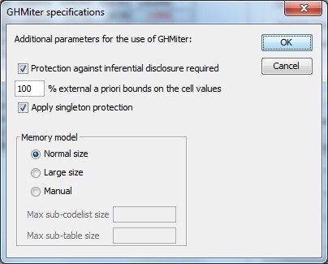

**Supplementary figure OCR (unverified; use the image for exact numbers, labels, and punctuation):**

```text
Additional parameters for the use of GHMiter:

rotection against inferential disclosure required

100

‘% external a priori bounds on the cell values

Apply singleton protection

Memory model

Normal size

) Large size

) Manual

Max sub-codelit size

Max sub-table size
```

---

<a id="pdf-page-017"></a>

### PDF page 17 / manual page 16

[Original PDF page](https://research.cbs.nl/casc/Software/TauManualV4.1.pdf#page=17) · [Local source PDF](TauManualV4.1.pdf#page=17)

```text
        way, terms “reduction of the sliding protection ratio” and “reduction of the
        protection level” are used synonymously in the report file.
    •   Note that step 11 will make cells eligible for secondary suppression that
        τ-ARGUS considers as ‘protected’ (so called ‘frozen’ cells, for discussion of
        this option see for instance Giessing (2003).
As this is inconsistent with the current view on protected cells in τ-ARGUS this will
lead to the following error message:
```

The cell value and the codes of those suppressed frozen cells are then displayed by τ-ARGUS :This information is also written in the file “frozen.txt” in the temp- directory.

#### Original figures on this page

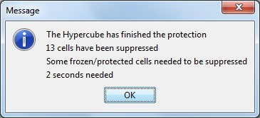

**Supplementary figure OCR (unverified; use the image for exact numbers, labels, and punctuation):**

```text
Message

=]

‘The Hypercube has finished the protection

13 cells have been suppressed

Some frozen/protected cells needed to be suppressed

2 seconds needed
```

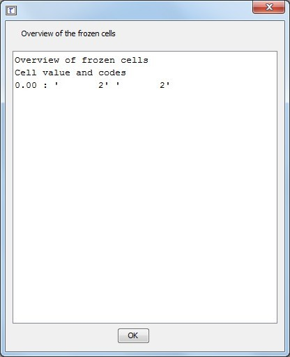

**Supplementary figure OCR (unverified; use the image for exact numbers, labels, and punctuation):**

```text
0 —

Overview of the frozen cells

overview of frozen cells

cell value and codes

0.00

5

a

7

=D
```

---

<a id="pdf-page-018"></a>

### PDF page 18 / manual page 17

[Original PDF page](https://research.cbs.nl/casc/Software/TauManualV4.1.pdf#page=18) · [Local source PDF](TauManualV4.1.pdf#page=18)

When the status of these cells is changed into ‘unprotected’ before re-running the hypercube method, the solution will be a feasible solution for τ-ARGUS. Zero cells are consider to be frozen as well in the hypercube. Those frozen cells can be ignored Negative values The hypercube method has no problems when certain cells are negative.

```text
References on GHMITER
    Repsilber, R. D. (1994), ‘Preservation of Confidentiality in Aggregated data’, paper
    presented at the Second International Seminar on Statistical Confidentiality,
    Luxembourg, 1994
    Repsilber, D. (1999), ‘Das Quaderverfahren’ - in Forum der Bundesstatistik, Band
    31/1999: Methoden zur Sicherung der Statistischen Geheimhaltung, (in German)
    Repsilber, D. (2002), ‘Sicherung persönlicher Angaben in Tabellendaten’ - in
    Statistische Analysen und Studien Nordrhein-Westfalen, Landesamt für
    Datenverarbeitung und Statistik NRW, Ausgabe 1/2002 (in German)
    Giessing, S. and Repsilber, D. (2002), ‘Tools and Strategies to Protect Multiple Tables
    with the GHQUAR Cell Suppression Engine’, in ‘Inference Control in Statistical
    Databases’ Domingo-Ferrer (Editor), Springer Lecture Notes in Computer Science Vol.
    2316.
    Giessing, S. (2003), ‘Co-ordination of Cell Suppressions: strategies for use of
    GHMITER’, Proceedings of the Joint ECE/Eurostat work session on statistical data
    confidentiality (Luxembourg, 7-9 April 2003)
```

<a id="source-2-9"></a>

##### 2.9 Optimisation models for secondary cell suppression                       10

τ-ARGUS applies different approaches to find optimal and near-optimal solutions. One of these approaches is based on a Mathematical Programming technique which consists of solving Integer Linear Programming programs modelling the combinatorial problems under different methodologies (Cell Suppression and Controlled Rounding). The main characteristic of these models is that they share the same structure, thus based only on a 0-1 variable for each cell. In the Cell Suppression methodology, the variable is 1 if and only if the cell value must be suppressed. In the Controlled Rounding methodology, the variable is 1 if and only if the cell value must be rounded up. No other variables are necessary, so the number of variables in the model is exactly the number of cells in the table to be protected. In addition, the model also imposes the protection level requirements (upper, lower and sliding) in the same way for the different methodologies (Cell Suppression and Controlled Rounding). These requirements ask for a guarantee that an attacker will not get too narrow an interval of potential values for a sensitive cell, which he/she will compute by solving two linear programming programs (called attacker problems). Even if a first model containing this two- attacker problem would lead to a bi-level programming model, complex to be solved in practice, a Benders' decomposition approach allows us to convert the attacker problems into a set of linear inequalities. This conversion provides a

10 The optimisation models have been built by a team of researchers headed by Juan-José Salazar-Gonzalez of the University La Laguna, Tenerife, Spain. Other members of the team were: G. Andreatta, M. Fischetti, R. Betancort Villalva, M.D. Montesdeoca Sanchez and M. Schoch

---

<a id="pdf-page-019"></a>

### PDF page 19 / manual page 18

[Original PDF page](https://research.cbs.nl/casc/Software/TauManualV4.1.pdf#page=19) · [Local source PDF](TauManualV4.1.pdf#page=19)

```text
second model for each methodology that can be efficiently solved by a modern
cutting-plane approach. Since the variables are 0-1, a branching phase can be
necessary, and the whole approach is named "branch-and-cut algorithm".
Branch-and-cut algorithms are modern techniques in Operations Research that
provide excellent results when solving larger and complicated combinatorial
problems arising in many applied fields (like routing, scheduling, planning,
telecomunications, etc.). Shortly, the idea is to solve a compact 0-1 model
containing a large number of linear inequalities (as the ones above mentioned for
the Cell Suppression and for the Controlled Rounding) through an iterative
procedure that does not consider all the inequalities at the same time, but generates
the important ones when needed. This dynamic procedure of dealing with large
models allows the program to replace the resolution of a huge large model by a
short sequence of small models, which is termed a "decomposition approach". The
on-line generation of the linear inequalities (rows) was also extended in this work
to the variables (columns), thus the algorithm can also works on tables with a large
number of cells, and the overall algorithm is named "branch-and-cut-and-price" in
the Operations Research literature.
To obtain good performance, the implementation has also considered many other
ingredients, standard in branch-and-cut-and-price approaches. For example, it is
fundamentally the implementation of a pre-processing approach where redundant
equations defining the table are eliminated, where variables associated to non-
relevant cells are removed, and where dominated protection levels are detected.
The pre-processing is fundamental to make the problem as small as possible before
starting the optimization phase. Another fundamental ingredient is the heuristic
routine, which allows the algorithm to start with an upper bound of the optimal loss
of information. This heuristic routine ensures the production of a protected pattern
if the algorithm is interrupted by the user before the end. In other words, thanks to
the heuristic routine, the implemented algorithm provide a near-optimal solution if
the execution is cancelled before having a proof of optimality. During the implicit
enumeration approach (i.e., the branch-and-cut-and-price) the heuristic routine is
called several times, thus providing different protected patterns, and the best one
will be the optimal solution if its loss of information is equal to the lower bound.
This lower bound is computed by solving a relaxed model, which consists of
removing the integrability condition on the integer model. Since the relaxed model
is a linear program, a linear programming solver must be called.
We have not implemented our own linear programming solver, but used a
commercial solver which is already tested by other programmers for many years. A
robust linear programming solver is a guarantee that no numerical trouble will
appear during the computation.
That is the reason to requires either CPLEX (from ILOG) or Xpress (from FICO).
Because the model to be solved can be applied to all type of table structures (2-
dim, 3-dim, 4-dim, etc), including hierarchical and linked tables, we cannot use
special simplex algorithm implementations, like the min-cost flow computation
which would required to work with tables that can be modelled as a network (e.g.,
2-dimensional tables or collections of 2-dim tables linked by one link). On this
special table, ad-hoc approaches (solving network flows or short path problems)
could be implemented to avoid using general linear programming solvers.
In any case, future works will try to replace the commercial solvers by freely
available linear-programming solvers.
```

---

<a id="pdf-page-020"></a>

### PDF page 20 / manual page 19

[Original PDF page](https://research.cbs.nl/casc/Software/TauManualV4.1.pdf#page=20) · [Local source PDF](TauManualV4.1.pdf#page=20)

<a id="source-2-10"></a>

##### 2.10 The Modular approach                   11

```text
The modular (HiTaS) solution is a heuristic approach to cell suppression in
hierarchical tables. Hierarchical tables are specially linked tables: at least one of
the spanning variables exhibits a hierarchical structure, i.e. contains (many) sub-
totals.
In Fischetti and Salazar (1998) a theoretical framework is presented that should be
able to deal with hierarchical and generally linked tables. In what follows, this will
be called the mixed integer approach. In this framework, additional constraints to a
linear programming problem are generated. The number of added constraints
however, grows rapidly when dealing with hierarchical tables, since many
dependencies exist between all possible (sub-)tables containing many (sub-)totals.
The implemented heuristic approach (HiTaS) deals with a large set of (sub)-tables
in a particular order. A non hierarchical table can be considered to be a hierarchical
table with just one level. In that case, the approach reduces to the original mixed
integer approach and hence provides the optimal solution. In case of a hierarchical
table, the approach will provide a sub-optimal solution that minimises the
information loss per sub-table, but not necessarily the global information loss of
the complete set of hierarchically linked tables.
In the following section, a short description of the approach is given. For a more
detailed description of the method, including some examples, see e.g., De Wolf
(2002).
HiTaS deals with cell suppression in hierarchical tables using a top-down
approach. The first step is to determine the primary unsafe cells in the base-table
consisting of all the cells that appear when crossing the hierarchical spanning
variables. This way all cells, whether representing a (sub-)total or not, are checked
for primary suppression. Knowing all primary unsafe cells, the secondary cell
suppressions have to be found in such a way that each (sub-)table of the base-table
is protected and that the different tables cannot be combined to undo the protection
of any of the other (sub-)tables. The basic idea behind the top-down approach is to
start with the highest levels of the variables and calculate the secondary
suppressions for the resulting table. The suppressions in the interior of the
protected table is then transported to the corresponding marginal cells of the tables
that appear when crossing lower levels of the two variables. All marginal cells,
both suppressed and not suppressed, are then ‘fixed’ in the calculation of the
secondary suppressions of that lower level table, i.e., they are not allowed to be
(secondarily) suppressed. This procedure is then repeated until the tables that are
constructed by crossing the lowest levels of the spanning variables are dealt with.
A suppression pattern at a higher level only introduces restrictions on the marginal
cells of lower level tables. Calculating secondary suppressions in the interior while
keeping the marginal cells fixed, is then independent between the tables on that
lower level, i.e., all these (sub)-tables can be dealt with independently of each
other. Moreover, added primary suppressions in the interior of a lower level table
are dealt with at that same level: secondary suppressions can only occur in the
same interior, since the marginal cells are kept fixed.
However, when several empty cells are apparent in a low level table, it might be
the case that no solution can be found if one is restricted to suppress interior cells
only. Unfortunately, backtracking is then needed.
```

11 See section 4.4.4 Secondary cell suppression in hierarchical and linked tables of the SDC-Handbook, Hundepool et all (2012).

---

<a id="pdf-page-021"></a>

### PDF page 21 / manual page 20

[Original PDF page](https://research.cbs.nl/casc/Software/TauManualV4.1.pdf#page=21) · [Local source PDF](TauManualV4.1.pdf#page=21)

```text
Obviously, all possible (sub)tables should be dealt with in a particular order, such
that the marginal cells of the table under consideration have been protected as the
interior of a previously considered table. To that end, certain groups of tables are
formed in a specific way (see De Wolf (2002)). All tables within such a group are
dealt separately, using the mixed integer approach.
The number of tables within a group is determined by the number of parent-
categories the variables have one level up in the hierarchy. A parent-category is
defined as a category that has one or more sub-categories. Note that the total
number of (sub)-tables that have to be considered thus grows rapidly.
Singletons
Singleton cells should be treated with extra care. The single respondent in this cell
could easily undo the protection if no extra measures were taken. The most
dangerous situation is that there are only two singletons in a row, or one and one
other primary unsafe cell. These singletons could easily disclose the other cell.
We have added options for extra singleton protection in the following situations.
1.   If on a row or column of a subtable there are only two singletons and no other
     primary suppressions.
2.   If there is only one singleton and one multiple primary unsafe cell.
3.   If a frequency rule is used, it could happen that two cells on a row/column are
     primary unsafe, but the sum of the two cells could still be unsafe. In that case
     it should be prevented that these two cells protect each other.
Cells within a table sometimes consist of exactly one contributor. Such a cell is
called a singleton. Linear sensitivity rules will usually label this cell as (primary)
unsafe. When cell suppression is used to protect a table with unsafe cells, these
singletons need to be taken care of in a special way.
Within a suppression pattern, contributors in singletons may be able to recalculate
other suppressed cells. Obviously, a contributor could always insert its own
contribution and thereby recalculate its own suppressed cell. This could in turn lead
to the possibility of recalculating other suppressed cells in the same suppression
pattern. Whenever such a recalculated cell is (primary) unsafe, this means
disclosure.
Within the current models used to determine suppression patterns, it is not possible
to take all possible situations into account when singletons are part of a suppression
pattern. However, an important group of instances of disclosure by singletons, is
when a singleton is part of a row with exactly one additional (also primary)
suppression.
4.   If on a row or column of a subtable there are only two singletons and no other
     primary suppressions.
5.   If there is only one singleton and one multiple primary unsafe cell.
6.   If a frequency rule is used, it could happen that two cells on a row/column are
     primary unsafe, but the sum of the two cells could still be unsafe. In that case
     it should be prevented that these two cells protect each other.
Note that the last situation is not really a singleton problem, but this problem is
handeled in the same way.
To prevent this kind of disclosure, it would be sufficient to force an additional
(third) suppression in the same row. In prior versions of τ-ARGUS this was
accomplished by increasing the protection levels of one of the (primary) unsafe
cells in the row. In short, the protection level of one of the primary suppressed cells
```

---

<a id="pdf-page-022"></a>

### PDF page 22 / manual page 21

[Original PDF page](https://research.cbs.nl/casc/Software/TauManualV4.1.pdf#page=22) · [Local source PDF](TauManualV4.1.pdf#page=22)

```text
was raised in such a way that the other primary suppression would not be able to
give sufficient protection. The largest primary unsafe cell in the row got the cell
value of the other unsafe cell in the row, plus a small value, as protection level.
Indeed, this forces a third suppression in the row.
However, since the cell value of one of the suppressed cells was involved, this
meant that the increased protection level of this cell could become quite large,
which would have an effect on the suppression pattern in one of the other
dimensions. In certain situations this led to oversuppression.
To circumvent this problem, the newly implemented approach adds a virtual cell to
the table. That virtual cell is assigned a value equal to the sum of the two primary
suppressed cells in the row, and is given the status `(primary) unsafe'. That virtual
cell then only has to be protected against exact disclosure, i.e., it suffices to impose
a small protection interval.
The table below shows an example table, displaying the singleton problem. In the
first table the values of the cells are given, with in bold, red, italic the (primary)
unsafe cells. The second table shows the names of the cells, where cij stands for the
cell with coordinates (i, j).
```

```text
            Total     X1      X2      X3      X4
Total        227      73      33      93      25
  A          146      52      15      62      17
  B          81       24      18      31       8
```

```text
            Total     X1      X2      X3      X4
Total        c00      c01     c02     c03     c04
  A          c10      c11     c12     c13     c 14
```

```text
      B          c20      c21     c22     c23     c24
Example table to explain Singleton Problem.
Bold and red means (primary) unsafe.
```

Now assume that cell c12 = (A,X2) is a singleton and cell c14 = (A,X4) is unsafe according to a p%-rule with p=10. Hence, cell c14 is the only other (primary) unsafe cell in that row. To protect cell c14 against disclosure by the contributor of singleton c12, a `virtual cell cv is defined with value 32. Moreover, that virtual cell is given a small protection interval, (32,33) say. The relations that define the table structure, including the virtual cell, are given below:

---

<a id="pdf-page-023"></a>

### PDF page 23 / manual page 22

[Original PDF page](https://research.cbs.nl/casc/Software/TauManualV4.1.pdf#page=23) · [Local source PDF](TauManualV4.1.pdf#page=23)

___________________________ c00 = c01 + c02 + c03 + c04 c10 = c11 + c12 + c13 + c04 c20 = c21 + c22 + c23 + c24 c00 = c10 + c20 c01 = c11 + c21 c02 = c12 + c22 c03 = c13 + c23 c04 = c14 + c24 cv = c12 + c14 _____________________________ Table showing the relations defining table structure of table above Within τ-ARGUS, this procedure is implemented in both the optimal approach as well as in the modular approach. For the modular approach, this procedure is applied to each subtable separately, whenever a subtable is dealt with within the modular approach. This special attention to singletons is only given when the other suppressed cell in the same row is a `true' primary suppression. This is natural, since it has to be done prior to the search for secondary suppressions. In the modular approach, a hierarchical table is divided into many, non-hierarchical, subtables. Secondary suppressions in one table sometimes temporarily become primary suppressions in other tables during the process. I.e., those suppression are not `true' primary suppressions. It is therefore also natural not to construct virtual cells in case a singleton is in the same row with exactly one other primary suppression that was originally a secondary suppression. This is indeed the way it is implemented in the modular approach. In previous versions of τ-ARGUS a similar procedure was available. But then the additional protection was achieved by increasing the protection level of the singleton cell. This would lead however also in additional protection in other dimensions and would create over-protection Negative values The implementation by Fischetti and Salazar does not allow for negative values. However it is not uncommon, that some cells in a table have negative values. Therefore additional measures have been taken. If in a subtable during the process negative values are found, all cell values are increased such that the lowest value becomes positive. Of course the margins have to be recalculated, but a safe protection pattern will be found. References on the modular method Fischetti, M. and J.J. Salazar-González (1998). Models and Algorithms for Optimizing Cell Suppression in Tabular Data with Linear Constraints. Technical Paper, University of La Laguna, Tenerife. P.P. de Wolf (2002). HiTaS: a heuristic approach to cell suppression in hierarchical tables. Proceedings of the AMRADS meeting in Luxembourg (2002). Additional reading on the optimisation models can be found at the CASC-website (http://neon.vb.cbs.nl/casc/Related/99wol-heu-r.pdf)

---

<a id="pdf-page-024"></a>

### PDF page 24 / manual page 23

[Original PDF page](https://research.cbs.nl/casc/Software/TauManualV4.1.pdf#page=24) · [Local source PDF](TauManualV4.1.pdf#page=24)

<a id="source-2-11"></a>

##### 2.11 The modular approach for linked tables

```text
When tables are linked through simple linear constraints, cell suppressions must
obviously be coordinated between tables. The most typical case is when tables
share common cells (usually marginals), i.e., when they are linked through
constraints saying literally that cell X of table A is identical to cell Y of table B.
Suppose a set of N tables, {T1,…,TN}, need to be protected. These tables are
assumed to be linked. Each table has a hierarchical structure that may differ from
the hierarchical structures of the other tables. However, it is assumed that tables
using the same spanning variables have hierarchies that can be covered. Loosely
speaking this means that a single hierarchy can be constructed such that all
hierarchies of the same variable in the N tables are a sub hierarchy of the cover
hierarchy. See De Wolf and Giessing (2009) for more details. In the context of pre-
planned table production processes which are typically in place in statistical
agencies for the production of certain sets of pre-specified standard tabulations, it
is normally no problem to satisfy these conditions. Literally speaking, the
assumption is that tables in a set of linked tables may present the data in a
breakdown by the same spanning variable at various amounts of detail. But only
under the condition that, if in one of the tables some categories of a spanning
variable are grouped into a certain intermediate sum category, during SDC
processing this intermediate sum category is considered in any other table
presenting the data in a breakdown of the same spanning variable and at that much
detail.
The idea is then as follows. Suppose that the N tables {T1,…,TN} that need to be
protected simultaneously, contain M different spanning variables. Since the
hierarchies are supposed to be coverable, an M-dimensional table exists having all
the specified tables as subtables. The spanning variables will be numbered 1 up to
M.
Each spanning variable can have several hierarchies in the specified tables. Denote
                                               i         i
those hierarchies for spanning variable i by H 1 ,..., H I i where Ii is the number of
different hierarchies of variable i.
Define the M-dimensional table by the table with spanning variables according to
hierarchies G1,…,GM such that, for each i = 1,..., M hierarchy Gi covers the set of
                i
hierarchies { H j } with j = 1,…, Ii. This M-dimensional table will be called the
cover table. See De Wolf and Giessing (2009) for more details.
Then use the Modular approach (see section 2.10) on the cover table TC, but only
consider those subtables that are also subtables of at least one of the specified
tables T1,…,TN and disregard the other subtables.
I.e., the procedure of the Modular approach is followed, but during that process any
simple subtable that is not a subtable of any of the tables in the set { T1,…,TN} is
skipped. I.e., the order the simple subtables will be protected, is the same as in the
‘complete’ Modular approach, only some subtables will be skipped.
See De Wolf and Hundepool (2010) for a practical application of the Adjusted
Modular Approach.
```

---

<a id="pdf-page-025"></a>

### PDF page 25 / manual page 24

[Original PDF page](https://research.cbs.nl/casc/Software/TauManualV4.1.pdf#page=25) · [Local source PDF](TauManualV4.1.pdf#page=25)

References on the modular approach for linked tables De Wolf, P.P. and S. Giessing (2009), Adjusting the τ-ARGUS modular approach to deal with linked tables, Data & Knowledge Engineering, Volume 68, Issue 11, pp. 1160- 1174. De Wolf, P.P. and A. Hundepool (2010), Three ways to deal with a set of linked SBS tables using τ-ARGUS, Privacy in Statistical Databases, J. Domingo-Ferrer and E. Magkos (Eds.), Springer 2010, LNCS 6344 pp. 66-74.

<a id="source-2-12"></a>

##### 2.12 Network solution for large 2 dimensional tables with one hierarchy

```text
τ-ARGUS also contains a solution for the secondary cell suppression based on
network flows. This contribution is by Jordi Casto of the Universitat Politècnica de
Catalunya in Barcelona. The network flows solution for cell suppression
implements a fast heuristic for the protection of statistical data in two-dimensional
tables with one hierarchical dimension (1H2D tables). This new heuristic sensibly
combines and improves ideas of previous approaches for the secondary cell
suppression problem in two-dimensional general, see Castro(1994) and positive
tables, see Kelly(1992) and Castro(2003) tables. Details about the heuristic can be
found in Castro(1996) and Cox(1995). Unfortunately this approach is only possible
for two-dimensional tables with only one hierarchy, due to the limitations of the
network flows.
The heuristic is based on the solution of a sequence of shortest-path subproblems
that guarantee a feasible pattern of suppressions (i.e., one that satisfies the
protection levels of sensitive cells). Hopefully, this feasible pattern will be close to
the optimal one.
The current package is linked with three solvers: CPLEX7.5/8.0 see ILOG(2000)
PPRN see Castro(1996), and an efficient implementation of the bidirectional
Dijkstra’s algorithm for shortest-paths (that will be denoted as ”Dijkstra”) see
Ahuja(1993). Later releases of CPLEX will also work if the interface routines are the
same than for version 8.0. The heuristic can use any of the three solvers for the
solution of the shortest path subproblems, although Dijkstra is recommended (and
the default one) for efficiency reasons. CPLEX is needed if a lower bound of the
optimal solution want to be computed. The auditing phase can be performed with
either CPLEX or PPRN.
PPRN and Dijkstra were implemented at the Dept. of Statistics and Operations
Research of the Universitat Politècnica de Catalunya, and are included in NF CSP.
PPRN was originally developed during 1992–1995, but it had to be significantly
improved within the CASC project to work with NF CSP. Dijkstra was completely
developed in the scope of CASC. The third solver, CPLEX, is a commercial tool, and
requires purchasing a license. However, PPRN is a fairly good replacement—
although not so robust— for the network flows routines of CPLEX. Therefore, in
principle, there is no need for an external commercial solver, unless lower bounds
want to be computed.
Even though two of the three solvers are included in the distribution of NF CSP,
this document only describes the features of the heuristic, and from the user’s point
of view. A detailed description of PPRN and Dijkstra’s solvers can be found in
Castro(1996) and Ahuja(1993), respectively.
The current implementation in τ-ARGUS however only uses the Dijkstra and the
PPRN solvers. We have restricted ourselves from commercial solvers here as the
network flows give already a very fast solution.
```

---

<a id="pdf-page-026"></a>

### PDF page 26 / manual page 25

[Original PDF page](https://research.cbs.nl/casc/Software/TauManualV4.1.pdf#page=26) · [Local source PDF](TauManualV4.1.pdf#page=26)

```text
References on the network solution
Ahuja, R.K, Magnanti, T.L., Orlin, J.B., Network Flows, Prentice Hall (1993).
Castro, J., PPRN 1.0, User’s Guide, Technical report DR 94/06 Dept. of Statistics and Op-
       erations Research, Universitat Politècnica de Catalunya, Barcelona, Spain, 1994.
Castro, J., Network flows heuristics for complementary cell suppression: an empirical
       evaluation and extensions, in LNCS 2316, Inference Control in Statistical
       Databases, J. Domingo-Ferrer (Ed), (2002) 59–73.
Castro, J., Nabona, N. An implementation of linear and nonlinear multicommodity network
       flows. European Journal of Operational Research 92, (1996) 37–53.
Cox, L.H., Network models for complementary cell suppression. J. Am. Stat. Assoc. 90,
      (1995) 1453–1462.
ILOG CPLEX, ILOG CPLEX 7.5 Reference Manual Library, ILOG, (2000).
Kelly, J.P., Golden, B.L, Assad, A.A., Cell Suppression: disclosure protection for sensitive
       tabular data, Networks 22, (1992) 28–55.
Castro, J. User’s and programmer’s manual of the network flows heuristics package for cell
       suppression in 2D tables Technical Report DR 2003-07, Dept. of Statistics and
       Operations Research, Universitat Politècnica de Catalunya, Barcelona, Spain,2003;
See http://neon.vb.cbs.nl/casc/deliv/41D6_NF1H2D-Tau-ARGUS.pdf
```

<a id="source-2-13"></a>

##### 2.13 Controlled Tabular Adjustment12

The purpose of controlled tabular adjustment (also known as minimum-distance controlled tabular adjustment or simply CTA) is to find the closest safe table to the original one. Since CTA is a perturbative method, this goal is achieved by publishing a table where the values of sensitive cells have been modified according to some predefined protection levels, and the remaining non-sensitive cells are minimally changed to guarantee the table additivity. The example illustrates CTA on a small two-dimensional table with one sensitive cell in boldface, with lower and upper protection levels equal to five (table (a) of the example). Depending on the 'protection direction' of the sensitive cell, either 'lower' or 'upper', which has to be decided, the value to be published for this cell will be respectively less or equal than the original cell value minus the lower protection level, or greater or equal than the original cell value plus the upper protection level. In the example, if the protection direction is 'lower', then the value published or the sensitive cell should be less or equal than 35; the optimal adjusted table for this case is shown in table (b) of the example. If the protection direction is 'upper', then the value must be greater or equal than 45, as shown in table (c) of the example. In a larger and more complex table, with many sensitive cells, the obtention of the protection directions that provide the minimal changes to non- sensitives cells is not as easy as in the example. CTA has thus to be formulated and solved as an optimization problem, in particular as a mixed integer linear problem (MILP). Example of a CTA solution: The cell (M2P3) is a sensitive cell with lower and upper protection level 5. Protected tables with 'lower protection direction' and 'upper protection direction' (i.e., value of sensitive is respectively reduced and increased by five units) 12 See section 4.5.2 A post-tabular method: Controlled tabular adjustment of the Handbook

---

<a id="pdf-page-027"></a>

### PDF page 27 / manual page 26

[Original PDF page](https://research.cbs.nl/casc/Software/TauManualV4.1.pdf#page=27) · [Local source PDF](TauManualV4.1.pdf#page=27)

```text
           P1        P2        P3
M1         20        24        28    72
M2         38        38        40   116
M3         40        39        42   121
           98     101      110      309
                Original table (a)
```

```text
        P1      P2         P3                                P1       P2   P3
M1         15    24        33        72              I       25       24    23    72
M2         43    38        35    116                         33       38    45   116
M3         40    39        42    121                         40       39    42   121
           98   101    110       309                         98   101      110   309
```

```text
       Adjusted table                                       Adjusted table
Lower protection direction (b)                       Upper protection direction (c)
```

```text
CTA was introduced in the manuscript Dandekar and Cox(2002) and,
independently and in an extended form, in Castro(2006) (in the latter it was named
minimum-distance controlled perturbation method). CTA has shown to have both a
small disclosure risk see Castro(2012) and small information loss see Castro and
González(2014).
The parameters that define any CTA instance are:
    •   A general table ai, i =1,...,n, with m linear relations Aa=b.
    •   Upper and lower bounds u and l for the cell values, assumed to be known
        by any attacker: l ≤ a ≤u
    •   Vector of nonnegative weights associated to the cell perturbations wi,
        i=1,...,n.
    •   Set    P⊆1,... , n of sensitive cells.
    •   Lower and upper protection levels for each primary cell lplp and uplp
             p∈P
CTA finds the safe table x closest to a, using some distance          l (w)
```

#### Original figures on this page

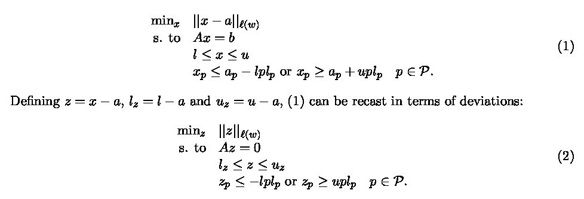

---

<a id="pdf-page-028"></a>

### PDF page 28 / manual page 27

[Original PDF page](https://research.cbs.nl/casc/Software/TauManualV4.1.pdf#page=28) · [Local source PDF](TauManualV4.1.pdf#page=28)

```text
Problem (3) has |P| binary variables, 2n continuous variables and m + 4|P|
constraints. The size of (3) is much less than that of the cell suppression problem.
For instance, for a table of 8000 cells, 800 primaries, and 4000 linear relations,
CTA formulates a MILP of 800 binary variables, 16000 continuous variables and
7200 constraints (these figures would be 8000, 12,800,000 and 32,000,000 for cell
suppression).
The benefits of CTA are not limited to a smaller size of the resulting MILP
problem. CTA can be easily extended with constraints to meet some data quality
criteria see Cox et al (2005). It has also been experimentally observed that the
information loss of CTA solutions is comparable (in some instances even better) to
that of cell suppression see Castro and Giessing(2006).
References on the controlled tabular adjustment solution
L.H. Cox, J.P. Kelly and R. Patil (2005), Computational aspects of controlled tabular
      adjustment: algorithm and analysis. B. Golden, S. Raghavan, E. Wassil, eds. The
      Next wave in Computer, Optimization and Decision Technologies, Kluwer, Boston,
      MA, 45–59.
J. Castro, Minimum-distance controlled perturbation methods for large-scale tabular data
       protection, European Journal of Operational Research, 171 (2006) 39–52.
J. Castro (2012), On assessing the disclosure risk of controlled adjustment methods for
       statistical tabular data, International Journal of Uncertainty, Fuzziness and
       Knowledge-Based Systems, 20 921–941.
J. Castro and S. Giessing (2006), Testing variants of minimum distance controlled tabular
       adjustment, in Monographs of Official Statistics. Work session on Statistical Data
       Confidentiality, Eurostat-Office for Official Publications of the European
       Communities, Luxembourg, 2006, 333–343. ISBN 92-79-01108-1.
J. Castro and J.A. González (2014), Assessing the information loss of controlled tabular
       adjustment in two-way tables, Lecture Notes in Computer Science, 8744, 11–23.
R.A. Dandekar and L.H. Cox (2002), Synthetic tabular data: An alternative to
     complementary cell suppression, manuscript, Energy Information Administration,
     US Department of. Energy.
```

#### Original figures on this page

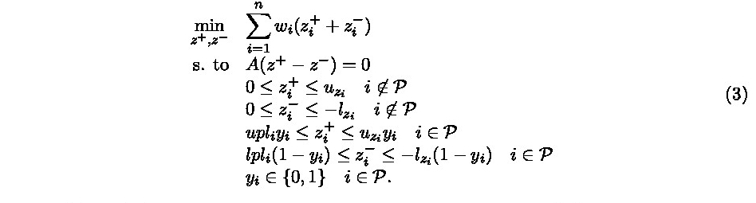

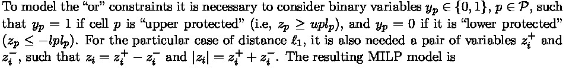

---

<a id="pdf-page-029"></a>

### PDF page 29 / manual page 28

[Original PDF page](https://research.cbs.nl/casc/Software/TauManualV4.1.pdf#page=29) · [Local source PDF](TauManualV4.1.pdf#page=29)

<a id="source-2-14"></a>

##### 2.14 Controlled rounding              13

```text
Controlled rounding is a rounding procedure that, differently from other rounding
methods, yields additive rounded tables. That is to say that the rounded values add
up to the rounded totals and sub-totals shown in the table. This property not only
permits the release of realistic tables but also makes it impossible to reduce the
protection by “unpicking” the original values by exploiting the differences in the
sums of the rounded values. The Controlled Rounding Procedure (CRP)
implemented in τ-ARGUS also allows the specification hierarchical tables.
Controlled rounding is a SDC method that is most effective for frequency tables. In
fact, this method gives adequate protection to small frequencies by creating
uncertainty also with respect to zero values (i.e. empty cells). The same cannot be
said for suppression in the way it is implemented now in τ-ARGUS.
```

```text
Restricted and non-restricted controlled rounding
In Zero-restricted Controlled Rounding the rounded values are chosen leaving
unaltered the original values that are already multiples of the rounding base, while
rounding the others to one of the adjacent multiples of this base. The modified
values are chosen so that the sum of the absolute differences between the original
values and the rounded ones is minimized under the additivity constraint.
Therefore, some values will be rounded up or down to the most distant multiple of
the base in order to satisfy the constraints. In most cases such a solution can be
found but in some cases it cannot. The zero-restriction constraint in CRP can be
relaxed allowing the values to be rounded to a nonadjacent multiple of the base.
This relaxation is controlled by allowing a maximum number of steps. For
example, consider rounding the value 7 when the base equals 5. In zero-restricted
rounding, the solution can be either 5 or 10. If 1 step is allowed, the solution can be
0, 5, 10 or 15. In general, let z be the integer to be rounded in base b, then this
number can be written as
        z=ub+r ,
where ub is the lower adjacent multiple of b (hence u is the floor value of z/b) and
r is the remainder. In the zero-restricted solution the rounded value, a, can take
values:
```

```text
        {{
         a=ub if r=0 ;
         a= ub       if r≠0.
            (u+1) b
If K steps are allowed, then a, can take values:
```

```text
{a=max {0, (u+ j )}b , j =−K ,… , K ,if r=0;
 a=max {o ,(u+ j )}b , j=−K ,… ,( K +1) ,if r≠0.
```

```text
Optimal, first feasible and RAPID solutions                    14
```

For a given table there could exist more than one controlled rounded solutions; any of these solutions is a feasible solution. The Controlled Rounding Program

13 See section 5.4.3 Rounding of the Handbook. 14 For further details see Salazar, Staggermeier and Bycroft (2005 Controlled rounding implementation, UN- ECE Worksession on SDC, Geneva)

---

<a id="pdf-page-030"></a>

### PDF page 30 / manual page 29

[Original PDF page](https://research.cbs.nl/casc/Software/TauManualV4.1.pdf#page=30) · [Local source PDF](TauManualV4.1.pdf#page=30)

embedded in τ-ARGUS determines the optimal solution by minimising the sum of the absolute distances of the rounded values from the original ones. Denoting the cell values, including the totals and sub-totals, with zi and the corresponding rounded values with ai, the function that is minimised is N

```text
∑ ∣zi −ai∣,
i=1
```

where N is the number of cells in a table (including the marginal ones). The optimisation procedure for controlled rounding is a rather complex one (NP- complete program), so finding the optimal solution may take a long time for large tables. In fact, the algorithm iteratively builds different rounded tables until it finds the optimal solution. In order to limit the time required to obtain a solution, the algorithm can be stopped when the first feasible solution is found. In many cases, this solution is quite close to the optimal one and it can be found in significantly less time. The RAPID solution is produced by CRP as an approximated solution when not even a feasible one can be found. This solution is obtained by rounding the internal cells to the closest multiple of the base and then computing the marginal cells by addition. This means that the computed marginal values can be many jumps away from the original value. However, a RAPID solution is produced at each iteration of the search for an optimal one and it will improve (in terms of the loss function) over time. τ-ARGUS allows to stop CRP after the first RAPID is produced, but this solution is likely to be very far away from the optimal one.

Protection provided by controlled rounding The protection provided by controlled rounding can be assessed by considering the uncertainty about the disclosive true values achieved releasing rounded values; that is the existence interval that an intruder can compute for the rounded value. We assume that also the values of the rounding base, b, and the number of steps allowed, K, are released together with the rounded table. Furthermore, we assume that it is known that the original values are frequencies (hence nonnegative integers).

```text
Zero-restricted rounding
Given a rounded value, a, an intruder can compute the following existence
intervals for the true value, z:
       z∈[0, b−1] if a=0
       z∈[a−b+1, a+b−1]if a≠0.
For example, if the rounding base is b=5 and the rounded value is a=0, a user can
determine that the original value is between 0 and 4. If the rounded value is not 0,
then users can determine that the true value is between plus or minus 4 units from
the published value.
```

K-step rounding As mentioned before, it is assumed that the number of steps allowed is released together with the rounded table. Let K be the number of steps allowed, then an intruder can compute the following existence intervals for the true value z:

---

<a id="pdf-page-031"></a>

### PDF page 31 / manual page 30

[Original PDF page](https://research.cbs.nl/casc/Software/TauManualV4.1.pdf#page=31) · [Local source PDF](TauManualV4.1.pdf#page=31)

```text
       z∈[0, (K +1)b−1]if a<( K +1) b
       z∈[ a−( K +1) b+1, a+( K +1) b−1] if a≥(K +1)b.
For example, assume that for controlled rounding with b=5 and K=1, a=15, then a
user can determine that z ∈[6, 24].
```

Choosing the parameters for Controlled Rounding The parameters that can be chosen for rounding are the rounding base, b, and the number of steps allowed. If their value is released, users (including potential intruders) will be able to compute existence intervals for the true values according to the formulae given above. Then, the choice of the parameters’ values depends on the protection required for the disclosive values. Of course, the larger the existence interval the greater the protection but also the damage caused to the data. The choice of the rounding base, then, should be made by the data protector considering the protection requirements and the damage caused to the data. A discussion on how existence intervals can be related to protection requirements can be found, for example, in Willenborg and de Waal (2001). Below we give some general considerations on the effect of different choices of the rounding base. Frequencies are disclosive if their values are not larger than a chosen threshold, say f. In τ-ARGUS the minimal rounding base is b=f. When this value is chosen, disclosive values can be rounded either to 0 or to b. Hence, an intruder would know that all published zeros are disclosive values, while he or she could not determine if a published value equal to b is a disclosive value or a larger, safe, one. In some cases this protection can be considered insufficient because it is required that the existence interval for values rounded to zero contains at least one safe value. Then the value of b must be chosen to be greater than f or the number of steps allowed must be greater than zero. It must be stressed, however, that the larger the base and the greater the damage inflicted to the data (including safe values). In some cases, data protector may be happy with a base that is less than the minimum frequency threshold. For example, it could be decided that the width of the existence interval must be not less than the minimum frequency. In this case, the base should be chosen to be the minimal integer not smaller than f 2 . Using a smaller base than the minimum safe frequency can be achieved in τ-ARGUS by lowering the threshold before computing the table. This “trick” is allowed in rounding because the procedure does not change if the disclosive cells are changed (unlike secondary suppression).

<a id="source-2-15"></a>

##### 2.15 Audit

When a table is protected by cell suppression, by making use of the linear relation between published and suppressed cell values in a table (including its margins), it is always possible for any particular suppressed cell of a table to derive upper and lower bounds for its true value. This holds for either tables with non-negative values, and those tables containing negative values as well, when it is assumed that instead of zero, some other (possibly tight) lower bound for any cell is available to data users in advance of publication. The interval given by these bounds is called the ‘feasibility interval’. The example below illustrates the computation of the feasibility interval in the case of a simple two-dimensional table where all cells may only assume non-negative values:

---

<a id="pdf-page-032"></a>

### PDF page 32 / manual page 31

[Original PDF page](https://research.cbs.nl/casc/Software/TauManualV4.1.pdf#page=32) · [Local source PDF](TauManualV4.1.pdf#page=32)

```text
Example                1             2        Total
      1               X11         X12             7
      2               X21         X22             3
      3                3             3            6
    Total              9             7           16
```

For this table the following linear relations hold:

```text
  X 11+ X 12=7 ( R1)
  X 21+ X 22=3( R2)
  X 11+ X 21=6(C1)
  X 12 +X 22=4(C2)
  with X ij ≥0 for all (i , j )
Using linear programming methodology, it is possible to derive systematically for
                                                         max
any suppressed cell in a table a upper bound ( X ) and a lower bound
      min
  ( X 11 ) for the set of feasible values. In the example above, for cell (1,1) these
                 min                    max
bounds are ( X 11 )      = 3 and    ( X 11 ) = 6 .
A general mathematical statement for the linear programming problem to compute
upper and lower bounds for the suppressed entries of a table is given in Fischetti
and Salazar (2000)15.
Note that in the current implementation the τ-ARGUS audit routine computes upper
and lower bounds (i.e. the feasibility intervals) for the suppressed entries of a
hierarchical table considering the full set of table relations – even, if the table is a
hierarchical table. After obtaining these feasibility intervals, they are compared to
the protection intervals (c.f. subsection on protection levels in section 4.3.2.
Protection level of the SDC-Handbook, Hundepool et al(2012)) and the result of
this comparison will be reported to the user. When a table has been protected
properly, the feasibility interval of each primary sensitive cell should cover the
protection interval. These intervals will be shown by τ- ARGUS.
Auditing a hierarchical table
It should be noted that secondary cell suppression algorithms like Modular and
Hypercube relying on a backtracking procedure (c.f. the subsection on linked and
hierarchical tables in section 4.4.4. Secondary cell suppression in hierarchical and
linked tables of the SDC-Handbook, Hundepool et all(2012)) assign secondary
suppressions considering only a part of the table relations at a time, e.g. those
referring to the ‘current’ subtable. These methods are able to protect each subtable
properly in the sense that the feasibility intervals of the sensitive cells indeed cover
the protection intervals. But this holds only, if the feasibility intervals are
computed considering only the table relations of the particular subtable. But for a
hierarchical table, feasibility intervals computed on basis of the set of relations for
the full table normally tend to be closer than those computed on basis of separate
sets of relations corresponding to individual sub-tables. Hence, in a hierarchical
```

```text
15
     Fischetti, M, Salazar Gonzales, J.J. (2000), Models and Algorithms for Optimizing Cell Suppression
     Problem in Tabular Data with Linear Constraints, in Journal of the American Statistical Association, Vol.
     95, pp 916
```

---

<a id="pdf-page-033"></a>

### PDF page 33 / manual page 32

[Original PDF page](https://research.cbs.nl/casc/Software/TauManualV4.1.pdf#page=33) · [Local source PDF](TauManualV4.1.pdf#page=33)

table, it is not unlikely that the Audit routine discovers that some cells were not protected properly. Discovering singleton problems Making use of the additional knowledge of a respondent, who is the single respondent to a cell (a so called ‘singleton’), it is possible to derive intervals that are much closer than without this knowledge. The audit routine could be used to identify problems in this respect in the following way: in advance of running the audit routine, set the status of a particular singleton cell from “unsafe” to “safe”.

---

<a id="pdf-page-034"></a>

### PDF page 34 / manual page 33

[Original PDF page](https://research.cbs.nl/casc/Software/TauManualV4.1.pdf#page=34) · [Local source PDF](TauManualV4.1.pdf#page=34)

<a id="source-2-16"></a>

##### 2.16 Functional design of τ-ARGUS

#### Original figures on this page

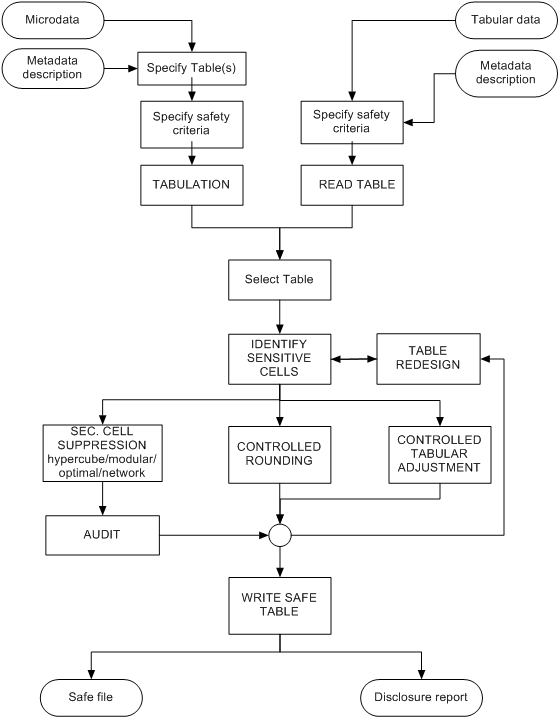

**Supplementary figure OCR (unverified; use the image for exact numbers, labels, and punctuation):**

```text
(ess, MH Specty Tablets)

v

¥

Specity safety

Specify safety

a)

criteria

criteria

,

v

t

TABULATION

READ TABLE

¥

Select Table

|

IDENTIFY

TABLE

SENSITIVE

<—>

REDESIGN

‘CELLS

¥

i

EC. CELL

SUPPRESSION

CONTROLLED

CONTROLLED

hypercube/modular!

ROUNDING

TABULAR

ADJUSTMENT

optimalinetwork

J

AUDIT

¥

WRITE SAFE

TABLE
```

---

<a id="pdf-page-035"></a>

### PDF page 35 / manual page 34

[Original PDF page](https://research.cbs.nl/casc/Software/TauManualV4.1.pdf#page=35) · [Local source PDF](TauManualV4.1.pdf#page=35)

<a id="source-3"></a>

#### 3 A TOUR OF τ-ARGUS

In this chapter, we explain and display the key features of τ- ARGUS. τ-ARGUS is a menu driven program, and here we describe a number of menu steps the user will follow in order to prepare a table for output in a ‘safe’ form. The aim of the tour is to guide the user through the basic features of the program without describing every feature in detail. The only pre-requisite knowledge is basic experience of the Windows environment. In Chapter 4 (Reference) a more systematic description of the different parts of τ-ARGUS will be given. Chapter 3 can be read as a standalone chapter as there is enough detail to enable the user to run the program. However, not every option is covered and the user is pointed in the direction of the Reference chapter in a number of instances. In addition, back references to the theory explained in Chapter 2 are also indicated. In this tour we will use the data in the file tau_testW.asc, which comes with the installation of τ- ARGUS. This file will be installed in a subdirectory of the installation called DATA. In most situations the user will not have write permission in that directory. So saving any information must be done in a folder,where the user has write permission. In this tour we will start with the fixed format data file tau_testW.asc, build a table from that file and go through the process of disclosure control and finish with saving a protected safe table. The key windows for preparation of the data and the processes of disclosure control (depicted graphically in the figure in section 2.16) are explored in this tour, which are given below.

<a id="source-3-1"></a>

##### 3.1 Preparation

```text
•   First steps. Before using τ-ARGUS for the first time, some options should be
    set to make τ-ARGUS better usable in your environment. E.g. you can select
    the solver you want to use in secondary cell suppression. See section 3.1.1
•   Open Microdata. This involves selecting both the microdata and the
    associated metadata. See section 3.1.2
•   Specify Metafile. This shows how the metafile can be entered when there in
    no metafile available, or can be edited after being read in but before any
    tables are being specified. This includes options such as declaring variables
    to be explanatory or response, and setting up the hierarchical structure of
    the data and the location of the variables in the file. See section 3.1.3
•   Specify Tables. Declare the tables for which protection is required, along
    with the safety rule and minimum frequency rule on which the primary
    suppressions will be based. When this has been finished the tables will be
    computed or read in. See section 3.1.4
•   Process of Disclosure Control. The main window of τ-ARGUS will show the
    table that we have computed or read in and when all the safety rules for
    primary suppressions have been applied.
•   You can inspect the table; get information about the number of unsafe cells
    etc. It contains options to modify the table using global recoding. There are
    several options to make the table safe via secondary cell suppression and
```

---

<a id="pdf-page-036"></a>

### PDF page 36 / manual page 35

[Original PDF page](https://research.cbs.nl/casc/Software/TauManualV4.1.pdf#page=36) · [Local source PDF](TauManualV4.1.pdf#page=36)

```text
    rounding. Also an audit procedure is available to check quality of any
    secondary suppression pattern. See section 3.2
•   Save Table. The user can save the ‘safe’ table in a number of formats as
    will be seen in section 3.3.
```

<a id="source-3-1-1"></a>

###### 3.1.1 First steps

Via (Help|Options) you can open the options window. Before starting the process of protecting a table, you can customise τ- ARGUS. Some methods for secondary suppression (the modular and the optimal), but also the audit procedure require an external linear programming solver. For the complex problems of τ-ARGUS we have concluded that the use of high quality commercial solvers can be efficient. However also a free solver can be chosen as a good alternative. Although τ-ARGUS is freeware software these solvers are commercial packages and you have to acquire a licence for them separately. More information can be found on the CASC-website (http://neon.vb.cbs.nl/casc/) The choice of this solver must be made before protecting a table. The choices are either Xpress or CPLEX or Free solver, the different LP_solver supported by τ- ARGUS. See also section 2.9 for more details.

For CPLEX the name of the licence file must specified. Once this window has been opened details of the solver can be entered. Also the maximum time the solver is allowed to spend on each sub-table in Modular can be specified. However always a feasible solution is sought. And the name of the logbook, by default TAULOGBOOK.TXT in the temp-directory can be chosen.

<a id="source-3-1-2"></a>

###### 3.1.2 Open a microdata file

In this tour we only deal with how to open a fixed format microdata file (see sections 3.1.2 to 3.1.4). If an already constructed table is to be used, then go to the Reference chapter (section 4.3.2). To start disclosure control with τ-ARGUS there are two possible options:

#### Original figures on this page

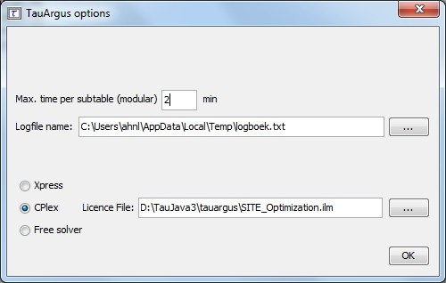

**Supplementary figure OCR (unverified; use the image for exact numbers, labels, and punctuation):**

```text
TauArgus options

Maxz time per subtable (moduiar) |2]

rin

Logfile name:

CC:\sersahnl\AppDataLocal|Temp Vogboek. txt

Xpress

© Cex

Licence File: [D:\TauJava3\tauargus\SITE_Optimzation.im

) Free solver
```

---

<a id="pdf-page-037"></a>

### PDF page 37 / manual page 36

[Original PDF page](https://research.cbs.nl/casc/Software/TauManualV4.1.pdf#page=37) · [Local source PDF](TauManualV4.1.pdf#page=37)

1. Open a microdata file from which a table can be constructed, 2. Open an already completed table, 3. Open a SPSS systemfile containing the microdata Opening an already completed table is not part of this tour. See section 4.3.2, neither is the SPSS-option. Both a microdata file and the metadata file describing this microdata file are required. The microdata file must be either a fixed format ASCII file or a free format file with a specified separator. By clicking (File|Open Microdata) you can specify both the name of the microdata file and the name of the file containing the metadata.

Τ-ARGUS, expects the microdata and metadata file to be stored in separate files. The simplest way to use the program is to use the extension .ASC for the (fixed format) datafile and .RDA (Record Description for Argus) for the metadata file. If the name of the metadata file is the same as the datafile, except for the extension, and it already exists in the same directory, τ- ARGUS will fill in the name of this metadata file automatically in the second textbox. If no metadata file is specified, the program has the facility to specify the metadata interactively via the menu option (Specify|Metafile). This is also the place to make changes to the metadata file. In subsection 3.1.3 we will give a description of the metadata file for τ- ARGUS.

<a id="source-3-1-3"></a>

###### 3.1.3 Specify metafile

When you enter or change the metadata file interactively using τ- ARGUS the option (Specify|Metafile) will bring you to the following screen:

#### Original figures on this page

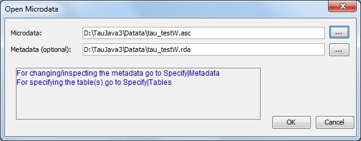

**Supplementary figure OCR (unverified; use the image for exact numbers, labels, and punctuation):**

```text
Open Microdata

Microdata:

[D:\Taulavaa\patataltau_testW.asc

Metadata (optional):

D:\Taulavaa\Patataltau_testW.rda

FFor changing/inspecting the metadata go to SpecifyMetadata

For specifying the table(s) go to Specify/Tables

(ici) (cei)
```

---

<a id="pdf-page-038"></a>

### PDF page 38 / manual page 37

[Original PDF page](https://research.cbs.nl/casc/Software/TauManualV4.1.pdf#page=38) · [Local source PDF](TauManualV4.1.pdf#page=38)

```text
The key elements of this window are the definitions for each variable. Most
variables will be defined as one of the following.
    •   Explanatory Variable: a variable to be used as a categorical (spanning)
        variable when defining a table.
    •   Response Variable: a numerical variable to be used as a cell item in a table.
    •   Weight variable: a variable containing the sampling weighting scheme.
More details on these variables along with the others options can be found in the
Reference chapter (subsection 4.4.1).
Other important features of this window are as follows.
    •   Codelist: τ-ARGUS will always automatically build the codelists for the
        explanatory variables from the datafile. However you can enhance the
        presentation of the information if you can specify a codelist file (a list-of-
        codes of the explanatory variables) as follows.
        ◦Automatic: The codelist is created from the categories in the variable.
        ◦Codelist file: The codes can be read in from an external file. Each
          category can contain a label. The codelist is only used for enhancing
          the presentation but always τ-ARGUS will build a codelist from the
          datafile itself.
    •   Missing values: this gives information on the missing values which are
        attached to a codelist. Two distinct missing value indicators can be set (the
        reason for this is for the purposes of indicating different reasons for
        missing values: for example perhaps non-responses of different forms:
        maybe one code for the response ‘don't know’, and another for ‘refusal’).
        Missing values however are not required.
    •   Hierarchical codes: The hierarchy can be derived from
        ◦the digits of the individual codes in the data file or
        ◦a specified file containing the hierarchical structure. See section 5.2
Examples are shown in the metafile information below.
```

#### Original figures on this page

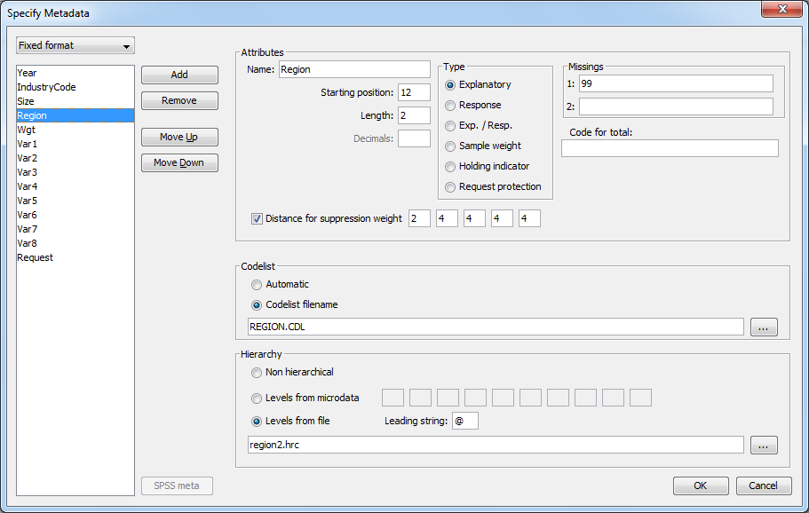

**Supplementary figure OCR (unverified; use the image for exact numbers, labels, and punctuation):**

```text
Sy Mtn rrr

Fixed format

=

“Attributes:

Type

tie) |

Starting position:

@ Explanatory

a: [99

Length:

(© Response

© Exp. /Resp.

Decimals:

Code for total:

© Sample weight

(© Haleing indicator

(© Request protection

Distance for suppression weight |2

la

la

la

la

(© Automatic

© Codelis flename

REGION.COL

‘Hierarchy

© Non hierarchical

© Levels from microdata

@ Levels from fle

.eading string: |@

region2.hre

(ci) (cis)
```

---

<a id="pdf-page-039"></a>

### PDF page 39 / manual page 38

[Original PDF page](https://research.cbs.nl/casc/Software/TauManualV4.1.pdf#page=39) · [Local source PDF](TauManualV4.1.pdf#page=39)

The Metafile The metafile describes the variables in the microdata file, both the record layout and some additional information necessary to perform the SDC-process. Each variable is specified on one main line, followed by one or more option lines. The options ine always start with an option name enclosed in "<" and ">".An example is shown here. The leading spaces shown only serve only to make the file more readable; they have no other meaning.

```text
Year 1 2 " x"
    <RECODEABLE>
    <TOTCODE> "Total"
IndustryCode 4 5 "99999"
    <RECODEABLE>
    <TOTCODE> "Total"
    <DISTANCE> 1 3 5 7 9
    <HIERARCHICAL>
    <HIERLEVELS> 3 1 1
Size 9 2 "99"
    <RECODEABLE>
    <TOTCODE> "Alles"
Region 12 2
    <RECODEABLE>
    <TOTCODE> "Total"
    <DISTANCE> 2 4 4 4 4
    <CODELIST> "REGION.CDL"
    <HIERARCHICAL>
    <HIERCODELIST> "D:\TauJava3\Datata\region2.hrc"
    <HIERLEADSTRING> "@"
Wgt 15 4
    <WEIGHT>
    <DECIMALS> 1
Var1 19 9
    <NUMERIC>
Var2 28 10
    <NUMERIC>
    <DECIMALS> 2
Var3 38 10
    <NUMERIC>
Var4 48 10
    <NUMERIC>
Var5 58 10
    <NUMERIC>
Var6 68 10
    <NUMERIC>
Var7 78 10
    <NUMERIC>
Var8 88 10
    <NUMERIC>
Request 99 1
    <NUMERIC>
```

Details of the variables ‘Year’ : For this variable begins on position 1 of each record , is 2 characters long and missing values are represented by 99. It is also recodeable implicitly stating that it is an explanatory or spanning variable used to create the tables. ‘IndustryCode’: For this variable begins on position 4 of each record and is 5 characters long. Missing values are represented by 99999. As well as being

---

<a id="pdf-page-040"></a>

### PDF page 40 / manual page 39

[Original PDF page](https://research.cbs.nl/casc/Software/TauManualV4.1.pdf#page=40) · [Local source PDF](TauManualV4.1.pdf#page=40)

```text
recodeable this variable is hierarchical and the hierarchy structure is specified. The
first 3 characters are in the top hierarchy level, the 4 th character in the second level
and the 5th character in the lowest level.
‘Size’: For this variable begins on position 9 of each record and is 2 characters
long, and missing values are represented by 99. It is also recodeable.
‘Region’: For this variable begins on position 12 of each record and is 2 characters
long. There is no missing value. There is a codelist file region.cdl and of a
hierarchical codelist file region2.hrc. Examples of these files are shown here.
Note: the codelist file is not essential; the content is only used to enhance some
information on the screen. The hierarchical information however plays an essential
role as it describes the structure of the table and the relation between the cells.
Note: In both files the code for Total is not specified. τ- ARGUS always explicitly
assumes that there will be a total in each dimension of the table. Without totals
there are no additivity constrains and hence there is no problem of Secondary Cell
Suppression.
The file region.cdl:
   1,Groningen
   2,Friesland
   3,Drenthe
   4,Overijssel
   5,Flevoland
   6,Gelderland
   7,Utrecht
   8,Noord-Holland
   9,Zuid-Holland
  10,Zeeland
  11,Noord-Brabant
  12,Limburg
  Nr,North
  Os,East
  Ws,West
  Zd,South
The file region.hrc:
  Nr
  @ 1
  @ 2
  @ 3
  Os
  @ 4
  @ 5
  @ 6
  @ 7
  Ws
  @ 8
  @ 9
  @10
  Zd
  @11
  @12
```

Additional details of these coding files can be found in the sections 5.3 and 5.2.

---

<a id="pdf-page-041"></a>

### PDF page 41 / manual page 40

[Original PDF page](https://research.cbs.nl/casc/Software/TauManualV4.1.pdf#page=41) · [Local source PDF](TauManualV4.1.pdf#page=41)

<a id="source-3-1-4"></a>

###### 3.1.4 Specify tables

When the metadata file is ready, the tables to be protected can be specified. This is achieved via Specify|Tables. A window to specify the tables is presented. In the example here we have a 2 dimensional table (2 explanatory variables; Size x Region) and a response variable (Var2). A safety rule (p%-rule) has been defined.

The key elements of this window are as follows. Explanatory variables On the left is the listbox with the explanatory variables. Click on ‘>>’ moves the selected variables to the next box in which the selected explanatory variables can be seen. From the box on the left hand side, containing explanatory variables, the variables that will be used in the row or the column of the table, in a 2-way table can be selected. Up to six explanatory variables can be selected to create a table, but higher dimensions will restrict the options to process a table. Cell items The ‘cell items’ box contains the variables, which were declared as ‘response variables’ in the metafile. By using the ‘>>’ button they can be moved to the ‘response variable’ box to be used in the defined table. Response variable Any variable in the cell items box can be chosen as the response variable. Also the implicit variable `<freq>` for making a frequency table.

#### Original figures on this page

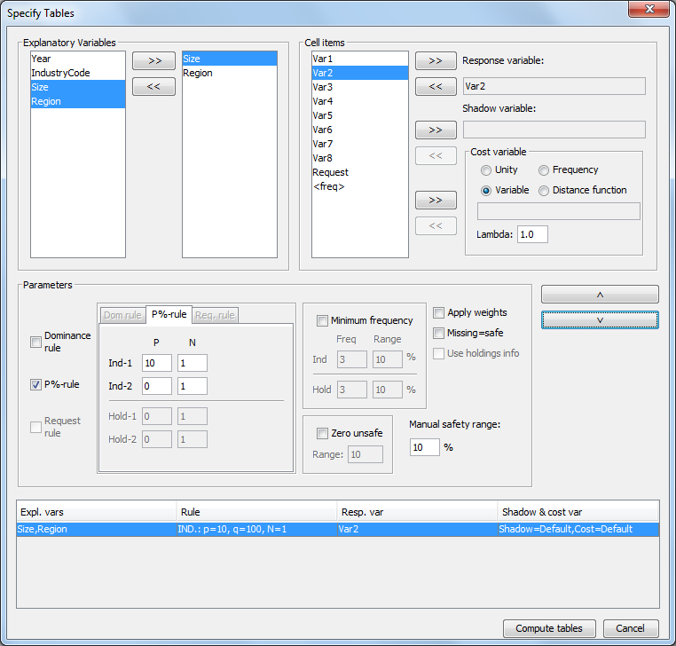

**Supplementary figure OCR (unverified; use the image for exact numbers, labels, and punctuation):**

```text
Specify Tables

Explanatory Variables:

Cellitems:

far

Ss

Response variable:

lar3

(<< me

lara

Shadow variable:

lar

=|

lar?

‘Cost variable

lar

<<

Unity

\<freq>

jariable © Distance function

<<

Lambda: [1.0

-

Parameters:

Domyule| Peru [Reg rule

‘Minimum frequency

Apply weights

Pe

N

Freq

Missing=safe

Ind-a {10

1

ind

10

[Huse holdings info

Prue

Ind-2 [0

1

Hold [3

10

Hold-t [0

A

Request

Manual safety range:

Hold-2 [0

A

Zero unsafe

Range: [10

Expl. vars

Resp. var

‘Shadow & cost var

R

IND.

5

fault,

Jefault

‘Compute tables

‘Cancel
```

---

<a id="pdf-page-042"></a>

### PDF page 42 / manual page 41

[Original PDF page](https://research.cbs.nl/casc/Software/TauManualV4.1.pdf#page=42) · [Local source PDF](TauManualV4.1.pdf#page=42)

Shadow variable The shadow variable is the variable which is used to apply the safety rule. By default this is the response variable. More details on the Shadow variable can be found in section 4.4.4 in the Reference chapter. Cost variable This variable describes the cost of each cell. These are the costs that are minimised when the pattern of secondary suppressed cells are calculated (see section 2.6 in the Theory chapter for the further details). By default this is the response variable but other choices are possible. If the response or any other explicitly specified variable is used for this purpose, the radio button 'variable' should be selected. Then, any variable name can be transferred from the cell items to the cost variable window. However if the name is empty by default the response variable will be chosen. It is also possible to use the frequency of the cells as a cost-function. This will suppress cells minimising the number of contributors to each cell. A third option is that the number of cells to be suppressed is minimised, irrespective of the size of their contributions (unity option – cost variable is set to 1 for each cell). However this tends to the suppression of totals and marginals. Also a distance function is available. More details will be given in the Reference Chapter along with an example (section 4.4.4). Note that choice of the cost variable does not have any impact when using the hypercube method for secondary suppression. Weight If the data file has a sample weight, specified in the metadata file, the table can be computed taking this weight into account. In this case, the 'apply weights' box should be ticked. More details will be given in the Reference Chapter along with an example (section 4.4.4). The safety rule The concept of safety rules is explained in section 2.2 in the chapter on Theory. In this window the left side of the window allows the type of rule to be selected, this is usually either the dominance rule or p% rule, along with the necessary parameter values. Several rules together can be set for any particular table. Additionally, the minimum number of contributors (threshold rule) can be chosen. In the window this is referred to as the ‘Minimum Frequency’ Now for the readability of this chapter, brief summaries are provided of the Dominance and p% rules. Dominance rule This is sometimes referred to as the (n,k) rule. The rule states that if the sum of contributions of the largest n contributors to a cell is more than k%, the cell is considered disclosive. This is the traditional rule; however we recommend to use the p% rule as a better alternative. The p%-rule focusses more on the individual contributors to a cell. p% rule The p% rule says that if the value of a cell x1 can be estimated to an accuracy of better than p% of the true value then it is disclosive where x1 is the largest contributor to a cell. This rule can be written as:

---

<a id="pdf-page-043"></a>

### PDF page 43 / manual page 42

[Original PDF page](https://research.cbs.nl/casc/Software/TauManualV4.1.pdf#page=43) · [Local source PDF](TauManualV4.1.pdf#page=43)

```text
   c
          p
  ∑ x i≥ 100 x 1 for the cell to be non-disclosive where c is the total number of
  ii=3
contributors to the cell and the intruder is a respondent in the cell.
It is important to know that when entering this rule in τ- ARGUS the value of n refers
to the number of intruders in coalition (who wish to group together to estimate the
largest contributor). In general n = 1.
A typical example would be that the sum of all reporting units excluding the largest
two must be at least 10% of the value of the largest. Therefore, in τ- ARGUS set p=10
and n =1 as there is just one intruder in the coalition, respondent x2.
Note: we only consider the situation for the largest contributor, as this is the worst
case. If the largest is safe all contributors are safe.
The choice of safety rule is specified by the user and the chosen parameters can
then be entered. From these parameters symmetric safety ranges are computed
automatically prior to the secondary suppressions.
For the minimum frequency rule, a safety range is calculated from the user given
range. This is usually a small positive value and is required to enable secondary
suppression to be carried out.
A manual safety range is also required for cells that can be made unsafe by
intervention of the user.
Other options such as the ‘Request Rule’ or the ‘Holding Rule’ will be looked at in
more detail in the Reference chapter (section 4.4.4).
When everything has been filled in, click '˅' to transport all the specified
parameters describing the table to the ‘listwindow’ on the bottom. As many tables
as you want may be specified, only limited by the memory of the computer. If a
table is to be modified press the ‘^’ button.
Creating the Table
Pressing the ‘Compute tables’ button will invoke τ-ARGUS to actually compute the
tables requested and the process to start disclosure control may be invoked. τ-
ARGUS will come back showing the (first) table in a spreadsheet like view number
of unsafe cells per variable, per dimension, as explained in the next section 3.2.
```

<a id="source-3-2"></a>

##### 3.2 The process of disclosure control

When the table(s) have been calculated, the main-window of τ- ARGUS will show the (first) table.

---

<a id="pdf-page-044"></a>

### PDF page 44 / manual page 43

[Original PDF page](https://research.cbs.nl/casc/Software/TauManualV4.1.pdf#page=44) · [Local source PDF](TauManualV4.1.pdf#page=44)

Safe cells are shown in black, whilst cells failing the safety rule and/or minimum frequency rule are displayed in red. Only the top2 levels of a hierarchy are shown initially. But at the bottom of the window there are options to open more levels. Also clicking on the '+'before a code will open a level of the hierarchy. In the example we have opened the 3rd level of the region variable. The user now has to decide whether to carry out secondary suppressions immediately or to perform some recoding first. There are other options such as changing the status of individual cells manually, this will be discussed further in the Reference chapter (see section 4.2).

<a id="source-3-2-1-1"></a>

###### 3.2.1.1 Cell information

```text
Cells can be selected in the table by clicking with the cursor on a specific cell. In
that case, information about the selected cell is shown on the right top part of the
window.
The status of the cell can be one of the following. Some of the terms will be
explained later in this section but others are expanded upon in the Reference
section 4.2.
    •   Safe: Does not violate the safety rule
    •   Safe (from manual): manually made safe during this session
    •   Unsafe: According to the safety rule
    •   Unsafe (request): Unsafe according to the Request rule.
```

#### Original figures on this page

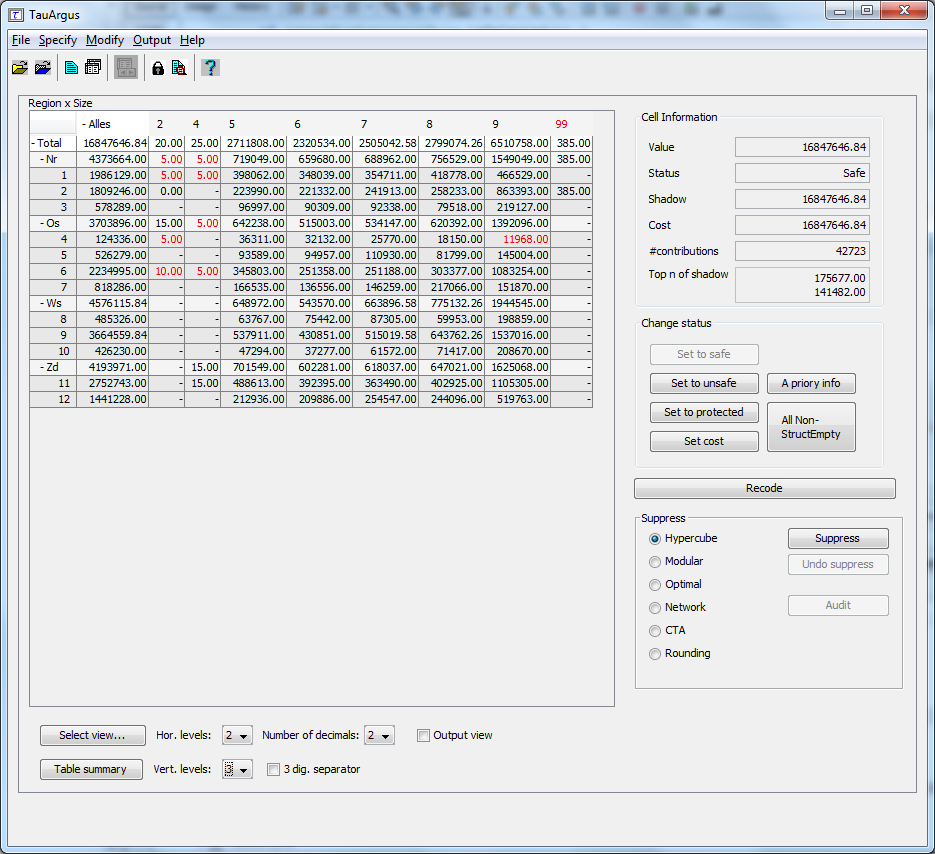

**Supplementary figure OCR (unverified; use the image for exact numbers, labels, and punctuation):**

```text
File Specify Modify Qutput Help

Blea\2

Region x Size

~alles

2

4

7

8

8

9

Call Information

[Total _| 16847646.84)

20.00)

25.00)

2711808.00|

2320534.00|

2505042, 58| 2798074.26|

6510758,00| 385.00)

Value

16847646.84

=H

4373664.00|

5.00]

5.00]

"718049.00|

1653680.00|

1688962.00]

"75852.00|

1549043.00| 385.00]

1986123.00|

5.00]

5.00]

73480300]

'354711.00|

418778.00|

468529.00|

+

Status

safe

10.09]

7223980..00|

221332.00|

241913.00|

7258233.00|

"363393,00) 385.00)

Shadow

16847646.84

'578289..00|

"96997,.00|

"30308..00|

'32338.00|

73518.00)

219127.00|

'3703896.00|

15.00)

5.00]

64223800]

'515003.00|

1534147.00|

62038200]

1392096.00|

Cost

16847646.84

124336.00|

5.00]

'36311.00)

3232.00)

5770.00)

1815000]

11968..00]

52627900]

'93589,.00|

'34957,00]

110930.09|

'31739..00|

745004.00|

‘#contrbutions

273

10.00]

5:00]

345803.00|

25135800]

25118800]

[30337700]

1083254.00|

Top n of shadow

175677.00

'318286,00|

146259,00|

7217066.00|

151870.00|

141482.00

=Ws.

4576115.84|

648972.00|

'543570.00|

663696.55|

775132.26|

1944545.00|

163767.00|

7542.00)

'87305.00|

'59953,00)

196859,00|

‘Change status

3654559,84|

'537911.00|

430851.00|

515019.53|

(643762.25|

1537016.00|

42623000]

47294,00)

'37277.00|

61572.00|

71417.00)

'208670.00|

Set to safe

J

4193971.00|

15.00)

701549.00|

602281.00|

618037.00|

647021.00|

1625068.00|

it

2752743.00|

88613.00|

363480.00|

402925.00|

1105305.00|

‘Set to unsafe

1441228.00|

7212936.00|

254547.00|

7244036,00) _519763.00|

— Apron

([ndo supress_]

Audit

cA

) Rounding

Output view:

(Secon

] vor tees: [Bo] Naber of decimal: [2 =

3dig. separator

(atic smmary_] vert. levels: [Bx
```

---

<a id="pdf-page-045"></a>

### PDF page 45 / manual page 44

[Original PDF page](https://research.cbs.nl/casc/Software/TauManualV4.1.pdf#page=45) · [Local source PDF](TauManualV4.1.pdf#page=45)

```text
    •   Unsafe (frequency): Unsafe according to the minimum frequency rule.
    •   Unsafe (zero cell) Unsafe because the zero-cells are considered unsafe.
    •   Unsafe (from manual): Manually made unsafe during this session.
    •   Protected: Cannot be selected as a candidate for secondary cell
        suppression.
    •   Secondary: Cell selected for secondary suppression.
    •   Secondary (from manual): Unsafe due to secondary suppression after
        primary suppressions carried out manually.
    •   Zero: Value is zero and cannot be suppressed.
    •   Empty: No records contributed to this cell and the cell cannot be
        suppressed.
Change Status
The second pane (‘Change Status’) on the right will allow the user to change the
cell–status.
    •   Set to Safe: A cell, which has failed the safety rules, can be declared safe
        by the user.
    •   Set to Unsafe: A cell, which has passed the safety rules, can be declared to
        be unsafe by the user.
    •   Set to Protected: A safe cell is set so that it cannot be selected for
        secondary suppression.
    •   Set Cost: Change the value of the Cost-value for this cell
    •   Use 'a priori' information (see below).
```

A Priori Info This option is an a priori option to be mainly used for microdata which allows the user to feed τ-ARGUS a list of cells where the status of the standard rules can be overruled i.e. the status of the cells is already specified. The associated file specifying this information is free format. The format will be: Code of first spanning variable, Code of second spanning variable, Status of cell (u = unsafe, p = protected (not to be suppressed), s = safe). Also the cost-function can be changed here for a cell. This will make the cell more likely to become secondary cell suppression, when the value is low or less likely when the value is high.

```text
    Nr, 4, u
    Zd, 6, p
     5, 5, c, 1
A full description of the aproiri file can be found in section 5.6
```

---

<a id="pdf-page-046"></a>

### PDF page 46 / manual page 45

[Original PDF page](https://research.cbs.nl/casc/Software/TauManualV4.1.pdf#page=46) · [Local source PDF](TauManualV4.1.pdf#page=46)

<a id="source-3-2-1-2"></a>

###### 3.2.1.2 Recode

The recode button will bring the user to the recoding system. Recoding is a very powerful method of protecting a table. Collapsed cells usually have more contributors and therefore tend to be much safer. Hierarchical Recoding The first window shows the variables available for recoding In this example, the ‘Region’ variable has been selected for recoding. As ‘Region’ is a hierarchical variable, the codes are shown in a hierarchical tree. The user can either fold or unfold the branches by clicking on the ‘+’ or ‘-‘ boxes which results in showing or omitting codes from the table, or by choosing an overall maximum hierarchical level. (See the following windows for details). Pressing the ‘Apply’ button followed by ‘Close’ will actually apply the selected recoding and show the resulting table. Press the undo-button – it is now possible to go back to the original recoding scheme. Below this there are two windows, one showing the recode window prior to applying the recoding for the hierarchical variable ‘Region’ and the second after the folding of the tree.

The next window shows the new hierarchical codes after collapsing all second level categories

#### Original figures on this page

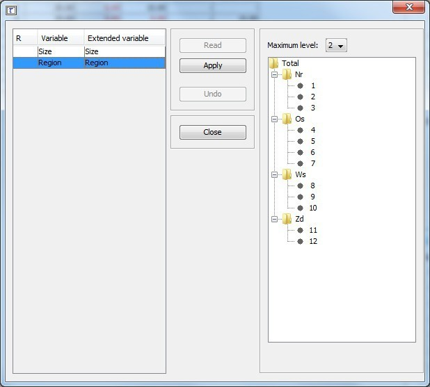

**Supplementary figure OCR (unverified; use the image for exact numbers, labels, and punctuation):**

```text
oO

=

3.48

Variable

Extended variable

‘Sze

‘see

(

Read

J

Maximum level

oe

Apply

[jp Tota

ele

Undo

°

ous

.

.

out

°

ous

a

°
```

---

<a id="pdf-page-047"></a>

### PDF page 47 / manual page 46

[Original PDF page](https://research.cbs.nl/casc/Software/TauManualV4.1.pdf#page=47) · [Local source PDF](TauManualV4.1.pdf#page=47)

By clicking 'Apply' and 'Close', we go back to the main window which shows the table after recoding:

#### Original figures on this page

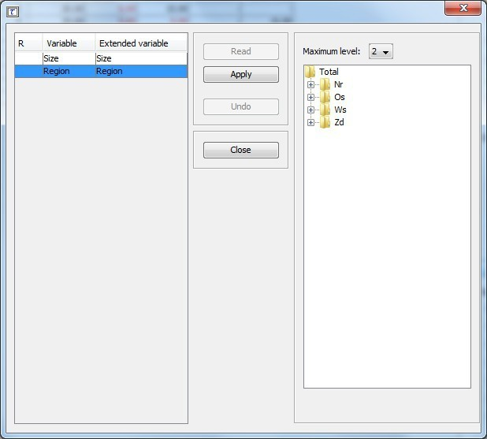

**Supplementary figure OCR (unverified; use the image for exact numbers, labels, and punctuation):**

```text
R

Variable

Extended variable

Read

Maximum level:

oe

‘Sze

Ise

Apply

[ip Tota

Nr

Os.

Undo

Ws

za
```

---

<a id="pdf-page-048"></a>

### PDF page 48 / manual page 47

[Original PDF page](https://research.cbs.nl/casc/Software/TauManualV4.1.pdf#page=48) · [Local source PDF](TauManualV4.1.pdf#page=48)

Non Hierarchical Recoding In this example the non-hierarchical ‘Size’ variable has been selected to be recoded. The user can either write the required recodings in the edit box or import them from a previously written file. In the example the line 2:2-6 results that categories 2,3,4,5,and 6 will be recoded into a new category 2. Note that τ-argus will give a warning that some codes have not been recoded. They will remain unchanged. The user will know whether this is harmful or not.

#### Original figures on this page

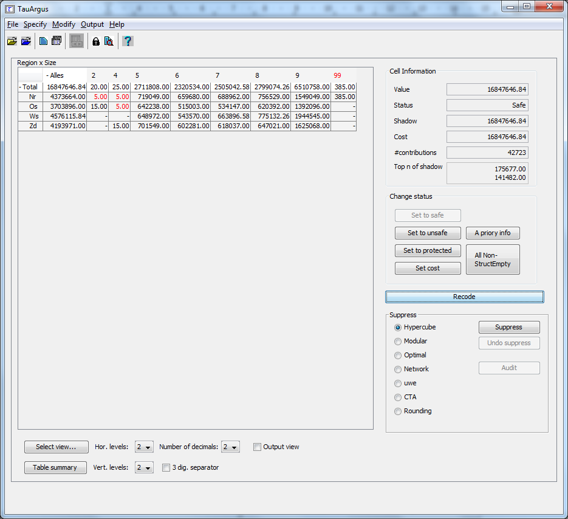

**Supplementary figure OCR (unverified; use the image for exact numbers, labels, and punctuation):**

```text
Lal

) S|

=

File Specify Modify Output Help

Bilea\2

Region x Size

~alles

2

4

8

8

9

Call Information

|-Total

15847546.84|

20.00)

25.00)

2711808.00|

2320534.00|

2505042, 58|

2739074,26| 6510758.00| 385.00)

Value

16847646.84

4373664.00|

5.00]

5.00]

"718049.00|

1653680.00|

1688962.00]

"756529.00| 1549043.00) 385.00]

'3703896.00|

15.00]

5.00]

64223800]

'515003.00|

'534147.00|

620392,00) 1392096.00|

+

Status

safe

Z|

4576115.84|

648972.00|

'543570.00|

663836.55|

"775132.26) 1944545.00|

Shadow

16847646.84

4193971.00|

=[5.00]

701549.00|

602281.00|

618037.00|

647021.00) 1625068.00|

z|

Cost

16847646.84

‘#contrbutions

273

Top n of shadow

175677.00

141482.00

‘Change status

Set to safe

Undo suppress

Audit

) CTA

Output view:

(Secon

] vor tees: [Bo] Naber of decimal: [2 =

3dig. separator

(atic smary_] vert. levels: [2 =
```

---

<a id="pdf-page-049"></a>

### PDF page 49 / manual page 48

[Original PDF page](https://research.cbs.nl/casc/Software/TauManualV4.1.pdf#page=49) · [Local source PDF](TauManualV4.1.pdf#page=49)

Once the recoding has been applied (both for hierarchical and non hierarchical data) the table can again be displayed. If there are now no cells, which fail the safety rules, the table can be saved as a protected table. However, if there are still a number of unsafe cells, secondary suppression needs to be carried out. This is necessary as the table is not yet safe. If only the cells failing the safety rules are suppressed, other cell values could be obtained by differencing.

<a id="source-3-2-1-3"></a>

###### 3.2.1.3 Secondary Suppression

```text
The Suppress button is an important button. It will activate the modules for
computing the necessary secondary suppressions as described above. There are a
number of options here.
    •   Hypercube
    •   Modular
    •   Network
    •   Optimal
Hypercube
This is also known as the GHMITER method. The approach builds on the fact that a
suppressed cell in a simple n-dimensional table without substructure cannot be
disclosed exactly if that cell is contained in a pattern of suppressed, nonzero cells,
forming the corner points of a hypercube.
```

#### Original figures on this page

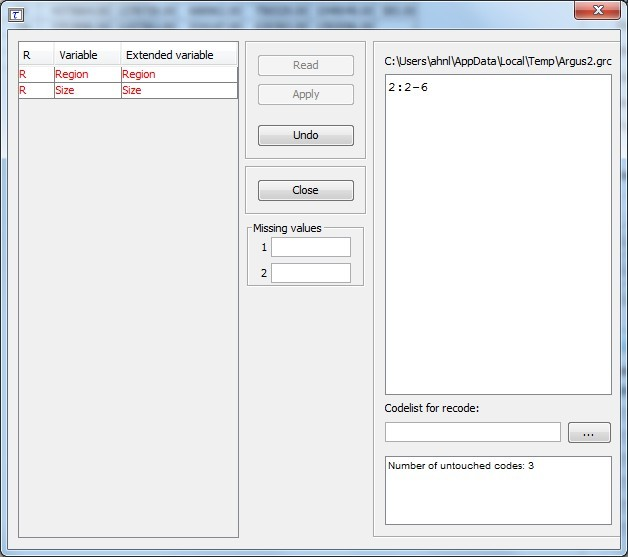

**Supplementary figure OCR (unverified; use the image for exact numbers, labels, and punctuation):**

```text
0S SES

R

Variable

Extended variable

(

Read

CC:\sers\ahnl\AppData|Local\Temp\Argus2.ar

R

Region

Region

!

R

isze.

isze

212-6

Apply

|

|

—

Missing values

1

2

Codelist for recade:

Number of untouched codes: 2
```

---

<a id="pdf-page-050"></a>

### PDF page 50 / manual page 49

[Original PDF page](https://research.cbs.nl/casc/Software/TauManualV4.1.pdf#page=50) · [Local source PDF](TauManualV4.1.pdf#page=50)

Modular This partial method will break the hierarchical table down to several non- hierarchical tables, protect them and compose a protected table from the smaller tables. As this method uses the optimisation routines, an LP-solver is required: this will be either Xpress or CPLEX, or the free solver The routine used can be specified in the Options window, this will be discussed later. Optimal This method protects the hierarchical table as a single table without breaking it down into smaller tables. As this method uses the optimisation routines, an LP- solver is required: this will be either Xpress or CPLEX. The routine used can be specified in the Options window; see section 4.7.3. Network This is a Network Flow approach for large unstructured 2 dimensional tables or a 2 dimensional table with one hierarchy (the first variable specified). This method is also based on optimisation techniques, but does not require an external solver like Xpress or CPLEX. As alternatives for cell suppression we canalso apply rounding and Controlled Tabular Adjustment (CTA) Rounding The controlled rounding procedure can be applied. The user has to specify the rounding base. Note that this option requires the Xpress solver or the free solver. See section 4.2.5 Controlled Tabular Adjustment (CTA) This method will modify a table such that the unsafe cells are replaced by their upper or lower protection level and the remaining cells are modified such that the table is still additive. See section 4.2.4 Choose the suppression method The radio-buttons at the right lower part of the window allow selecting the desired suppression method. Clicking on the Suppress button will then start the process of calculating the secondary suppressions. When this process has finished the protected table will be displayed and also the user will be informed about the number of cells selected for secondary suppression and the time taken to perform the operation. The secondary suppressed cells will be shown in blue.

---

<a id="pdf-page-051"></a>

### PDF page 51 / manual page 50

[Original PDF page](https://research.cbs.nl/casc/Software/TauManualV4.1.pdf#page=51) · [Local source PDF](TauManualV4.1.pdf#page=51)

<a id="source-3-2-1-4"></a>

###### 3.2.1.4 Summary Window

```text
By clicking on 'Table Summary', the summary window is obtained. The summary
window gives an overview of the cells according to their status.
    •   Freq: The number of cells in each category
    •   # rec: The number of observations in each category
    •   Sum Resp: Total cell value in each category
    •   SumCost: The sum of the cost variable. Here it is equal to the response
        variable.
```

#### Original figures on this page

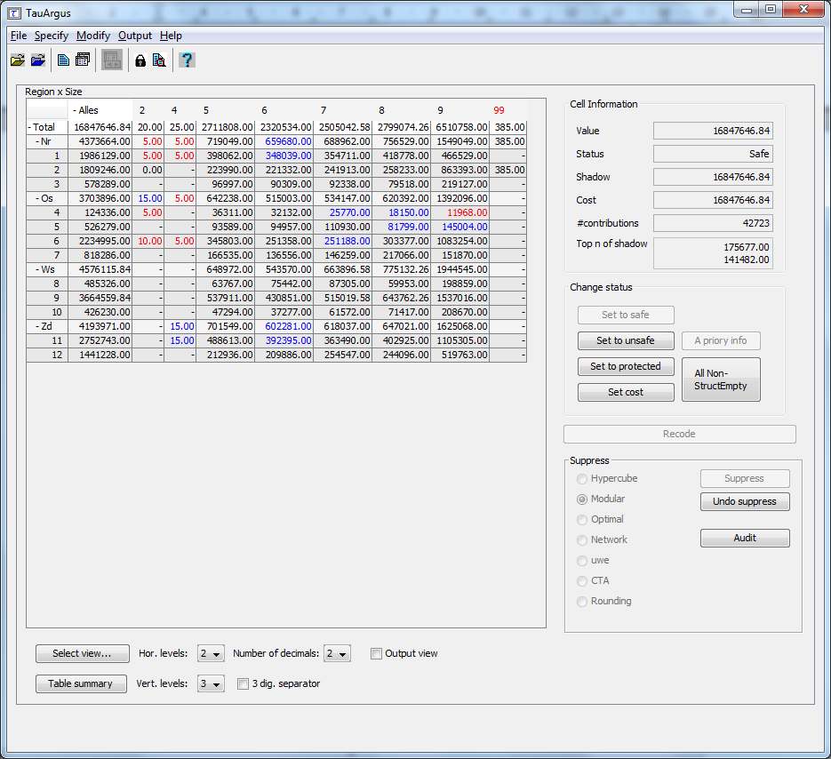

**Supplementary figure OCR (unverified; use the image for exact numbers, labels, and punctuation):**

```text
ae XS Ee eX ee ee ee ee ee ER

File Specify Modify Qutput Help

Blea\2

Region x Size

~alles

2

4

8

8

9

Call Information

[Total _| 16847646.84)

20.00)

25.00)

2711808.00|

2320534.00|

2505042, 58|

2739074,26|

6510758,00| 385.00)

Value

16847646.84

=H

4373664.00|

5.00]

5.00]

"718049.00|

1653680..00|

1688962.00]

"75852.00|

1549043.00| 385.00]

1986123.00|

5.00]

5.00]

7348039.00]

'354711.00|

418778.00|

468529.00|

+

Status

safe

10.09]

7223980..00|

221332.00|

241913.00|

7258233.00|

"363393,00) 385.00)

Shadow

16847646.84

'578289..00|

"96997,.00|

"30308..00|

73518.00)

219127.00|

'3703896.00|

15.00}

5.00]

64223800]

'515003.00|

1534147.00|

62038200]

1392096.00|

Cost

16847646.84

124336.00|

5.00]

'36311.00)

3232.00)

25770.00)

1815000]

11968..00]

52627900]

'93589,.00|

'34957,00]

110930.09|

31793,00)

745004.09]

‘#contrbutions

273

10.00]

5:00]

345803.00|

25135800]

251188,00|

[30337700]

1083254.00|

Top n of shadow

175677.00

'318286,00|

146259,00|

7217066.00|

151870.00|

141482.00

=Ws.

4576115.84|

648972.00|

'543570.00|

663696.55|

775132.26|

1944545.00|

163767.00|

7542.00)

'87305.00|

'59953,00)

196859,00|

‘Change status

3654559,84|

'537911.00|

430851.00|

515019.53|

(643762.25|

1537016.00|

42623000]

47294,00)

'37277.00|

61572.00|

71417.00)

'208670.00|

Set to safe

J

4193971.00|

15.00}

701549.00|

602281.00|

618037.00|

647021.00|

1625068.00|

it

2752743.00|

15.00}

88613.00|

7392395,00|

363480.00|

402925.00|

1105305.00|

‘Set to unsafe

1441228.00|

7212936.00|

254547.00|

7244036.00|

'519763.00|

—— (Carer

Recode

Hypercube

Suppress

[

J

lodular

Optimal

Network

uwe

cma

Rounding

Output view:

(Secon

] vor tees: [Bo] Naber of decimal: [2 =

3dig. separator

(atic smmary_] vert. levels: [3 v
```

---

<a id="pdf-page-052"></a>

### PDF page 52 / manual page 51

[Original PDF page](https://research.cbs.nl/casc/Software/TauManualV4.1.pdf#page=52) · [Local source PDF](TauManualV4.1.pdf#page=52)

By clicking on 'Close', we return to the table window. The table can now be written to an output file in the required format. Any cells which have been selected for suppression will be replaced by 'X', unless another option is chosen.. The safe table can be saved by using 'Output|Save table' menu on the main menu. See section 4.6.1.

<a id="source-3-3"></a>

##### 3.3 Save the safe table

When the table is safe it may be written to the hard disk of the computer. The user has six options: 1. As a CSV file. This Comma separated file can easily be read into Excel. Please note that τ-ARGUS uses the ‘,’ as the field-separator in this CSV-file. This might influence opening the CSV file in Excel. A solution for this is to change the settings in the Windows control-panel or use the 'Data|Text to Columns' option of Excel. This is a typical tabular output maintaining the appearance of the table in τ-ARGUS. 2. A CSV-file for a pivot table. This offers the opportunity to make use of the facilities of pivot tables in Excel. The status of each cell can be added here as an option (Safe, Unsafe or Protected for example). The information for each cell is displayed on a single line unlike standard csv format. 3. A text file in the format code-value, separated by commas. Here, the cell status is again an option. Also empty cells can be suppressed from the output file if required. The information for each cell is displayed on a single line similar to the CSV file for a pivot table. 4. SBS format. This is a special format required for sending data to Eurostat. 5. A file in intermediate format for possible input into another program. This contains protection levels and external bounds for each cell. This table could even be read back into τ-ARGUS. 6. A file in the JJ-format. This format has been introduced by JJ Salazar as an intermediate between the normal table and the structures required in the optimisation routines.

#### Original figures on this page

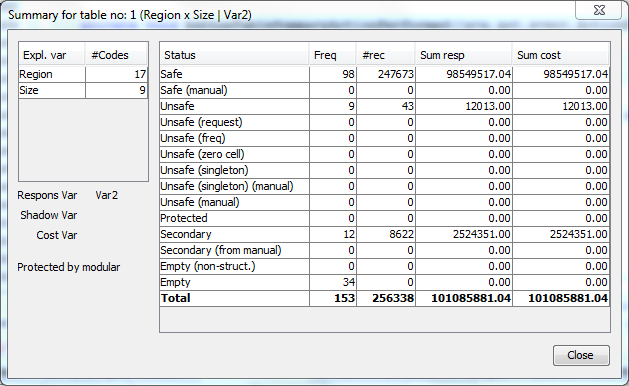

**Supplementary figure OCR (unverified; use the image for exact numbers, labels, and punctuation):**

```text
‘Summary for table no: 1 (Region x Size | Var2)

——

Expl. var

+#Codes

Status

Freq

rec

‘sum resp

‘Sum cost

F

fe

93|__ 247673)

98549517.04)

98549517.04)

[Region

[Size

93|

fe (manual)

Q

Q

0.00]

0.00]

|

a3

2013.00]

2013.00]

[Unsafe

[Unsafe Gequest)

0.00]

0.00]

0.00]

0.00]

[Unsafe (Fea)

[Unsafe (ero ca)

0.00]

0.00]

0.00]

0.00]

[Unsafe (ndleton)

Var.

[Unsafe (ndleton) (manuel)

0.00]

0.00]

Respons Var

[Unsafe (manual)

0.00]

0.00]

Shadow Var

Protected

0.00]

0.00]

Cost Var

[Secondary

DI

3622)

72524351.00)

72524351.00)

Q

Q

0.00]

0.00]

[Secondary (fom manuel)

Protected by modular

[Emoty (non-struct.)

Q

Q

0.00]

0.00]

Ee

Q

0.00]

0.00]

‘Total

153) 256338 _101085861.04|

101085881.04|
```

---

<a id="pdf-page-053"></a>

### PDF page 53 / manual page 52

[Original PDF page](https://research.cbs.nl/casc/Software/TauManualV4.1.pdf#page=53) · [Local source PDF](TauManualV4.1.pdf#page=53)

Finally, a report will be generated to a user specified directory. This report will also be displayed on the screen when the table has been written. It will contain details such as table structure, safety rules (and number of cells failing), secondary suppression method (and number of cell failing) and details of any recodes. An example is shown in the Reference section 4.6.2. As this is an HTML-file it can be viewed easily later or printed.

#### Original figures on this page

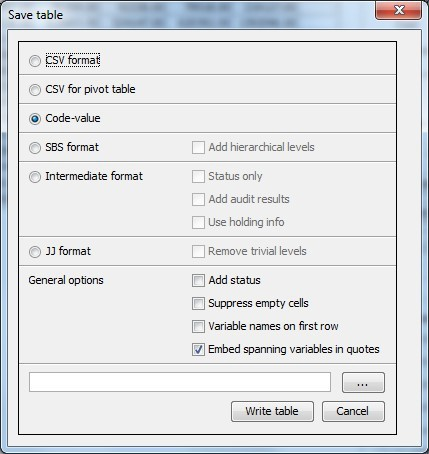

**Supplementary figure OCR (unverified; use the image for exact numbers, labels, and punctuation):**

```text
Save table

=

ESvformad

CCSV for pivot table

Code-value

SS format

‘Add hierarchical levels

Intermedate format

Status only

Add audit results

Use holding info

23 format

Remove trivial levels

General options

Ada status

(1 Suppress empty cels

[Hi Variabie names on frst rom

Embed spanning variables in quotes

=
```

---

<a id="pdf-page-054"></a>

### PDF page 54 / manual page 53

[Original PDF page](https://research.cbs.nl/casc/Software/TauManualV4.1.pdf#page=54) · [Local source PDF](TauManualV4.1.pdf#page=54)

<a id="source-4"></a>

#### 4 REFERENCE SECTION - DESCRIPTION OF THE MENU

ITEMS

Chapter 3 gave a brief introduction of the most frequently used options within τ-ARGUS. In this section a more detailed description of the program by menu-item is presented. In chapter 5 some general descriptions are given. Compared with the previous versions of τ- ARGUS (before 4.0 and before the Open Source version) the main window of τ- ARGUS looks rather different. A window with the unsafe combinations by variable and by code was presented. This information however was seldom used and the main focus of the users of τ- ARGUS was on the table itself. So from version 4.0 onwards the main window of τ- ARGUS will show the table(s) itself.

<a id="source-4-1"></a>

##### 4.1 Menu structure

```text
There are five menu headings:
File        Under File either a microdata file or tabular data file can be opened
            together with the meta data file describing the data; also a set of tables for
            the linked table procedure can be opened.
            In addition there is the option to open a Batch process file and to Exit.
```

#### Original figures on this page

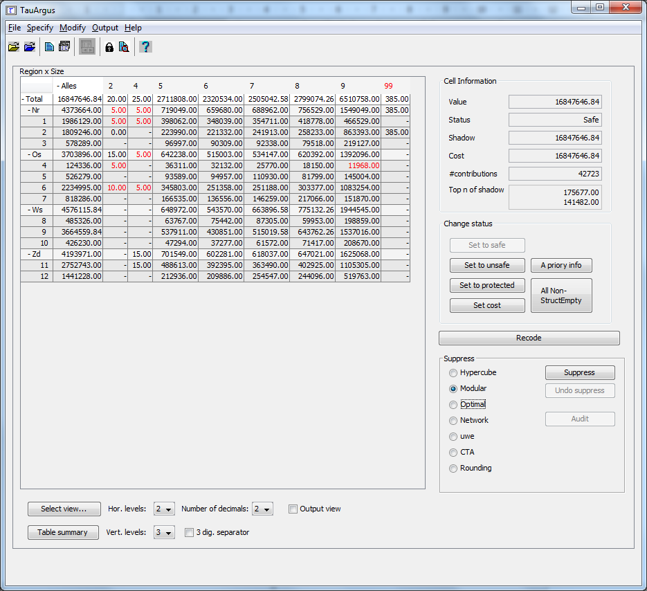

**Supplementary figure OCR (unverified; use the image for exact numbers, labels, and punctuation):**

```text
Lo) |

[5 Tauargus

) SS SS SS ee

=

File Specify Modify Qutput Help

Blea\2

Region x Size

~alles

2

4

8

8

9

Call Information

[Total _| 16847646.84)

20.00)

25.00)

2711808.00|

2320534.00|

2505042, 58|

2739074,26|

6510758,00| 385.00)

Value

16847646.84

=Nr

4373664.00)

5.00]

5.00]

718049.00]

1653680.00

1688962.00

756529.00

1549049.00| 385.00]

1986123.00|

5.00]

5.00]

73480300]

'354711.00|

418778.00|

468529.00|

+

Status

safe

1809246,00|

10.09]

7223980..00|

221332.00|

241913.00|

7258233.00|

"363393,00) 385.00)

Shadow

16847646.84

'578289..00|

"96997,.00|

"30308..00|

73518.00)

219127.00|

3703896.00)

15.00

5.00]

642238.00

'515003.00]

534147.00]

620382.00]

1392096.00]

Cost

16847646.84

124336.00|

5.00]

'36311.00)

3232.00)

5770.00)

1815000]

11968..00]

52627900]

'93589,.00|

'34957,00]

110930.09|

'31739..00|

745004.00|

‘#contrbutions

273

72234895.00|

10.00]

5:00]

345803.00|

25135800]

25118800]

[30337700]

1083254.00|

Top n of shadow

175677.00

'318286,00|

146259,00|

7217066.00|

151870.00|

141482.00

=Ws.

4576115.84|

648972.00

'543570.00

663696.55|

775132.26|

1944545.00]

485326,00|

163767.00|

7542.00)

'87305.00|

'59953,00)

196859,00|

‘Change status

3654559,84|

'537911.00|

430851.00|

515019.53|

(643762.25|

1537016.00|

42623000]

47294,00)

'37277.00|

61572.00|

71417.00)

'208670.00|

Set to safe

J

=zd

4193971.00)

15.00

701549.00]

602281.00]

618037.00

647021.00]

1625068.00

it

2752743.00|

88613.00|

363480.00|

402925.00|

1105305.00|

‘Set to unsafe

1441228.00|

7212936.00|

254547.00|

7244036.00|

'519763.00|

— (apron

(nde suppress]

Audit

J

) CTA

[loutput view

(Secon

] vor tees: [Bo] Naber of decimal: [2 =

(713d. separator

(atic smmary_] vert. levels: [3 v
```

---

<a id="pdf-page-055"></a>

### PDF page 55 / manual page 54

[Original PDF page](https://research.cbs.nl/casc/Software/TauManualV4.1.pdf#page=55) · [Local source PDF](TauManualV4.1.pdf#page=55)

```text
Specify      Specify allows the metadata to be entered or edited and the user can
             specify the tables to be protected along with primary sensitivity rules.
             When tabular data is the starting point the details about the table can be
             specified
Modify       Under Modify, the table to be protected can be selected and the linked
             tables procedure can be carried out.
Output       Output allows the suppressed table to be saved. In addition there is also
             view report and write a batchfile. Also a tool to generate a-priory
             information can be found here.
Help         Finally, there is a Help menu, with contents, news, options and about-box
             of the program.
Below is a list of the menu items which are shown under each of the menu
headings. As some of the items are context specific they will not all be always
available.
Overview of the menu-items
```

```text
File              Specify        Modify             Output           Help
Open               Metafile       Select Table      Save Table       Contents
 Microdata
Open Table         Specify       Linked             View             News
                    Tables        Tables             Report
Open Table                                          Generate         Options
 Set                                                 apriori
Open Batch                                          Write Batch      About
 Process                                             File
Exit
The most important items of the menu can also be reached via the corresponding
icons:
```

```text
Open       Open     Metadata    Specify     Select    Save      View       Help
Micro      Table                Tables      table     Table     Report
data
```

These menu items will be explained in detail in the sections following the description of the main window.

The Main window Starting with the Open Source version (4.0) the main window of τ- ARGUS has been changed completely. In the previous versions an overview was presented of the number of unsafe combinations for each explanatory variable and each code. However this information was hardy used and the focus of the user is on the table(s) itself. So from now on the table itself is the central point (the main window) of τ-ARGUS. As soon as the table has been completed, the table is

#### Original figures on this page


---

<a id="pdf-page-056"></a>

### PDF page 56 / manual page 55

[Original PDF page](https://research.cbs.nl/casc/Software/TauManualV4.1.pdf#page=56) · [Local source PDF](TauManualV4.1.pdf#page=56)

presented here and the process of disclosure control is controlled from this main window.

<a id="source-4-2"></a>

##### 4.2 Viewing the table

```text
On the left side the table itself is shown in a spreadsheet view. Safe cells are black,
unsafe cells (those failing the primary suppression rule) are red. In this example
there are 12 unsafe cells and by viewing the table the user can now see the actual
cells that are unsafe.
Any secondary suppressed cells are shown in blue (there are none at this stage, in
this example) and empty cells have a hyphen (-). The two check-boxes on the left-
bottom give some control over the layout.
    •   If the 3-digit separator box at the bottom is checked, the window will show
        the cell-values, using the 3 digits separator to give a more readable format.
    •   The Output view shows the table, with all the suppressed cells replaced by
        an ‘X’; this is how the safe table will be published, but without the colours
        distinguishing between primary and secondary suppressions.
```

For some windows, the complete table cannot be seen on the screen. In these cases there will be scrollbars at the bottom and the right of the table above, which can be used to display the unseen columns.

#### Original figures on this page

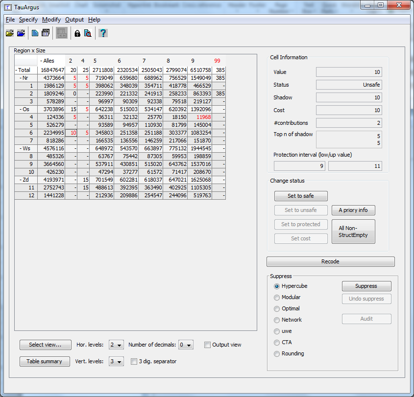

**Supplementary figure OCR (unverified; use the image for exact numbers, labels, and punctuation):**

```text
TauArgus

~ ee ee ee

re)

File Specify Modify Output Help

Blea\2

Region x Size

~alles

6

7

8

8

9

Call Information

Total _| 16847647|

20|__25| 2711808|

2520534|

2505043|

2739074|

6510758|

Value

10)

=H

4373664|

713043]

756523)

1986123]

348039]

354711|

41873)

Status

Unsafe

221332]

241913)

Shadow

96997]

"30309|

73518|

219127]

3703896|

642233)

515003)

534147]

620382]

Cost

10)

124336|

36311

32132|

18150)

11968]

110930]

31739]

745004]

‘#contrbutions

ct

345803)

251358)

251188)

303377)

Top n of shadow

"818286

146255)

217086 |

151879|

=Ws.

4576116|

648972)

543570]

663897)

775132)

1944545)

63767]

75442|

87305]

Protection interval ow/up value)

337911|

30851)

1515020)

643762|

1537016)

5

11

426230

47294|

61572

71417|

7208670)

4193971|

701549]

602281/

618037)

647021|

‘Change status

it

2752743|

288613)

02925)

1105305)

1441223)

212936]

254547]

1519763)

‘Set to safe

Set to unsafe

Set to protected

AI Non-

Set cost

Hypercube

([ndo supress_]

Audit

Output view:

cA

(Secon

] vor tees: [Bo] Nabe of decal: [9 =

3dig. separator

(atic smmary_] vert. levels: [3 v
```

---

<a id="pdf-page-057"></a>

### PDF page 57 / manual page 56

[Original PDF page](https://research.cbs.nl/casc/Software/TauManualV4.1.pdf#page=57) · [Local source PDF](TauManualV4.1.pdf#page=57)

For large tables one does not want to see the whole table on the screen, which is virtually impossible. Therefore τ- ARGUS will show only the first two levels of the hierarchal structures. If you want to see more you can open and close certain parts of the table by clicking on the codes with a ‘+’ or “-“sign. This works similar to the way you open and close certain parts in the Windows explorer. Via ‘Change View’ at the bottom of the screen you can also select the level of each hierarchy you want to see both horizontally and vertically. Example of a 3-dimensional table 3-dimensional tables cannot be displayed as a whole. τ- ARGUS can only show a 2- dimensional layer of the table. So for higher dimensional table two variables are selected to be show. For the other variables combo-boxes are shown. These combo- boxes allow for the selection of a specific layer of the table. Just select the corresponding code and that layer will be shown. If you want to see another combination of two explanatory variables, go to “Select view” at the bottom of the window. See section 4.2.7.

#### Original figures on this page

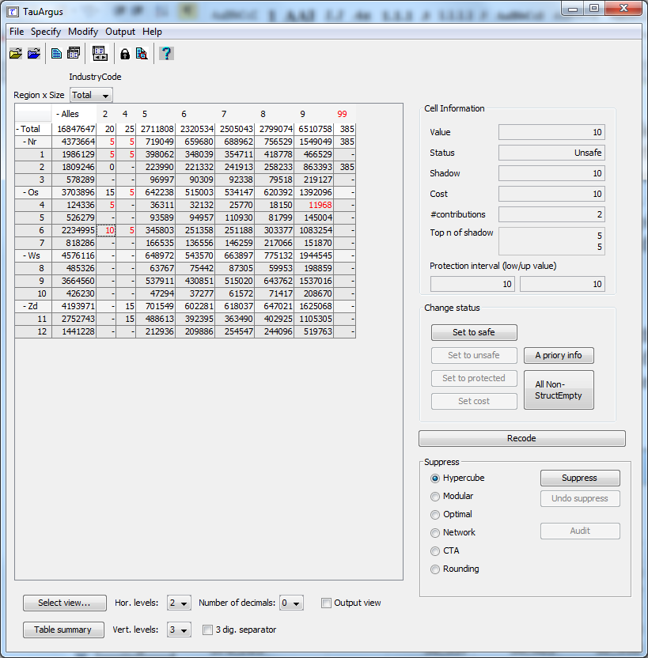

**Supplementary figure OCR (unverified; use the image for exact numbers, labels, and punctuation):**

```text
TauArgus

a ee ee)

File Specify Modify Output Help

B

|Blea|?

IndustryCode

Region x Size [Total

=

~alles

6

7

8

8

9

Call Information

Total _| 16847647|

20|__25| 2711808|

2520534|

2505043|

2739074|

6510758|

Value

=Nr

4373664|

713043]

756523)

1548029]

1986123]

348039]

354711|

41873)

Status

Unsafe

1809246)

221332]

241913)

258233)

Shadow

'578289|

96997]

"30309|

73518|

219127]

3703896|

642233)

515003)

534147]

620382]

1392096]

Cost

124336|

36311

32132|

18150)

11968]

528279)

110930]

31739]

745004]

‘#contrbutions

72234395)

ct

345803)

251358)

251188)

303377)

1083254)

Top n of shadow

"818286

146255)

217086 |

151879|

=Ws.

4576116|

648972)

543570

663897)

775132)

1944545)

485325)

63767]

75442|

87305]

159353]

136855]

Protection interval ow/up value)

3654560|

337911|

30851)

1515020)

643762|

1537016)

10

426230

47294|

61572

71417|

7208670)

=zd

4193971|

701549]

602281/

618037)

647021|

1625068)

‘Change status

it

2752743|

288613)

02925)

1105305)

1441223)

212936]

254547]

244036) _519763|

‘Set to safe

(

Set to unsafe

Set to protected

AI Non-

Set cost

‘Suppress

Hypercube

Undo suppress

Network

Audit

cA

(ise) ver tre: [2] Naber of ecm [0

Hl output view

Table summary

Vert. levels: [3

134i. separator

——
```

---

<a id="pdf-page-058"></a>

### PDF page 58 / manual page 57

[Original PDF page](https://research.cbs.nl/casc/Software/TauManualV4.1.pdf#page=58) · [Local source PDF](TauManualV4.1.pdf#page=58)

Additional information in the View Table window

Clicking on a cell in the main body of the table makes information about this cell visible in the Cell Information pane.

```text
Here, the following information can be seen:
1. the cell-value
2. the cell status
3. the value of cost variable
4. the value of the shadow variables
5. the number of contributors
6. the values of the largest contributors of the shadow variable
In addition for a primary unsafe cell also the required lower and upper protection
levels are shown. If you put your mouse over this value, also the lower and upper
protection as a distance to the cell value is shown together with the same value as a
percentage.
Information about the Holding level and the Request protection variable are also
displayed here.
The status of the cell can be:
    •   Safe: Does not violate the safety rule
    •   Safe (from manual): manually made safe during this session
    •   Unsafe: According to the safety rule
    •   Unsafe (request): Unsafe according to the Request rule.
    •   Unsafe (frequency): Unsafe according to the minimum frequency rule.
    •   Unsafe (from manual): manually made unsafe during this session (see
        ‘Change Status’ below).
    •   Protected: Cannot be selected as a candidate for secondary cell suppression
        (see ‘Change Status’ below).
    •   Secondary: Cell selected for secondary suppression.
    •   Secondary (from manual): Unsafe due to secondary suppression after
        primary suppressions carried out manually (see ‘Change Status’ and
        ‘Secondary suppressions’ below).
    •   Empty: No records contributed to this cell and the cell cannot be
        suppressed.
Change Status
The second pane (‘Change Status’) on the right will allow the user to change the
cell–status.
    •   Set to Safe: A cell, which was unsafe, e.g. due to the safety rules is made
        safe by the user.
    •   Set to Unsafe: A cell, which has passed the safety rules is made unsafe by
        the user. Hence the manual safety margin is applied
```

---

<a id="pdf-page-059"></a>

### PDF page 59 / manual page 58

[Original PDF page](https://research.cbs.nl/casc/Software/TauManualV4.1.pdf#page=59) · [Local source PDF](TauManualV4.1.pdf#page=59)

```text
•   Set to Protected: A safe cell is set so that it cannot be selected for
    secondary suppression. Note: use this option with care as the result might
    be that no solution can be found. Alternatively consider to set the cost-
    variable to a very high value.
•   Set Cost: Change the cost function for a cell.
```

<a id="source-4-2-1"></a>

###### 4.2.1 A priori info

This option allows you to feed τ-ARGUS a list of cells where the status of the standard rules can be overruled. E.g. a cell must be kept confidential or not for other reasons that just because of the sensitivity rules. By modifying the cost- function you can influence the selection of the secondaries. E.g. the cells suppressed last year can get a preference for the suppression this year by giving this cell a small value for the cost-function. The option ‘Expand trivial levels’ is important. Often in a table with hierarchies, some levels in a hierarchy break down in only one lower level. This implies that there are different cells in a table which are implicitly the same. Changing the status of one of them might lead to inconsistencies and serious problems. E.g. one if the two is unsafe and the other is protected, the solution is impossible. If you select the option ‘Expand trivial levels’, τ-ARGUS will always modify all cells that are the same if you modify one of them. The format of the file is free format. The separator can be chosen. The format is: Code of first spanning variable, Code of second spanning variable,…, Status of cell (u = unsafe, p = protected (not to be suppressed), s = safe). Also the cost-function can be changed here for a cell. This will make the cell more likely to become secondary cell suppression, when the value is low, or less likely when the value is high. Normally the sensitivity rules will also give the required protection levels for unsafe cells. But sometimes, e.g. in the case of ‘manual unsafe cells’ the user might want to specify the required protection level different for a standard percentage. After the keyword ‘pl’, the lower and upper protection levels can be given for a specific cell. Note that the protection levels will always have to be positive, as they are considered as distances from the cell-value. A full description of the apriori file is given in section 5.6.

```text
Nr, 4, u
Zd, 6, p
 5, 5, c, 1
Zd, 5, pl, 100, 200
```

When the apriori file has been applied τ- ARGUS will show an overview of the changes that have been made to the table.

---

<a id="pdf-page-060"></a>

### PDF page 60 / manual page 59

[Original PDF page](https://research.cbs.nl/casc/Software/TauManualV4.1.pdf#page=60) · [Local source PDF](TauManualV4.1.pdf#page=60)

<a id="source-4-2-2"></a>

###### 4.2.2 Global recoding

The recode button will open the recoding options. Recoding is a very powerful method of protecting a table. Collapsed cells tend to have more contributors and therefore tend to be much safer. Recoding a variable always starts with the original codes. It is not possible to refine a recoding. If required you must start with a complete new recoding. Recoding a non-hierarchical variable There is a clear difference in recoding a hierarchical variable compared to a non- hierarchical variable. In the non-hierarchical case the user can specify a global recoding manually. Either enter the recoding described below manually or read it from a file. The default extension for this file is .GRC. Details can also be found in section 5.4.

#### Original figures on this page

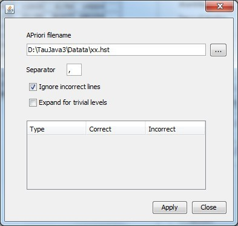

**Supplementary figure OCR (unverified; use the image for exact numbers, labels, and punctuation):**

```text
—

Prior flename

D:\Taulavadatatabochst

Separator

E

Ignore incorrect ines

Expand for trivial levels

Type

Correct

Incorrect
```

---

<a id="pdf-page-061"></a>

### PDF page 61 / manual page 60

[Original PDF page](https://research.cbs.nl/casc/Software/TauManualV4.1.pdf#page=61) · [Local source PDF](TauManualV4.1.pdf#page=61)

There are some standards about how to specify a recode scheme. Always the new code is specified first followed by a colon (`:`). After that the set of old codes to be collapsed into the new code is specified. All codelists are treated as alphanumeric codes. This means that codelists are not restricted to numerical codes only. However, this also implies that the codes '01' and ' 1' are considered different codes and also 'aaa' and 'AAA' are different. In a recoding scheme the user can specify individual codes separated by a comma (,) or ranges of codes separated by a hyphen (-). The range is determined by treating the codes as strings and using the standard string comparison. E.g. `0111`< `11` as the `0` precedes the `1` and `ZZ’< `a` as the uppercase `Z` precedes the lowercase `a`. Special attention should be paid when a range is given without a left or right value. This means every code less or greater than the given code. In the first example, the new category 1 will contain all the codes less than or equal to 49 and code 4 will contain everything larger than or equal to 150. Example: for a variable with the categories 1,…,182 a possible recode is then:

```text
1: - 49
2: 50 - 99
3: 100 – 149
4: 150 –
```

#### Original figures on this page

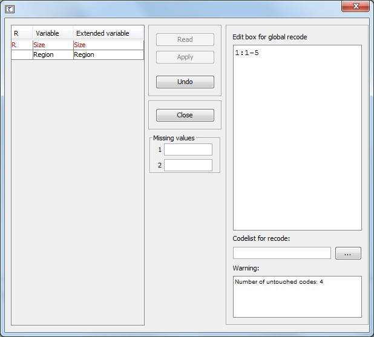

**Supplementary figure OCR (unverified; use the image for exact numbers, labels, and punctuation):**

```text
oO

i. Ss

R

Variable

Extended variable

Read

Editbox for global recode

Rk

Ise

Ise

Region

Region

ari-s

Apply

|

—

Missing values

Codelist for recode:

Warning:

Number of untouched codes: 4
```

---

<a id="pdf-page-062"></a>

### PDF page 62 / manual page 61

[Original PDF page](https://research.cbs.nl/casc/Software/TauManualV4.1.pdf#page=62) · [Local source PDF](TauManualV4.1.pdf#page=62)

```text
for a variable with the categories 01 till 10 a possible recode is:
 1: 01 , 02
 2: 03 , 04
 3: 05 – 07
 4: 08 , 09 , 10
```

An important point is not to forget the colon (:) if it is forgotten, the recode will not work. Recoding 3: 05,06,07 can be shortened to 3: 05-07.

Additionally, changing the coding for the missing values can be performed by entering these codes in the relevant textboxes. Also a new codelist with the labels for the new coding scheme can be specified. This is entered by means of a codelist file. An example is shown here. (note, there are no colons is this file)

```text
 1,Groningen
 2,Friesland
 3,Drenthe
 4,Overijssel
 5,Flevoland
 6,Gelderland
 7,Utrecht
 8,Noord-Holland
 9,Zuid-Holland
10,Zeeland
11,Noord-Brabant
12,Limburg
Nr,North
Os,East
Ws,West
Zd,South
```

Pressing the ‘Apply’ button will actually restructure the table. The variable concerned will be displayed in red and additionally an x is shown in front of the variable. If required, recoding can easily be undone by pressing 'undo recoding'. The window will return to the originally coding structure. If there is any error in the recoding such as certain codes not being found when pressing the ‘Apply’ button, an error message will be shown at the bottom of the screen. Alternatively, a warning could be issued; e.g. if the user did not recode all original codes, τ- ARGUS will inform the user. This may have been the intention of the user, therefore the program allows it. In the above example a τ- ARGUS message informs the user that 4 codes have not been changed. At the end of the operation τ-ARGUS will ask you whether or not a modified recoding scheme must be saved or not.

---

<a id="pdf-page-063"></a>

### PDF page 63 / manual page 62

[Original PDF page](https://research.cbs.nl/casc/Software/TauManualV4.1.pdf#page=63) · [Local source PDF](TauManualV4.1.pdf#page=63)

Once the ‘Close’ button has been pressed, τ- ARGUS will present the table with the recoding applied.

Recoding a hierarchical variable

In the hierarchical case the code scheme is typically a tree. To global recode a hierarchical variable requires a user to manipulate a tree structure. The standard Windows tree view is used to present a hierarchical code. Certain parts of a tree can be folded and unfolded with the standard Windows actions (clicking on ‘+’ and ‘-‘). The maximum level box at the top of the screen offers the opportunity to fold and unfold the tree to a certain level. Pressing the ‘Apply’ button will actually restructure the table. If required, a recoding may always be undone.

#### Original figures on this page

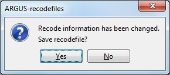

**Supplementary figure OCR (unverified; use the image for exact numbers, labels, and punctuation):**

```text
ARGUS-recodefiles

Recode information has been changed,

Save recodefile?
```

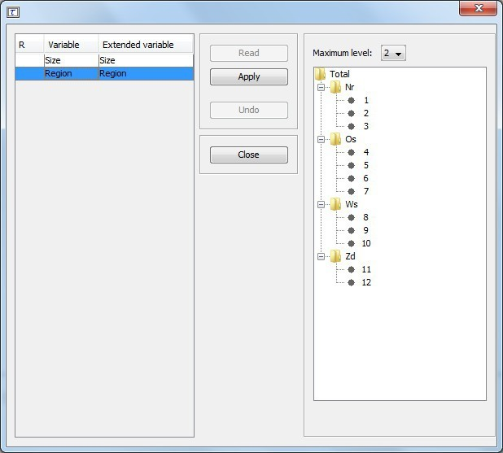

**Supplementary figure OCR (unverified; use the image for exact numbers, labels, and punctuation):**

```text
—~_~, TE

Variable

Extended variable

‘see

Ise

Read

Maximum level

oe

Apply

[jp Tota

ele

Undo

°

ous

.

.

out

°

ous

a

°
```

---

<a id="pdf-page-064"></a>

### PDF page 64 / manual page 63

[Original PDF page](https://research.cbs.nl/casc/Software/TauManualV4.1.pdf#page=64) · [Local source PDF](TauManualV4.1.pdf#page=64)

<a id="source-4-2-3"></a>

###### 4.2.3 Secondary suppression

When the table is ready, the most commonly used method to protect a table is secondary cell suppression With suppress the table will be protected by causing additional cells to be suppressed. This is necessary to make a safe table.

```text
Suppression Options
There are a number of suppression options, which can be seen on the bottom right
hand side of the window.
      •   Hypercube
      •   Modular
      •   Optimal
      •   Network
```

<a id="source-4-2-3-1"></a>

###### 4.2.3.1 Hypercube

This is also known as the GHMITER method. The approach builds on the fact that a suppressed cell in a simple n-dimensional table without substructure cannot be

#### Original figures on this page

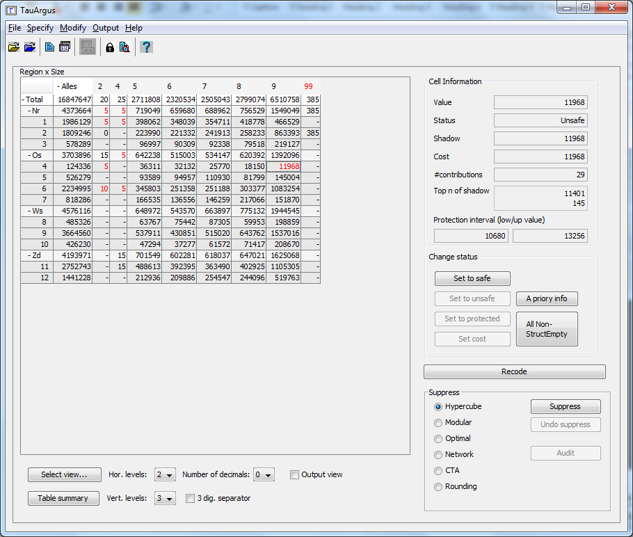

**Supplementary figure OCR (unverified; use the image for exact numbers, labels, and punctuation):**

```text
TauArgus

eecowrr? .

aren)

ees ew ow SE

File Specify Modify Output Help

oe B

Bleal?

Region x Size

Call Information

~alles

6

7

8

8

9

Total _| 16847647|

20|__25| 2711808|

2520534|

2505043|

2739074|

6510758|

Value

11968 |

=Nr

4373664|

713043]

756523)

1548029]

Status

Unsafe

1986123]

348039]

354711|

41873)

221332]

241913)

258233)

96997]

"30309|

73518|

219127]

Shadow

11968 |

=05,

3703896|

642233)

515003)

534147]

620382]

1392096]

Cost

11968 |

124336|

36311

32132|

18150)

TiSes

‘#contrbutions

110930]

31739)

145004]

10

345803)

251358)

251188)

303377)

1083254)

Top n of shadow

11401.

'818286|

146255)

217086 |

151879|

145

=Ws.

4576116|

648972)

543570

663897)

775132)

1944545)

63767]

75442|

87305]

159353]

136855]

Protection interval ow/up value)

337911|

30851)

1515020)

643762|

1537016)

10680

426230

47294|

61572

71417|

7208670)

=zd

4193971|

701549]

602281/

618037)

647021|

1625068)

‘Change status

it

2752743|

288613)

02925)

1105305)

1441223)

212936]

254547]

244036) _519763|

Set to unsafe

Set to protected

AI Non-

Set cost

‘Suppress

Hypercube

Undo suppress

Network

Audit

cA

(ise) ver tre: [2] Naber of ecm [0

Hl output view

Table summary

Vert. levels: [3

134i. separator
```

---

<a id="pdf-page-065"></a>

### PDF page 65 / manual page 64

[Original PDF page](https://research.cbs.nl/casc/Software/TauManualV4.1.pdf#page=65) · [Local source PDF](TauManualV4.1.pdf#page=65)

disclosed exactly if that cell is contained in a pattern of suppressed, nonzero cells, forming the corner points of a hypercube. Selecting the hypercube method will lead to the following window being showed by τ-ARGUS. GHMITER will select secondary suppressions that protect the sensitive cells properly against the risk of inferential disclosure, to some extent, if the user activates the option “Protection against inferential disclosure required”. If the option is inactivated, on the other hand, GHMITER will not check secondary suppressions to be sufficiently large. For more explanation, and detailed information on the hypercube see section 2.8.

```text
The lower part of the window above enables the user to affect the setting of two
parameters, “Max sub-codelist size” and “Max sub-table size” that GHMITER uses
for memory allocation.
If the option ‘normal size’ is active, the default values mentioned below will be
used. Ticking the option ‘large size’ will lead to a setting of 250 and 25000,
respectively.
“Max sub-codelist size” must exceed the largest maximum sub-codelist size of all
explanatory variables of the table. The maximum sub-codelist size of a
(hierarchical) variable is the largest number of categories on the same
(hierarchical) level that contribute to the same category on the (hierarchical) level
just above. The default value for “Max sub codelist size” is 200.
“Max sub-table size” must exceed the number of cells in the largest subtable, e.g.
the product of the maximum sub-codelist sizes taken over all explanatory variables.
The default value is 6000.
Note that we strongly recommend designing tables so that they fit the ‘normal’
setting, e.g. better think about restructuring the table rather than using the ‘large’
option. The better approach (instead of using the ‘large’ option) would be to
introduce a (more detailed) hierarchical structure into the table, because in this way
the table will provide more information to the user.
The Cancel button will bring you back to the main window, without protecting the
table.
```

#### Original figures on this page


**Supplementary figure OCR (unverified; use the image for exact numbers, labels, and punctuation):**

```text
Additional parameters for the use of GHMiter:

rotection against inferential disclosure required

100

‘% external a priori bounds on the cell values

Apply singleton protection

Memory model

Normal size

) Large size

) Manual

Max sub-codelit size

Max sub-table size
```

---

<a id="pdf-page-066"></a>

### PDF page 66 / manual page 65

[Original PDF page](https://research.cbs.nl/casc/Software/TauManualV4.1.pdf#page=66) · [Local source PDF](TauManualV4.1.pdf#page=66)

<a id="source-4-2-3-2"></a>

###### 4.2.3.2 Modular

This partial method will break down the hierarchical table into several non- hierarchical tables, protect them and compose a protected table from the smaller tables. As this method uses the optimisation routines, an LP-solver is required: this can be either Xpress or CPLEX or a free solver. The routine used can be specified in the Options box, this will be discussed later. After starting the modular procedure a little window will be shown. This allows to select three additional rules to be applied. At the end of section 2.10 more information on these three rules can be found.

<a id="source-4-2-3-3"></a>

###### 4.2.3.3 Optimal

This method protects the (hierarchical) table as a single table without breaking it down into smaller tables. As this method uses the optimisation routines, an LP- solver is required: this can be either Xpress or CPLEX or a free solver. The routine used can be specified in the Options box, this will be discussed later. It is the responsibility of the users of τ- ARGUS to apply for a licence for one of these commercial packages themselves. Information on obtaining one of these licences will be found in a ‘read.me’ file supplied with the software or on the CASC website. The same window as in Modular is shown to select the 3 additional rules; see above. By choosing ‘Suppress/Optimal’ a further question is asked. The question is ‘How much time do you allow the system to compute the optimal solution’.

When the specified time limit has been reached τ-ARGUS will ask you what to do. This can be twofold, you allow τ-ARGUS to continue for a new amount of time, or not. The window below allows you to specify this. Note that τ-ARGUS will check only at a specific location in a cycle whether or not the time has elapsed.

#### Original figures on this page

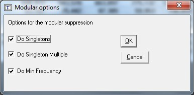

**Supplementary figure OCR (unverified; use the image for exact numbers, labels, and punctuation):**

```text
Modular options

—-

Options for the madular suppression

F BeSigeiond

a]

Do Singleton Mutiple

Cancel

I DoMin Frequency
```

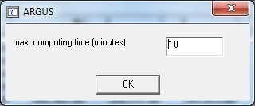

**Supplementary figure OCR (unverified; use the image for exact numbers, labels, and punctuation):**

```text
‘ARGUS

‘max. computing time (minutes)

i

Lx
```

---

<a id="pdf-page-067"></a>

### PDF page 67 / manual page 66

[Original PDF page](https://research.cbs.nl/casc/Software/TauManualV4.1.pdf#page=67) · [Local source PDF](TauManualV4.1.pdf#page=67)

<a id="source-4-2-3-4"></a>

###### 4.2.3.4 Network

This is a Network Flow approach for large unstructured 2 dimensional tables with only one hierarchy (the first variable specified). The user has the option of selecting an optimisation method ( PPRN and Dykstra). Both optimisation methods are available free of an additional licence. By default the Dykstra solution is advised.

#### Original figures on this page

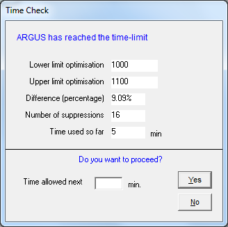

**Supplementary figure OCR (unverified; use the image for exact numbers, labels, and punctuation):**

```text
Time Check

ARGUS has reached the time-imit

1000

Lower limit optimisation

1100

Upper limit optimisation

9.09%

Difference (percentage)

16

Number of suppressions

Time used so far

5

rin

Do you want to proceed?

Time allowed nest

Yes

rin,
```

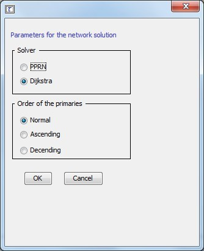

**Supplementary figure OCR (unverified; use the image for exact numbers, labels, and punctuation):**

```text
o

Parameters for the network solution

Solver

PERI

© Dikstra

Order of the primaries

@ Normal

Ascending

Decending
```

---

<a id="pdf-page-068"></a>

### PDF page 68 / manual page 67

[Original PDF page](https://research.cbs.nl/casc/Software/TauManualV4.1.pdf#page=68) · [Local source PDF](TauManualV4.1.pdf#page=68)

As the network solution is a heuristic to find an approximation of the real optimal solution, it cannot be expected that always an optimal solution is found. Nevertheless it is guaranteed that at least a good feasible solution is found in a relatively short time. The order in which the primaries are provided to the network algorithm could influence the solution found. Therefore three options are available to order the primaries.

<a id="source-4-2-3-5"></a>

###### 4.2.3.5 After the suppression

After selecting one of the options and after clicking the Suppress button, τ- ARGUS will run and display a protected table after informing the user of the number of cells selected for secondary suppression and the time taken to perform the operation.

The secondary suppressed cells will be shown in blue.

#### Original figures on this page

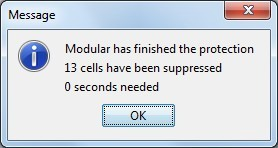

**Supplementary figure OCR (unverified; use the image for exact numbers, labels, and punctuation):**

```text
a

Message.

Modular has finished the protection

13 cells have been suppressed

O seconds needed
```

---

<a id="pdf-page-069"></a>

### PDF page 69 / manual page 68

[Original PDF page](https://research.cbs.nl/casc/Software/TauManualV4.1.pdf#page=69) · [Local source PDF](TauManualV4.1.pdf#page=69)

When the user is satisfied with the table it can be saved (see section 4.6.1 for the possible formats). Via the menu Output|Save table you can specify the format and start the process of saving a table.

<a id="source-4-2-4"></a>

###### 4.2.4 Controlled Tabular Adjustment

A method new in version 4.0 of τ- ARGUS is a method called Controlled Tabular Adjustment. Instead of suppressing a set of cells, a selected set of cells is modified. The aim is to change the sensitive cells such that the cells are replaced by a value larger that the upper protection level or smaller than the lower protection level. i.e. far enough away from the unsafe value.. And a set of safe cells is modified such that the resulting table is additive again. Of course we try to minimise the information loss. More information can be found in section 2.13. We have implemented two variants. A standard version, suitable for general cases, and an expert version for the specialists.

#### Original figures on this page

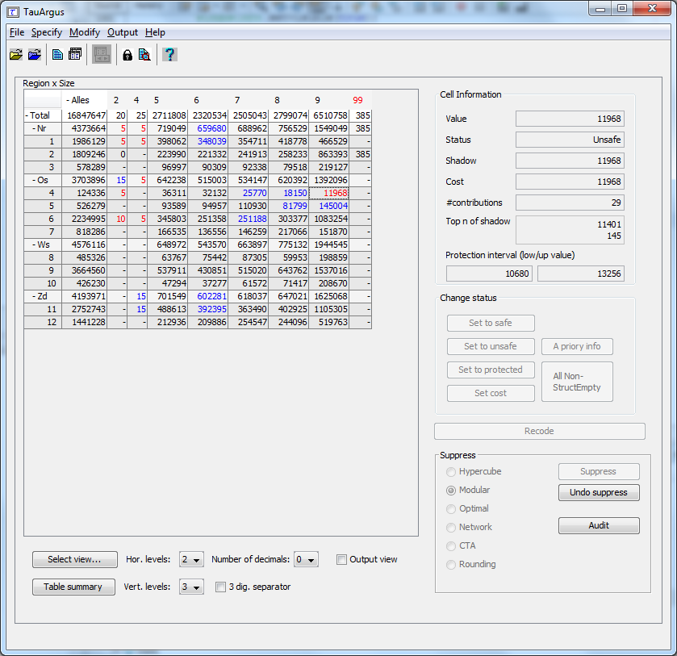

**Supplementary figure OCR (unverified; use the image for exact numbers, labels, and punctuation):**

```text
File Specify Modify Output Help

oe B

Blea\2

Region x Size

~alles

6

7

8

8

9

Call Information

Total _| 16847647|

20|__25| 2711808|

2520534|

2505043|

2739074|

6510758|

Value

11968 |

=H

4373664|

713043]

653680

756523)

1986123]

348039]

354711|

41873)

Status

Unsafe

221332]

241913)

Shadow

11968 |

96997]

"30309|

73518|

219127]

3703896|

15)

642233)

515003)

534147)

620382]

Cost

11968 |

124336|

36311

32132|

25770]

18150)

TiSes

110930]

31799]

145004]

‘#contrbutions

10

345803)

251358)

251188)

303377)

Top n of shadow

11401.

'818286|

146255)

217086 |

151879|

145

=Ws.

4576116|

648972)

543570]

663897)

775132)

1944545)

63767]

75442|

87305]

Protection interval ow/up value)

337911|

30851)

1515020)

643762|

1537016)

10680 |

426230

47294|

61572

71417|

7208670)

4193971|

15)

701549]

602281

618037)

647021|

‘Change status

it

2752743|

15)

288613)

7392385)

02925)

1105305)

1441223)

212936]

254547]

244036) _519763|

Set to safe

Set to unsafe

Aproryinfo |}

Set to protected

ALNon-

Set cost

Structematy

Recode

‘Suppress

Hypercube

[

Suppress

J

Moduiar

Optimal

Network

cma

(Secon

] vor tees: [Bo] Nabe of decal: [9 =

Output view:

Rounding

3dig. separator

(atic smmary_] vert. levels: [3 v
```

---

<a id="pdf-page-070"></a>

### PDF page 70 / manual page 69

[Original PDF page](https://research.cbs.nl/casc/Software/TauManualV4.1.pdf#page=70) · [Local source PDF](TauManualV4.1.pdf#page=70)

The standard version will run CTA without any further questions. The expert version will show the following window: You can e.g. select the solver and the type of CTA. We further refer to the detailed CTA documentation.

<a id="source-4-2-5"></a>

###### 4.2.5 Controlled rounding

The “Round” option in the View Table window is active only if the Xpress licence is selected in the Help|Option window, or the free solver will be used.. The reason for this is that for Xpress, τ-ARGUS has access to the Mixed Integer Model (MIP), thanks to the cooperation of Dash Inc. This option allows to round the selected table with the Controlled Rounding Program (see Section 2.14 for details on this method). The CPLEX licence used in combination with τ- ARGUS however does not include the MIP modules. In general, rounding is more appropriate for frequency tables than for magnitude tables. The next figure shows the simple frequency table obtained from the test data using the variable Size and Region.

#### Original figures on this page

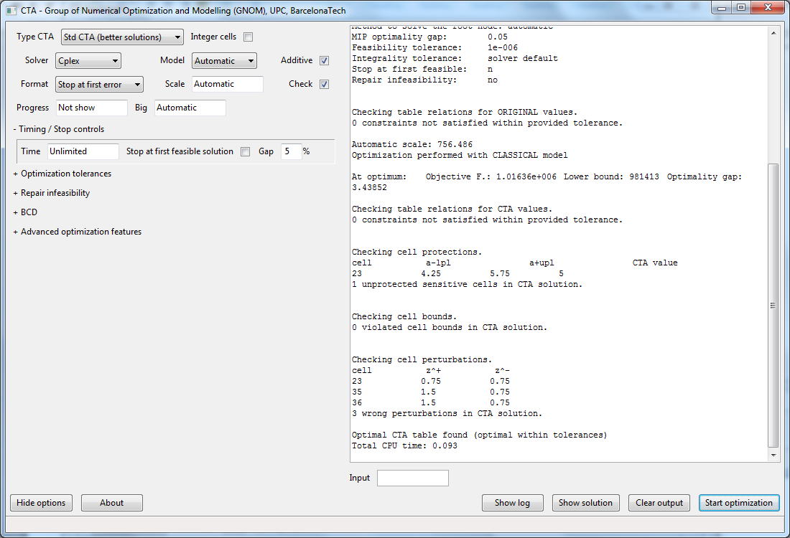

**Supplementary figure OCR (unverified; use the image for exact numbers, labels, and punctuation):**

```text
“=

. wl

CTA- Group of Numerical Optimization and Modelling (GNOM), UPC,

= sas |

ee

MIP optimality gap:

0.08

Feasibility tolerance:

e006

Integrality tolerance:

solver default

sok

a

vs ase

Stop at first feasibl:

Scale Automatic

Check

Repair infeasibility:

no

fomat(Sepatinero=)

Progress Not show

Big Automatic

Checking table relations for ORIGINAL values.

0 constraints not satisfied within provided tolerance.

= Timing / Stop controls

Automatic scale:

756.486

Time Unlimited

‘Stop at first feasible solution

Gap 5%

Optimization performed with CLASSICAL model

+ Optimization tolerances

|At optimum:

objective F.

1.01636e+006 Lower bound: 981413 Optimality gap:

3.43852

“+ Repair infeasibility

Checking table relations for CTA values.

+BCD

0 constraints not satisfied within provided tolerance.

+ Advanced optimization features

Checking cell protections.

cell

acipl

atupl

CTA value

23

4.25

5.75

5

1 unprotected sensitive cells in CTA solution.

Checking cell bounds.

(0 violated cell bounds in CTA solution.

Checking cell perturbations.

cell

os

a

23

0.75

0.75

35

1s

0.75

36

1s

0.75

3 wrong perturbations in CTA solution.

optimal CTA table found (optimal within tolerances)

‘Total CPU time: 0.093,

all

Input

eS SS |=

‘Start optimization
```

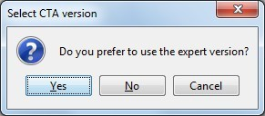

**Supplementary figure OCR (unverified; use the image for exact numbers, labels, and punctuation):**

```text
Select CTA version

Do you prefer to use the expert version?
```

---

<a id="pdf-page-071"></a>

### PDF page 71 / manual page 70

[Original PDF page](https://research.cbs.nl/casc/Software/TauManualV4.1.pdf#page=71) · [Local source PDF](TauManualV4.1.pdf#page=71)

Rounding can be applied also to tables with no unsafe cells. The choice of the minimum threshold and whether zeros are safe or not has an effect on the minimal possible rounding base, as it will be explained in the Option paragraph. When rounding has been chosen and the round-button has been pressed, the following window will be shown. You can enter a few parameters.

#### Original figures on this page

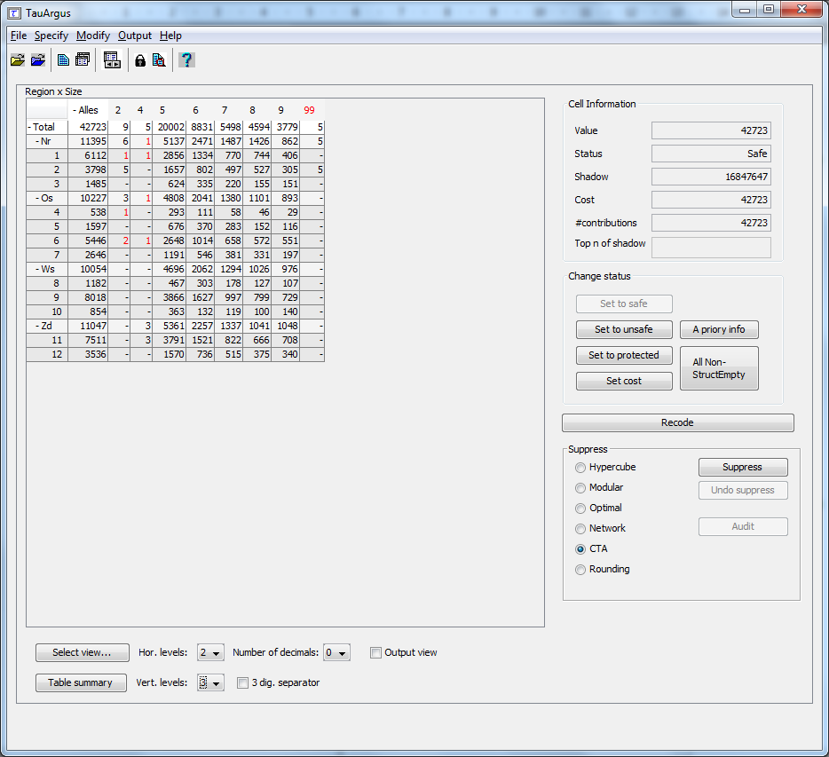

**Supplementary figure OCR (unverified; use the image for exact numbers, labels, and punctuation):**

```text
File Specify Modify Output Help

|Blea|?

Region x Size

Call Information

~alles

2

4

6

7

8

8

9

|-Total

42723|

20002|

3833

4594

Value

273

=H

11385)

3137]

2471

137|

1425|

6112)

Status

safe

302]

237)

Shadow

16847647

1485|

151

10227]

2041

1580]

1104]

Cost

273

iii]

1597|

676

116|

‘#contrbutions

273

1014]

351)

Top n of shadow

1191]

545)

31)

331)

197]

10054)

1025|

976)

1182|

467)

303)

173

107]

‘Change status

015)

397]

132]

119]

149]

Set to safe

11047]

5361

1041|

it

751i

3731

1521|

322]

666) 708|

1570|

736) 515)

375) 340)

Hypercube

Undo suppress

Audit

cA

Output view:

(Secon

] vor tees: [Bo] Nabe of decal: [9 =

3dig. separator

(atic smmary_] vert. levels: [Bx
```

---

<a id="pdf-page-072"></a>

### PDF page 72 / manual page 71

[Original PDF page](https://research.cbs.nl/casc/Software/TauManualV4.1.pdf#page=72) · [Local source PDF](TauManualV4.1.pdf#page=72)

Rounding Options

```text
The controlled rounding window allows to set the following parameters:
   •   Rounding Base
       Cell values will be changed to multiples of the base. The minimum
       rounding base is equal to the maximum between the minimum frequency
       threshold and twice the highest Protection Level set for an unsafe cell (with
       the Dominance or p-q rule). See the Section 2.2 for details on safety rules
       and section 2.6 protection levels. If no rule is specified the minimum base
       is 1. Rounding can be used to round a table for “cosmetic” motives.
   •   Number of steps allowed
       This value specifies the maximum number of steps allowed in order to find
       a feasible solution when a zero-restricted one does not exist. The default
       value is 0, i.e. zero-restricted. Higher values can be chosen by selecting the
       value from the drop-down menu. Note that the higher the number of steps
       allowed the lengthier is the search, hence the greater the risk of hitting the
       time constraint. At any rate, if a zero-restricted solution exists, this is the
       solution provided, whatever the number of steps allowed.
   •   Max computing time
       This value determines the time after which the user is prompted for a
       decision about continuing or stopping the search. The default value is 20
       minutes. When the maximum time is hit the user is prompted to enter a
       new maximum time or to choose to terminate the search.
   •   Partitions
       This option enables the partitioning of the table into sub-tables
       corresponding to each category of the first spanning variable. This option
       is recommended for tables with more than approximately 150,000 cells.
       Partitioning can only be used in this version when the first variable is non-
       hierarchical. The first variable should be such that the sub-tables have
```

#### Original figures on this page

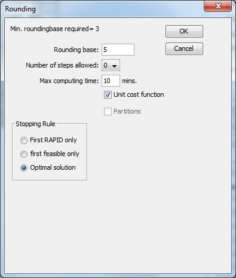

**Supplementary figure OCR (unverified; use the image for exact numbers, labels, and punctuation):**

```text
Rounding

Min. roundingbase require

Rounding base: |5

Number of steps allowed: [0

Max computing time: [10

mins,

Unit cost function

Partitions

| Stopping Rule

First RAPID only

) frst feasible only

© Optimal solution
```

---

<a id="pdf-page-073"></a>

### PDF page 73 / manual page 72

[Original PDF page](https://research.cbs.nl/casc/Software/TauManualV4.1.pdf#page=73) · [Local source PDF](TauManualV4.1.pdf#page=73)

```text
        maximum size of about 150,000 cells and also trying to keep their number
        low; performance may be improved by wisely choosing the partitioning
        variable. See Section (rounding theory) for further details.
    •   Stopping Rule
These options allow to control the quality of the rounded solution. The user can
choose:
    •   First Rapid
        The solution is obtained by rounding conventionally (to the closest
        multiple of the base) the internal cells and then the marginal values are
        obtained by addition. This solution is likely to present several values that
        have a large distance from the original values. This option should be used
        with extreme care and, likely, when everything else fails;
    •   First feasible
        The solution provided is the first rounded one that has the specified
        number of jumps, regardless of its optimality. This means that there could
        exist other solutions that have a lower overall distance from the original
        table. In many cases, when optimality is not crucial, this solution is quite
        close to the optimal one and it can be found in a shorter time;
    •   Optimal
        This option provides the fully optimal controlled rounded solution.
The rounded table
The next figure shows the rounded table with the values rounded to multiples of 5.
Note that the values that were originally zero (hence empty cells denoted with a
dash) are still shown as a dash while the values that have been rounded down to
zero are shown as zeros.
```

---

<a id="pdf-page-074"></a>

### PDF page 74 / manual page 73

[Original PDF page](https://research.cbs.nl/casc/Software/TauManualV4.1.pdf#page=74) · [Local source PDF](TauManualV4.1.pdf#page=74)

<a id="source-4-2-6"></a>

###### 4.2.6 The audit procedure

After the secondary cell suppression procedure has been carried out all cells should have been properly protected. Cell suppression guarantees that unsafe cells cannot be estimated to a narrower interval that the required protection interval. The realised upper and lower bounds can be computed by solving two linear programming problems for each unsafe cell. This can be rather an effort doing it all manually, but the audit procedure will do this. Note that the Model solved by the audit procedure will check only for the required protection levels, but not for the additional singleton protection. See also section 2.15. The Audit option will only be active after secondary cell suppression. By activating the procedure all the linear programming problems for all unsafe (both primary and secondary) cell will be computed. When completed a message will be showing whether all cells were protected correctly.

#### Original figures on this page

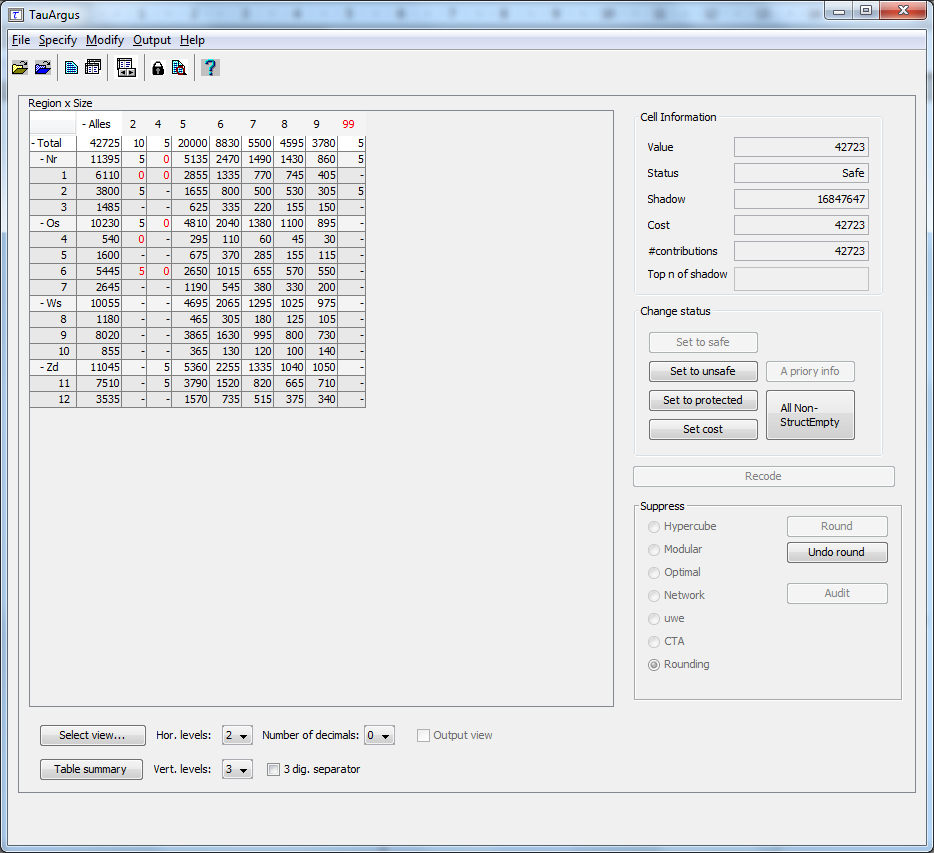

**Supplementary figure OCR (unverified; use the image for exact numbers, labels, and punctuation):**

```text
|[File Specify Modify Qutput Help

|Blea|?

| pa

Call Information

~alles

2

4

5

6

9

|-Total

42725|

20009]

5500|

4595| 3780)

Value

273

=H

11385)

5135

2470]

19]

1430|

6110)

Status

safe

Shadow

16847647

1485|

10230]

810]

1109]

95]

Cost

273

120]

675

145

‘#contrbutions

273

1015|

Top n of shadow

1199]

10055)

4635|

1295|

1025|

975)

1180|

‘Change status

'3020|

140]

Set to safe

11045)

1040] 1050]

it

7510]

665) 710|

1570| 735)

515)

375) 340)

Recode

‘Suppress

Hypercube

Round

Moduiar

Optimal

Network

Audit

uwe

ory

Rounding

(output view

(Secon

] vor tees: [Bo] Nabe of decal: [9 =

3dig. separator

(atic smmary_] vert. levels: [3 v
```

---

<a id="pdf-page-075"></a>

### PDF page 75 / manual page 74

[Original PDF page](https://research.cbs.nl/casc/Software/TauManualV4.1.pdf#page=75) · [Local source PDF](TauManualV4.1.pdf#page=75)

If in the unfortunate case the protection was not optimal according to the audit procedure a list of problems will be shown. Also the problematic cells will be highlighted. For each unsafe cell the realised lower and upper bounds will be shown. If you put your mouse on the value also the distance to the real value and the corresponding percentage will be shown

#### Original figures on this page

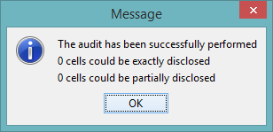

**Supplementary figure OCR (unverified; use the image for exact numbers, labels, and punctuation):**

```text
Message

‘The audit has been successfully performed

O cells could be exactly disclosed

O cells could be partially disclosed

OK
```

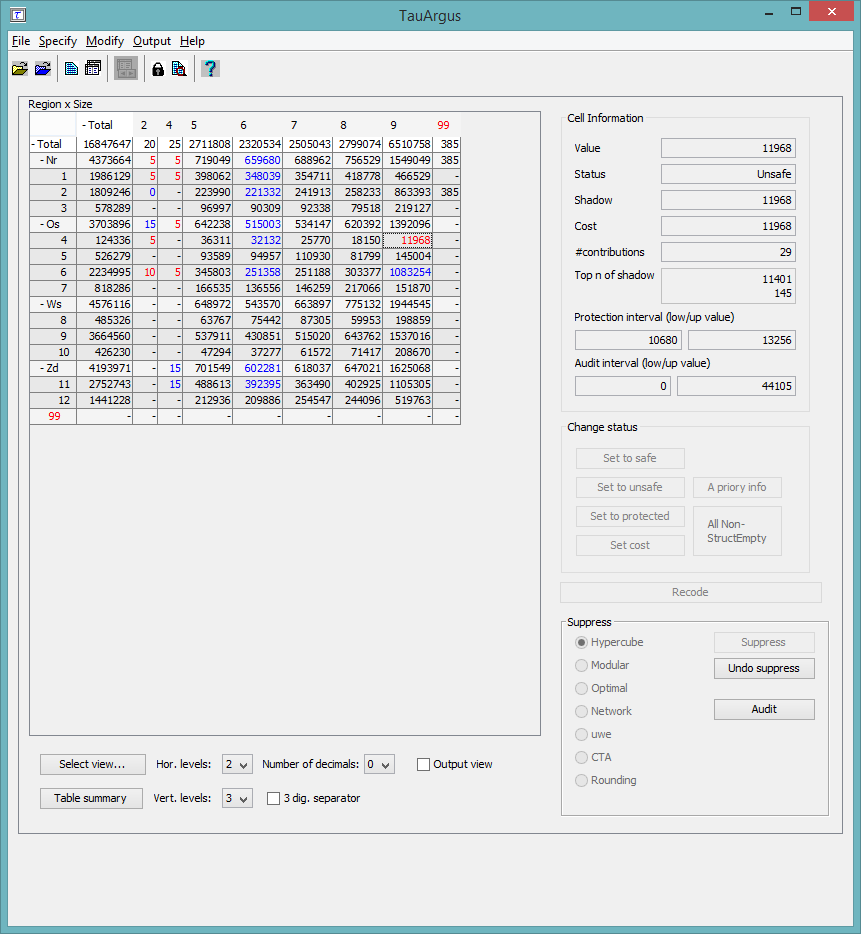

**Supplementary figure OCR (unverified; use the image for exact numbers, labels, and punctuation):**

```text
i)

File Specify Modify Output Help

Blaale

Region x Size

Total

6

7

8

Call Information

|-Total_| 16847647|

20|__25| 2711808|

2520534|

2505043|

2739074|

6510758|_335|

Value

11968 |

=Nr

4373664|

713043]

653680]

1549049) 385)

1986123]

348039]

354711|

41873)

Status

221332]

241913)

Shadow

11968 |

96997]

"30309|

73518|

219127]

3703896|

15)

642235|

515003|

534147]

620392|

1392096]

Cost

11968 |

124336|

36311

32132|

18150)

TiSes

110930]

31739)

145004]

‘#contrbutions

345803)

251353]

251188)

303377)

Top n of shadow

11401.

'818286|

146255)

217086 |

151879|

145

=Ws.

4576116|

648972|

543570

1663897|

775132)

63767]

75442|

87305]

Protection interval ow/up value)

337911|

30851)

1515020)

643762|

1537016)

10680 |

426230

47294|

61572

71417|

7208670)

4193971|

15)

701549]

602281

618037|

ea21|

Auditinterval (ow/up value)

it

2752743|

288613)

7392385)

02925)

1105305)

ol

44105)

14412283)

212936

254547)

1519763)

‘Change status

Set to safe

Set to unsafe

A priory info

Set to protected

‘AlINon-

Set cost

‘Structempty

Recode

© Hypercube

Suppress

[Undo suppress

Optimal

‘Audit

Network

uwe

‘select view.

Hor. levels: [2 y] Number of decimals: |0_ y

cma

Cloutput view

Rounding

Table summary | Vert. levels: [3 y

(713di. separator
```

---

<a id="pdf-page-076"></a>

### PDF page 76 / manual page 75

[Original PDF page](https://research.cbs.nl/casc/Software/TauManualV4.1.pdf#page=76) · [Local source PDF](TauManualV4.1.pdf#page=76)

<a id="source-4-2-7"></a>

###### 4.2.7 The Options at the Bottom of the table

At the bottom of this window there are a few additional options. These options will be described here. Select View By clicking on Select View a dialog box below pops up. The user can specify which variable is preferred in the row and the column. In the two-dimensional case, the table can only be transposed. In the higher dimensional case, the remaining variables will be in the layer. For these layer variables a combo-box will appear at the top of the table, where the user can select a code. This will show the corresponding slice of the table.

For a 3 dimensional table, this window is as follows:

#### Original figures on this page

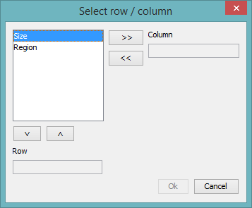

**Supplementary figure OCR (unverified; use the image for exact numbers, labels, and punctuation):**

```text
en el

<<

Ok

cancel
```

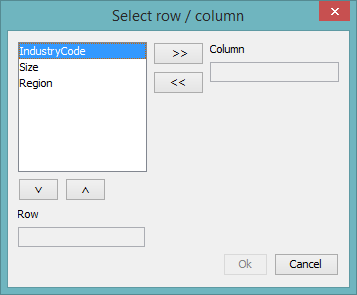

**Supplementary figure OCR (unverified; use the image for exact numbers, labels, and punctuation):**

```text
>

<<

Ok

cancel
```

---

<a id="pdf-page-077"></a>

### PDF page 77 / manual page 76

[Original PDF page](https://research.cbs.nl/casc/Software/TauManualV4.1.pdf#page=77) · [Local source PDF](TauManualV4.1.pdf#page=77)

Table summary Pressing 'table summary' provides a table summary giving an overview of the number of cells according to their status. The example shown here refers to the case after secondary suppression has been performed.

The headings in the summary window are as follows: Freq: The number of cells in each category # rec: The number of observations in each category Sum resp: Total cell value in each category Sum cost: The sum of the cost variable. Hor. Levels and Vert. levels A large (hierarchical) table can never be shown completely on the screen. Therefor τ-ARGUS will start by showing only the top-2 levels of the hierarchy. With these options you can specify that more levels of the table must be shown. Alternatively you can click on the + and – symbols of the hierarchical codes in the table to fold and unfold parts of the table. 3 dig separator This removes or inserts the character separating the thousands for the values in the table. Output View This option allows the table to be shown as it will be output, with suppressed cells (primary and secondary) replaced by a X.

#### Original figures on this page

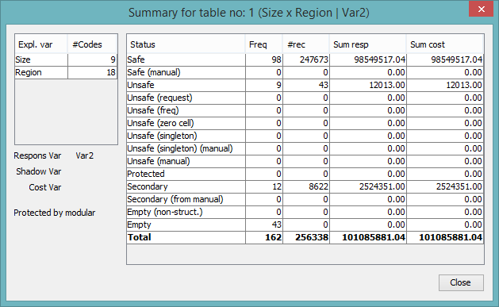

**Supplementary figure OCR (unverified; use the image for exact numbers, labels, and punctuation):**

```text
Bxpl. var

+#Codes

status

Freq

rec

‘sum resp

‘Sum cost

{size

9

fe

93 247673)

98549517.04)

98549517.04)

33)

fe (manual)

Q

0.00]

0.00]

a3

2013.00]

2013.00]

[Unsafe

[Unsafe Gequest)

0.00]

0.00]

0.00]

0.00]

[Unsafe (Fea)

[Unsafe (ero ca)

0.00]

0.00]

0.00]

0.00]

[Unsafe (ndleton)

[Unsafe (ndleton) (manuel)

0.00]

0.00]

Respons Var Var2

[Unsafe (manual)

0.00]

0.00]

Shadow Var

Protected

0.00]

0.00]

Cost Var

[Secondary

72524351.00)

72524351.00)

0.00]

0.00]

[Secondary (fom manuel)

Protected by modular

[Emoty (non-struct.)

0.00]

0.00]

a3

0.00]

0.00]

‘Total

162|

256338, _101085861.04|

101085881.04|
```

---

<a id="pdf-page-078"></a>

### PDF page 78 / manual page 77

[Original PDF page](https://research.cbs.nl/casc/Software/TauManualV4.1.pdf#page=78) · [Local source PDF](TauManualV4.1.pdf#page=78)

<a id="source-4-3"></a>

##### 4.3 The File menu

τ-ARGUS can read data in two ways. The first option is that τ- ARGUS will read the data from a microdata file (fixed format, free format and a SPSS_systemfile), which is explained in section 4.3.1. From this microdata τ-ARGUS can then build one or more tables and during this tabulation process compute all necessary additional information, needed to fully protect a table. This is the most flexible way allowing using all the functionality of τ-ARGUS. The second option is the input and treatment of a pre-tabulated data and is dealt with in section 4.3.2. Only one of these options can be used at one time, a pre- tabulated table and tables computed from microdata cannot be read in τ- ARGUS simultaneously. A set of pre-tabulated tables can be read into τ- ARGUS and via the linked tables procedure be protected. See section 4.3.3. τ-ARGUS can also be used in batch, see section 4.3.4. Finally the τ-ARGUS can be closed.

<a id="source-4-3-1"></a>

###### 4.3.1 File | Open Microdata

The File|Open microdata menu allows the user to specify the microdata file (both fixed and free format or a SPSS-system file) and optionally the metadata file.

```text
In this dialog box the user can select the microdata-file or the SPSS system file and
optionally the corresponding metadata file
By default the microdata-file has extension .asc and the metafile .rda. .(Note, the
user may use any file extension, but is advised to use default names).
When the user clicks on          he will get the traditional open file dialog box.
```

#### Original figures on this page

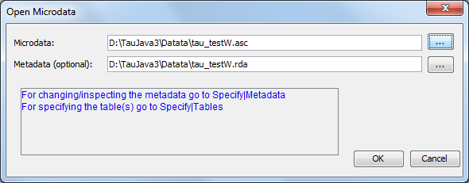

**Supplementary figure OCR (unverified; use the image for exact numbers, labels, and punctuation):**

```text
Open Microdata

Microdata:

[D:\Taulavaa\patataltau_testW.asc

Metadata (optional):

D:\Taulavaa\Patataltau_testW.rda

FFor changing/inspecting the metadata go to SpecifyMetadata

For specifying the table(s) go to Specify/Tables

(ici) (cei)
```


---

<a id="pdf-page-079"></a>

### PDF page 79 / manual page 78

[Original PDF page](https://research.cbs.nl/casc/Software/TauManualV4.1.pdf#page=79) · [Local source PDF](TauManualV4.1.pdf#page=79)

This box enables searching for the required files. Other file-extensions can be chosen when clicking on the files of type listbox. When the user has selected the microdata file a suggestion for the metafile (with the same name but with the extension .rda) is given but only when this file exists. Note, both files do not necessarily have to have the same name. If a user selects a data file with another extension,τ- ARGUS will remember this and will suggest this extension in a future use of τ-ARGUS. A full description of the metadata file can be found in section 5.1. When the data file has been selected and optionally the meta data file, you can proceed to the menu options Specify|Metafile to edit/modify the meta data file and to Specify|Tables to specify the tables required. See section 4.4 and 4.4.4.

<a id="source-4-3-2"></a>

###### 4.3.2 File | Open Table

This is the option allowing the input of tabular data into τ- ARGUS. In this case, an already-constructed table is read in. This is reached by selecting ‘Open Table’ in the file menu of τ-ARGUS.

#### Original figures on this page

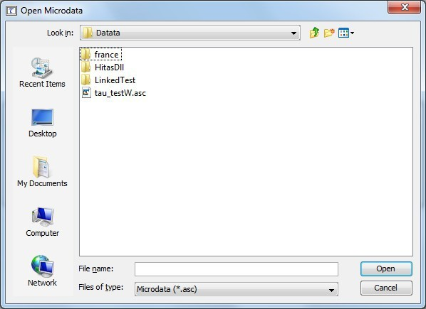

**Supplementary figure OCR (unverified; use the image for exact numbers, labels, and punctuation):**

```text
Lookin: (J) Datata

=

aoe

S

Sy HitasDi

Recent Items

Ls LinkeaTest

tau_testWaasc

Desktop

B

My Documents

|

Computer

«

File name:

Network

Fies of type: microdata (ase)

=
```

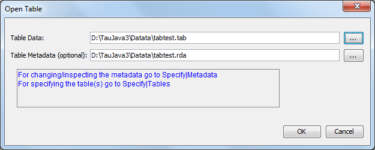

**Supplementary figure OCR (unverified; use the image for exact numbers, labels, and punctuation):**

```text
Table Data:

D:\Taulava3\Datataltabtest. tab

Table Metadata (optional): [D:\Taulavad\Datataltabtest.rda

FFor changing/inspecting the metadata go to SpecifyMetadata

For specifying the table(s) go to Specify[Tables

(ci) (cis)
```

---

<a id="pdf-page-080"></a>

### PDF page 80 / manual page 79

[Original PDF page](https://research.cbs.nl/casc/Software/TauManualV4.1.pdf#page=80) · [Local source PDF](TauManualV4.1.pdf#page=80)

```text
The name of the file containing the table to be opened (in the format given below)
needs to be specified in the first line. Optionally the name of the file containing the
metadata is entered in the second line. Later on you will be offered the option of
adapting the metadata or even enter the metadata from scratch.
There is a great flexibility with this option.
The structure of the file is that each line/record describes one cell in free format.
The separator is to be specified in the metadata. The more detail is given for each
cell, the more τ-ARGUS can do for you.
In any case for each cell the codes of the explanatory variables and the cell value
need to be given. Optionally the following information can be specified:
    •   Frequency
    •   Status
    •   Cost variable
    •   Shadow variable
    •   Top-n variables
    •   Lower and upper protection levels
The more details are given for each cell to more flexibility τ- ARGUS offers in a later
stage to apply sensitivity rules etc.
If only the cell status is provided, τ- ARGUS can only use that and give each unsafe
cell a fixed protection level of some percentage to be specified. If also the largest
say 2 contributors are provided, τ- ARGUS can apply most of the sensitivity rules,
like a p% rule of a dominance rule (up to n=2).
It is important
    1. To stress that all the cells of a table have to be specified as τ- ARGUS will
       not compute any (sub-)totals. In most situations this is simply impossible.
    2. A table has to be additive. Theoretically this is trivial, but many methods to
       protect a table even require strict additivity.
After clicking ‘OK’ you can either proceed by adapting the metadata via Specify|
Metafile or by specifying the table details via Specify|Table.
This (artificially generated) datafile shows 2 explanatory variables, cell value, cell
frequency and the top 3 values in each cell. With this information τ-ARGUS is still
able to apply the primary sensitivity rules, like p% rule.
An example of a 2 dimensional table
  T, T, 2940 ,48, 200,200,200
  T, A, 745 ,12, 200,100,100
  T, B, 810 ,12, 200,100,100
  T, C, 685 ,12, 200,100,100
  T, D, 700 ,12, 200,100,100
  1, T, 795 ,12, 200,100,100
  1, A, 350 ,3,            200,100,50
  1, B, 190 ,3,            100,50,40
  1, C, 150 ,3,            100,40,10
  1, D, 115 ,3,            50,40,25
  2, T, 670 ,12, 200,100,100
  2, A, 115 ,3,            50,40,25
  2, B, 340 ,3,            200,100,40
```

---

<a id="pdf-page-081"></a>

### PDF page 81 / manual page 80

[Original PDF page](https://research.cbs.nl/casc/Software/TauManualV4.1.pdf#page=81) · [Local source PDF](TauManualV4.1.pdf#page=81)

```text
2,    C,    115 ,3,         50,40,25
2,    D,    120 ,3,         100,10,10
3,    T,    785 ,12,        200,100,100
3,    A,    190 ,3,         100,50,40
3,    B,    115 ,3,         50,40,25
3,    C,    325 ,3,         200,100,25
3,    D,    165 ,3,         100,40,25
4,    T,    690 ,12,        200,100,100
4,    A,    100 ,3,         50,25,25
4,    B,    175 ,3,         100,50,25
4,    C,    115 ,3,         50,40,25
4,    D,    310 ,3,         200,100,10
```

Alternatively if only the status is given to τ-ARGUS , there is no other option than to use the status and treat all unsafe cells as ‘manually’ unsafe and apply the manual safety margin.

```text
T,    T, 2940 ,u
T,    A, 745 ,s
T,    B, 810 ,s
T,    C, 685 ,s
T,    D, 700 ,s
1,    T, 795 ,s
1,    A, 350 ,s
1,    B, 190 ,s
1,    C, 150 ,s
1,    D, 115 ,s
2,    T, 670 ,s
2,    A, 115 ,s
2,    B, 340 ,s
2,    C, 115 ,u
2,    D, 120 ,u
3,    T, 785 ,s
3,    A, 190 ,s
3,    B, 115 ,s
3,    C, 325 ,s
3,    D, 165 ,s
4,    T, 690 ,s
4,    A, 100 ,s
4,    B, 175 ,s
4,    C, 115 ,s
4,    D, 310 ,s
```

For tables of dimension 3 or higher, additional columns for the explanatory variables need to be added as well as additional rows to allow for the increased depth of the table. The next step will be to optionally edit the metadata and then read the table.

---

<a id="pdf-page-082"></a>

### PDF page 82 / manual page 81

[Original PDF page](https://research.cbs.nl/casc/Software/TauManualV4.1.pdf#page=82) · [Local source PDF](TauManualV4.1.pdf#page=82)

<a id="source-4-3-3"></a>

###### 4.3.3 File | Open Table Set

When the linked tables procedure will be used in combination with tabular input, the option “Open Table Set” must be used to read a set of tables in τ-ARGUS. The “Open Table” option as described above (4.3.2) allows for only one single individual table. In this option a set of tables with the corresponding metadata files (*.rda) is specified. When the set is complete, press the OK-button.

After pressing the OK-button, you will be guided automatically to the Specify Tables window. This is described in section 4.4.5. In the linked tables approach it is no longer possible to modify the metadata. As the same rules will be applied to each individual table, you will be guided to the Specify Tables window only once. The choices will be applied to each table. This implies that all tables in a linked set should have the same additional variables, as described in the previous section 4.3.2. Please note that it is advisable to read each table in τ-ARGUS before. This to be sure that the specification of the tables and the metadata is correct, before starting the linked tables procedure.

<a id="source-4-3-4"></a>

###### 4.3.4 File | Open Batch Process

This option allows the user to run the commands in batch mode from opening the microdata and metadata, protecting the table and creating the output of the final table(s). If the last line of the batch-file is `<GOINTERACTIVE>` τ- ARGUS will first perform all the actions as specified in the batch-file and then open the main menu and giving the control to the user to continue the work in the interactive modus.

#### Original figures on this page

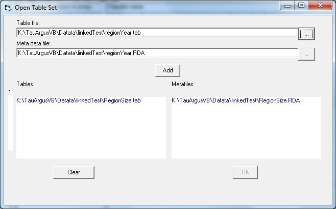

**Supplementary figure OCR (unverified; use the image for exact numbers, labels, and punctuation):**

```text
Table fe:

IK \TauAigusVB \Datata\inkedT est\vegion'veartab

ie

Meta datafile:

IK \TauAigusVB \Datata\inkedTest\region'vear ADA

|

(3

Tables

Metaflles

K:\TauArgusVB\DatatallinkedTest\RegionSize.tab

K:\TauArgusVB\Datata\linkeaT est\RegionSize.ADA

Cla

al]

|
```

---

<a id="pdf-page-083"></a>

### PDF page 83 / manual page 82

[Original PDF page](https://research.cbs.nl/casc/Software/TauManualV4.1.pdf#page=83) · [Local source PDF](TauManualV4.1.pdf#page=83)

The lay-out of the batch-file is described in section 5.7. Note that a log file is maintained of all actions. This is the place to look if something might go wrong, as a batch-process typically does not report to a GUI. By default the log file is “Logbook.txt” in the temp-directory, but in the batch-file a different file can be chosen. Also from the command-line a log file name can be specified. See also section 5.7.

<a id="source-4-3-5"></a>

###### 4.3.5 File | Exit

Exits the τ-ARGUS-session.

<a id="source-4-4"></a>

##### 4.4 The Specify menu

The metadata structure is different for describing microdata and tabular data. Therefor the structure of the metadata file (RDA-file) is different and also the window to specify and modify the metadata is different. The version presented depends on the type of data that has been selected. We will first describe the situation for microdata (section 4.4.1) and then for tabular data (section 4.4.3).

<a id="source-4-4-1"></a>

###### 4.4.1 Specify | Metafile [for microdata]

Clicking on ‘Specify|Metafile’ gives the user the opportunity to either edit a metafile already read in or to enter the metadata information directly at the computer from scratch. In this dialog box all attributes of the variables can be specified. This is a good alternative to manually edit the rda-file outside τ- ARGUS. τ-ARGUS does a moderate checking of the rda-file, but no guarantee can be given for a proper functioning of a manually edited rda-file. The rda-file has been explained in detail in section 5.1. Here, the editing of a rda-file within τ-ARGUS is looked at.

#### Original figures on this page


**Supplementary figure OCR (unverified; use the image for exact numbers, labels, and punctuation):**

```text
Sy Mtn rrr

Fixed format

=

“Attributes:

Type

tie) |

Starting position:

@ Explanatory

a: [99

Length:

(© Response

© Exp. /Resp.

Decimals:

Code for total:

© Sample weight

(© Haleing indicator

(© Request protection

Distance for suppression weight |2

la

la

la

la

(© Automatic

© Codelis flename

REGION.COL

‘Hierarchy

© Non hierarchical

© Levels from microdata

@ Levels from fle

.eading string: |@

region2.hre

(ci) (cis)
```

---

<a id="pdf-page-084"></a>

### PDF page 84 / manual page 83

[Original PDF page](https://research.cbs.nl/casc/Software/TauManualV4.1.pdf#page=84) · [Local source PDF](TauManualV4.1.pdf#page=84)

```text
If under File|Open Microdata an rda-file has been specified, this dialog box shows
the contents of this file. If no .rda-file has been specified the information can be
specified in this dialog box after pushing the New button. As default "New" is
substituted as the variable name, but the user is expected to fill in a correct name.
Apart from defining a new variable, an existing one can be modified or deleted.
In the left top field the file type (fixed, free format or SPSS) can be specified.
The following attributes for each variable can be specified or edited:
    •   name of the variables
    •   its first position in the data file (for fixed format)
    •   its field-length
    •   the number of decimals (for numerical variables).
    •   Furthermore, the role of variable can be specified or edited (more detail on
        these can be seen in section 4.3.1):
    •   explanatory variable: This can be used as a spanning variable in the row or
        column of the table
    •   response variable: This can be used as a cell-item
    •   weight variable: This specifies the sampling-weight of the record and is
        based on the sampling design used.
The following are special variable types and have not been previously described.
As they are specific to designating safety rules, more detail is given in section
4.4.4.
Holding Indicator
The Holding indicator: sometimes groups of records belong together. E.g. if a set
of records describe the contributions of one business to various cells. So it could be
better to apply the confidentiality protection at the business level in all cells of the
table, especially the marginal cells. This variable is the group identifier. τ- ARGUS
expects the records of a group to be together in the input datafile. An example is
shown in section 4.4.4.
Request Protection
The Request protection option is used if the Request Rule under ‘Specify tables’ is
to be applied. This variable indicates whether or not a record asked for protection.
This is further explained in section 4.4.4. Additionally the codes specifying
whether a respondent asked for asking protection is to be specified; two different
codes are possible, corresponding to two different sets of parameters in the
sensitivity rule. This rule is often used in Foreign Trade Statistics.
Distance function
When finding a pattern of secondary suppressions, most methods try to minimalize
some kind of cost function. Often the costs are some value linked to each cell.
Some users like to group the secondaries close to the primaries. The advantage is
that loss of information is grouped in certain parts of the table.
This can be achieved by used the distance function. The costs for each cell depend
on the number of steps the cell is apart from a primary. For each step the cost can
be specified, with a maximum of 5.
The distance function can only be applied in combination with the modular
suppression method.
```

---

<a id="pdf-page-085"></a>

### PDF page 85 / manual page 84

[Original PDF page](https://research.cbs.nl/casc/Software/TauManualV4.1.pdf#page=85) · [Local source PDF](TauManualV4.1.pdf#page=85)

Total code Optionally a code for the total can be chosen; the default is "Total". Additional Specifications Other attributes, which may be edited or specified are missing value options, (optional, not required) codelist files, (optional, not required) hierarchies. Details on these options have been given in section 4.3.1. In summary, for codelist the ‘automatic’ option simply generates the codes from the data. Specifying a codelist, allows the user to supply an additional file (usually .cdl) containing the labels attached to the codes. These labels are used to enhance the information by τ- ARGUS on the screen. In both cases τ- ARGUS will use the codes that it finds in the datafile. Hierarchies can either be derived from the digits in the codes or from a file (usually .hrc) The RDA file Here is an example of a rda file for microdata. This has already been shown in section 4.3.1 and is shown here for completeness. (Note, the dots at the bottom just means that here a shortened version of the file is presented.)

```text
 Year 1 2
   <RECODEABLE>
 IndustryCode 4 5 99999
   <RECODEABLE>
   <HIERARCHICAL>
   <HIERLEVELS> 3 1 1 0 0
   <DISTANCE> 1 3 5 7 9
 Size 9 2 99
   <RECODEABLE>
   <TOTCODE> Alles
 Region 12 2
   <RECODEABLE>
   <CODELIST> "REGION.CDL"
   <HIERARCHICAL>
   <HIERCODELIST> "region2.hrc"
   <HIERLEADSTRING> "@"
   <DISTANCE> 2 4 4 4 4
 Wgt 15 4 9999
   <DECIMALS> 1
   <WEIGHT>
 Var1 19 9 999999999
   <NUMERIC>
 Var2 28 10 9999999999
   <NUMERIC>
    <DECIMALS>         2 ………………
See also section 5.1.1 for a more detailed description
τ-ARGUS can also read free format data files. In that case there are slight differences.
You select free format in the combo box in the left upper corner. And specify the
separator used. The parameter starting position is no longer valid and will not be
visible.
```

---

<a id="pdf-page-086"></a>

### PDF page 86 / manual page 85

[Original PDF page](https://research.cbs.nl/casc/Software/TauManualV4.1.pdf#page=86) · [Local source PDF](TauManualV4.1.pdf#page=86)

<a id="source-4-4-2"></a>

###### 4.4.2 Specify | Metafile [SPSS System files]

When τ-ARGUS works with a SPSS system file the specification of the meta data is twofold. The data is stored in the SPSS system file and also the metadata. But the metadata available in the SPSS system file is not enough for τ-ARGUS. E.g. no information on hierarchies is available. So the SPSS metadata is only a starting point. The metadata has to be extended. The procedure is that τ-ARGUS will retrieve the SPSS meta data and then expects the user to extend the metadata, using the familiar window; see section 4.4.1. However certain variables in the metadata cannot be changed any more as we have to guarantee that the extended metadata is still applicable to the SPSS system file. E.g. the length of the variables cannot be modified nor the number of decimals nor the name. Selecting the variables. If no RDA file but only the SPS-system file has been specified you have to select the variables of interest running τ- ARGUS. At the bottom of the metadata window you will find a button “SPSS meta”. This will bring you to a window showing all variables available. Make a selection.

If the RDA-file has been specified too this step is not needed. Extending the metadata Secondly the meta data has to be filled in that could not be automatically retrieved from the system file. SPSS gives only the basic information like variable names, field length. But northing about SDC-specific information The working of τ-ARGUS when using a SPSS system file is very similar to the fixed format version, However you will see that certain fields cannot be changed as they are implied by SPSS. This is to guarantee that the τ- ARGUS metadata is still applicable to the SPSS system file.

#### Original figures on this page

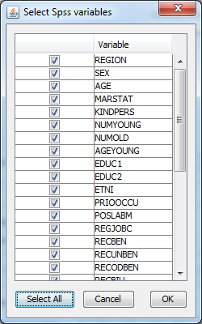

**Supplementary figure OCR (unverified; use the image for exact numbers, labels, and punctuation):**

```text
Select Spss variables

[REGION

[MARSTAT

jouct

Duce

PRIOOCOU

JREG208¢

JRECODEEN

‘Seect Al

(cancel)

[0K
```

---

<a id="pdf-page-087"></a>

### PDF page 87 / manual page 86

[Original PDF page](https://research.cbs.nl/casc/Software/TauManualV4.1.pdf#page=87) · [Local source PDF](TauManualV4.1.pdf#page=87)

Often τ-ARGUS cannot decide whether a variable from SPSS is a spanning variable or a response variable (eg AGE recoded numerically in SPSS). Also the hierarchical information has to be added. Refer to section 4.4.1. When the metadata is ready, you can save it in the traditional way. This RDA file can also be used if you want to use this SPS system file again. For the rest will behave exactly as if a fixed format microdata input file had been used. Only if you start computing tables computing the tables τ- ARGUS will automatically first extract the data from SPSS before computing the tables. Apart from a small delay you will not notice this.

<a id="source-4-4-3"></a>

###### 4.4.3 Specify | Metafile [for tabular data]

```text
When a tabular datafile has been selected, the metadata window will have a
different form. Clicking on ‘Specify|Metafile’ gives the opportunity to either edit
the metafile already read in or to enter the metafile information directly at the
computer. In section 5.1.4 a detailed description of the metafile for tabular data can
be found
Below is displayed the ‘Specify metafile’ window for tabular input data.
Above the list of variables the separator used to separate the variables in the
datafile can be specified.
Here, the variables can be specified or edited as required.
The options are:
    •   ‘Explanatory’ – The spanning variables used to produce the table.
    •   ‘Response’– The variable used to calculate the cell total.
    •   ‘Shadow’– The variable is used as a shadow variable.
```

#### Original figures on this page

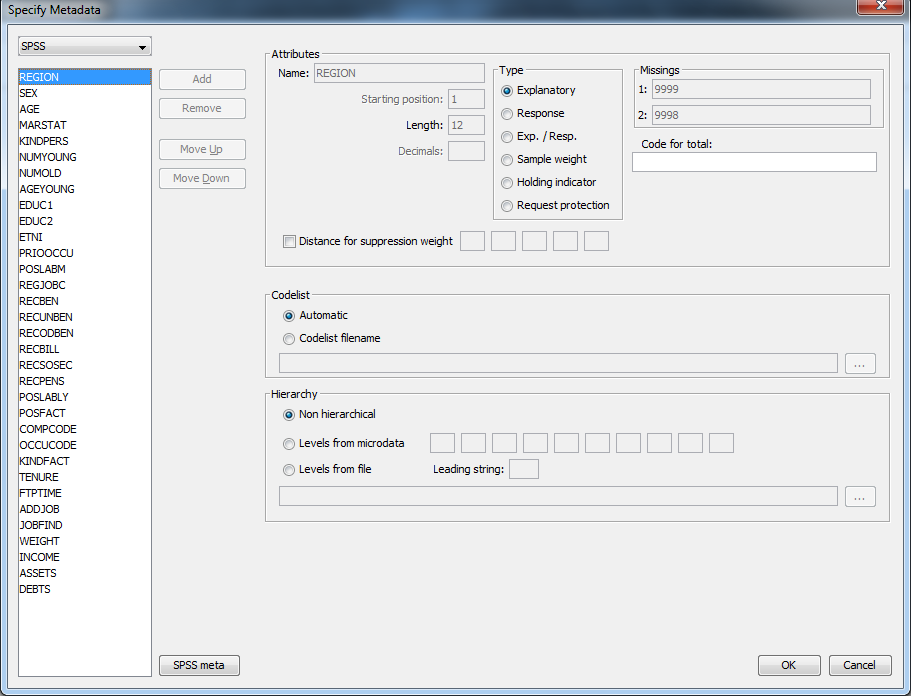

**Supplementary figure OCR (unverified; use the image for exact numbers, labels, and punctuation):**

```text
“Attributes:

Name: [REGION

Type

[

Add

1: [2399

Starting position: [1

Expianatory

[

Remove

2: [a998

rAT

Length: [12

Exp. /Resp.

Code for total:

[

Move Up

‘Sample weight

(leven:

n_|

Holding indicator

Request protection

[P]0istance for suppression weight

) Automatic

Codelstflename

‘Hierarchy

) Non hierarchical

co

) Levels from microdata

KINDFACT

) Levels from fle

Leading string

ND

EIGHT

fn

Ss

bet

(ci) (cis)
```

---

<a id="pdf-page-088"></a>

### PDF page 88 / manual page 87

[Original PDF page](https://research.cbs.nl/casc/Software/TauManualV4.1.pdf#page=88) · [Local source PDF](TauManualV4.1.pdf#page=88)

```text
•   ‘Cost’– The variable is used as the cost-variable.
•   ‘Lower prot .Level’ – The lower protection level
•   ‘Upper prot. Level’ – The upper protection level
•   ‘Frequency’ – This indicates the number of observations making up the
    cell total. If there is no frequency variable each cell is assumed to consist
    of a single observation.
•   ‘topN variable’ – This shows if this variable is defined as one of the top N
    contributors to the cell. The pre-defined value for TopN is 1. The first
    variable declared as ‘topN’ will contain the largest values in each cell, the
    second variable so declared will contain the second largest values etc.
•   ‘Status indicator’ – allows a variable in the left-hand pane to be declared as
    a Status Indicator. Typically cells can be declared as Safe, Unsafe or
    Protected.
```

The codelist and the hierarchy are the same as for microdata, so we refer to section 4.4.1. For explanatory variables the code for the total has to be specified. We strongly recommend strongly that the user also provides the values for the totals himself, but if needed he can ask τ- ARGUS to compute these totals. However it should be noted that when the option to compute the totals by τ- ARGUS is selected you will lose vital information as the cell status. See also section 4.4.5 In any case, τ-ARGUS needs these totals as they play an important role is the structure of a table and also are important for the suppression models.

#### Original figures on this page

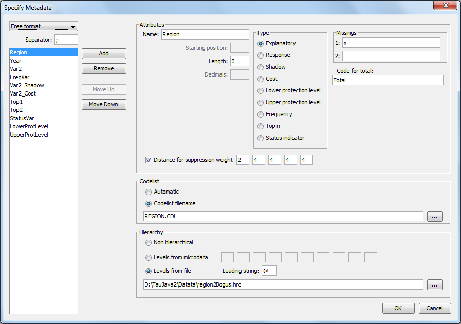

**Supplementary figure OCR (unverified; use the image for exact numbers, labels, and punctuation):**

```text
Metadata

Specify

Fics format.

=

“Attributes:

Type

Separator: |;

Name: [Region

@ Explanatory

alk

Starting position:

(© Response

Length:

© Shadow

Decimals:

Code for total:

© cost

Total

© Loner protection level

ropt

© Upper protection level

(© Frequency

OTepn

(© Status indicator

Distance for suppression weight |2

la

la

la

la

‘Codelst

(© Automatic

© Codelis flename

REGION.COL

‘Hierarchy

© Non hierarchical

© Levels from microdata

@ Levels from fle

.eading string: |@

:\Taudava2\Patatalyeaion2Bogus.hre

(ci) (cis)
```

---

<a id="pdf-page-089"></a>

### PDF page 89 / manual page 88

[Original PDF page](https://research.cbs.nl/casc/Software/TauManualV4.1.pdf#page=89) · [Local source PDF](TauManualV4.1.pdf#page=89)

<a id="source-4-4-4"></a>

###### 4.4.4 Specify | Specify Tables [for microdata]

In this dialog box the user can specify the tables which require protection. In one run of τ-ARGUS more than one table can be specified, but the tables will be protected separately unless they are linked (have at least one variable in common). In that case they can be protected simultaneously if required. In section 4.5.2 the idea of linked tables will be discussed. Also, the user has to specify the parameters for the dominance rule or p% rule and the minimum number of contributors in a cell, etc. At present τ- ARGUS allows up to 6-dimensional tables, but due to the capacities of the LP-solver used (either Xpress or CPLEX depending on the user’s license or the free solver) and the complexity of the optimisations involved, tables of this complexity can only be protected by the hypercube method (see section 2.8 in the Theory chapter). The solutions based on optimisation are limited to 4 dimensions. Below is a typical window obtained when specifying tables with the p%-rule applied.

In section 4.4 details of variable definitions in the metafile were explained. Now consider how the variables defined in the metafile are used to create a table along with an associated safety rule.

#### Original figures on this page

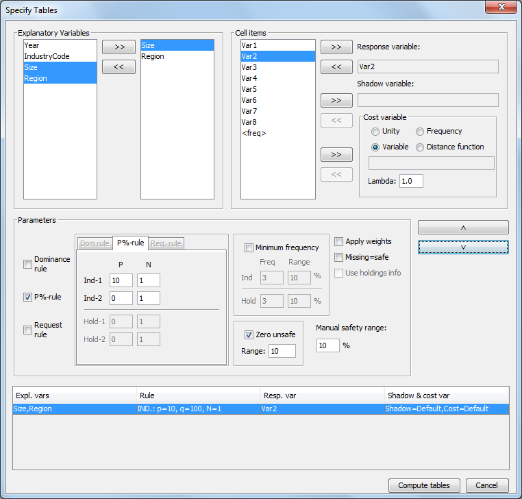

**Supplementary figure OCR (unverified; use the image for exact numbers, labels, and punctuation):**

```text
Specify Tables

Explanatory Variables:

Cellitems:

far

Ss

Response variable:

lar3

(<< me

lara

Shadow variable:

lar

=|

lar?

‘Cost variable

lars

<<

\<freq>

Unity

jariable © Distance function

<<

Lambda: [1.0

-

Parameters:

Domyule| Peru [Reg rule

‘Minimum frequency

Apply weights

Pe

N

Freq

Missing=safe

Ind-a {10

1

ind

10

[Huse holdings info

Prue

Ind-2 [0

1

Hold [3

10

Hold-t [0

A

Manual safety range:

Hold-2 [0

A

Zero unsafe

Expl. vars

Resp. var

‘Shadow & cost var

R

IND.

5

fault,

Jefault

‘Compute tables

‘Cancel
```

---

<a id="pdf-page-090"></a>

### PDF page 90 / manual page 89

[Original PDF page](https://research.cbs.nl/casc/Software/TauManualV4.1.pdf#page=90) · [Local source PDF](TauManualV4.1.pdf#page=90)

The explanatory (or spanning) variables On the left is the listbox with the explanatory variables. When the user clicks on ‘>’ or ‘<’ the selected variable is transported to the next box. From the left box with explanatory variables the user can select the variables that will be used as the spanning variables in the row or the column of the table. Cell items Here, is a list of variables that can be used as response, shadow or cost variables in the disclosure control. By pressing the '>' or '<' they can be transferred to or from the windows on the right.

The response variable From the list of cell items the user can select a variable as a response variable. This is the variable for which the table to be protected is calculated. If `<freq>` is selected a frequency table will be computed. As the neither dominance rule nor the p% rule are meaningful in this situation, the cannot be used for frequency tables. The shadow variable The shadow variable is the variable that is used to apply the safety rule. By default this is the response variable, but it is possible to select another variable. The safety rules are built on the principle of the characteristics of the largest contributors to a cell. If a variable other than the response variable is a better indicator this variable can be used here; e.g. the turnover (a proxy for the size of the enterprise) can be a suitable variable to apply the safety rule, although the table is constructed using another (response) variable. The cost variable This variable describes the costs of suppressing each individual cell; these costs are used by the internal workings of the secondary suppression routines. Note that the choice of the cost variable does not have any effect when the hypercube method is used for secondary cell suppression. See 2.7.1 for information about how cell costs are determined during execution of the hypercube method. With exception of the hypercube method, these costs are minimised when the secondary suppressed cells are determined. By default, this is the response variable but two other choices are possible as well as the use of a different response variable. Use the frequency of the cells as a cost-function: this will minimise the number of records contributing to the cells to be suppressed. The number of cells to be suppressed is minimised, irrespective of the size of their contributions (Unity option). However this might lead to the suppression of many marginal. A Box-Cox like-transformation can be applied to the individual values of the cost variable before minimisation of the cost function. The simplified Box Cox function used here is xλ where x is the cost variable and λ is the transformation parameter. For example if λ = 0.5 a square root transformation is used and if λ =0 a log transformation will be applied. Applying this to the unity-choice is rather meaningless. Weight If the data file has a sample weight, specified in the metadata, the table can be computed taking these weights into account.

---

<a id="pdf-page-091"></a>

### PDF page 91 / manual page 90

[Original PDF page](https://research.cbs.nl/casc/Software/TauManualV4.1.pdf#page=91) · [Local source PDF](TauManualV4.1.pdf#page=91)

```text
If the ‘Apply Weights’ box is ticked, the weights are applied to the cell entries as
for the simple application of normal sampling weights in a survey. In addition
these weights are used in applying the safety rules. When we have a sample the
normal idea behind the sensitivity rules that the largest contributions can make a
good estimate of each other is no longer valid. The solution is that we artificially
create a complete cell by assuming that each contribution is in fact as many
contributions as its sample weight. And we apply the sensitivity rules on this cell.
An example might help here.
For example if there is a cell with two contributions:
100, weight 4
10, weight 7
The cell value = (4 x 100) + (7 x 10) = 470. Without considering the weights there
are only two contributors to the cell 100 and 10. However by taking account of the
sampling weights the cell values are approximately 100, 100, 100, 100, 10, 10, 10,
10, 10, 10 and 10. The largest two contributors are now 100 and 100. These are
regarded as the largest two values for application of the safety rules. If the weights
are not integers, a simple extension is applied.
The safety rule
The concept of safety rules is explained in section 2.2 On the left side of the
window the type of rule that can be selected along with the value of the parameters
is shown. The possible rules are:
       •   Dominance Rule
       •   P% Rule
       •   Request Rule (this rule is described in detail later in this section)
Additionally, the minimum number of contributors may be chosen (in the
'minimum frequency' box).
Two dominance rules and two P% rules can be applied to each table. When 2 rules
are specified, for a cell to be declared non-disclosive, it must satisfy both rules.
Dominance Rule
This is sometimes referred to as the (n,k) rule where n is the number of
contributors to a cell contributing more than k% of the total value of the cell (if the
cell is to be defined as unsafe). A popular choice would be to set n equal to 3 and k
equal to 75%. An example of the window when specifying a single dominance rule
is shown at the start of this section.
P% rule
The p% rule says that if x1 can be determined to an accuracy of better than P% of
the true value then it is disclosive where x1 is the largest contributor to a cell.
The rule can be written as:
   c
         p
  ∑ xi≥ 100 x1         for the cell to be non-disclosive where c is the total number of
  i=3
contributors to the cell and the intruder is a respondent in the cell.
It is important to know that when entering this rule in τ-ARGUS the value of N refers
to the number of intruders in coalition (who wish to group together to estimate the
largest contributor).
```

---

<a id="pdf-page-092"></a>

### PDF page 92 / manual page 91

[Original PDF page](https://research.cbs.nl/casc/Software/TauManualV4.1.pdf#page=92) · [Local source PDF](TauManualV4.1.pdf#page=92)

A typical example would be that the sum of all reporting units excluding the largest two must be at least 10% of the value of the largest. Therefore, in τ-ARGUS set p=10 and n =1 as there is just one intruder in the coalition, respondent x2. For the dominance rule and the p%-rule the safety ranges required (as a result of applying the rule) can be derived automatically. The theory gives formulas for the upper limit only, but for the lower limit there is a symmetric range. See e.g. Loeve (2001). (This is referenced in Section 2.2 (Theory)) As this rule focusses better on the protection of individual contributors the τ-ARGUS team is convinced that the p%-rule is to be preferred over the dominance rule. This is also the advice in Europe.

```text
Request Rule
This is a special option applicable in certain countries relating to e.g. foreign trade
statistics. Here, cells are protected only when the largest contributor represents
over (for example) 70% of the total and that contributor asked for protection.
Therefore, a variable indicating the request is required.
This option requires an additional variable in the data, with e.g. 0 representing no
request for that particular business, and 1 representing a request where the
particular cell value is > x% of the cell total. In fact there is an option for two
different thresholds. The min freq is interpreted such that if a cell has at least one
request and the cell-freq is below the freq-threshold, that cell is considered to be
unsafe as well. Even if the request is not the largest one. The idea is that in that
case a large non requesting contributor could reveal the smaller requesting
contributor.
Note that the 3 rules (dom. rule, p% rule and request rule) do not make any sense if
there are positive and negative contributions to a cell.
Minimum Frequency
If this box is checked, a rule controlling the minimum number of contributors to a
cell will be specified. If the number of contributors is less than this value, the cell
is considered unsafe.
Freq
Here, the minimum number of contributors can be stated. This is sometimes known
as the threshold rule. It is also possible to specify no safety rule apart from a
minimum frequency value.
Frequency-range
As described above, for the dominance rule and the P%-rule safety ranges can be
derived automatically. However, the theory does not provide any safety range for
the minimum frequency rule. Therefore, the user must provide a safety-range
percentage required to allow secondary suppressions to be carried out. For
example, if this value was set to equal 30%, it would mean an attacker would not
be able to calculate an interval for this cell to within 30% of the actual value when
looking at the safe output. Following this, the secondary suppressions may be
carried out.
Manual Safety Range
When a cell is set manually unsafe (an option to discussed later), τ-ARGUS cannot
calculate safety-ranges itself. Therefore, the user must supply a safety-percentage
```

---

<a id="pdf-page-093"></a>

### PDF page 93 / manual page 92

[Original PDF page](https://research.cbs.nl/casc/Software/TauManualV4.1.pdf#page=93) · [Local source PDF](TauManualV4.1.pdf#page=93)

for this option for the same reasons as in the above section, to allow secondary suppressions to be applied. Zero Unsafe If all contributions to a cell are zero, the cell value will be zero too. Applying sensitivity rules here has some problems. Is the sum of the largest 3 zeros larger than zero? Nevertheless all contributions to this cell can be easily disclosed. If cells with total contributions of zero are to be regarded as unsafe, this box has to be checked. A manual safety range will also be required, not as a percentage but as a value at the level of the cell-item.

Missing = safe If one of the spanning variables of a cell has a code missing, this cell is often no longer sensitive. The idea behind this is that the respondent in this cell is not identifiable. When this option is checked, all cells for which at least one spanning variable has a missing value is considered safe, whatever all the sensitivity rules say. If this option is not checked the normal procedures as for all other cells are applied. Holding Indicator This section on the Holding Indicator is best read after section 4.2 In some countries, confidentiality protection is applied to businesses at different levels. For example, as in the U.K. a number of ‘reporting units’ (the lower level of unit) within a cell might belong to an ‘enterprise group’ (higher level). The level at which the confidentiality rule is applied clearly matters. The holding indicator allows such groupings to be defined and used in one or more of the safety rules. This is now illustrated with an example looking at both the p% rule and the threshold rule at the same time.

---

<a id="pdf-page-094"></a>

### PDF page 94 / manual page 93

[Original PDF page](https://research.cbs.nl/casc/Software/TauManualV4.1.pdf#page=94) · [Local source PDF](TauManualV4.1.pdf#page=94)

Consider the following dataset

```text
Cell Ref       Cell Ref                Cell value Enterprise
                                       (reporting group
                                       unit)
        800                       20          599                 1
        800                       20          344                 1
        800                       20          244                 1
        800                       30          355                 1
        800                       20          644                 2
        800                       30          433                 2
```

#### Original figures on this page

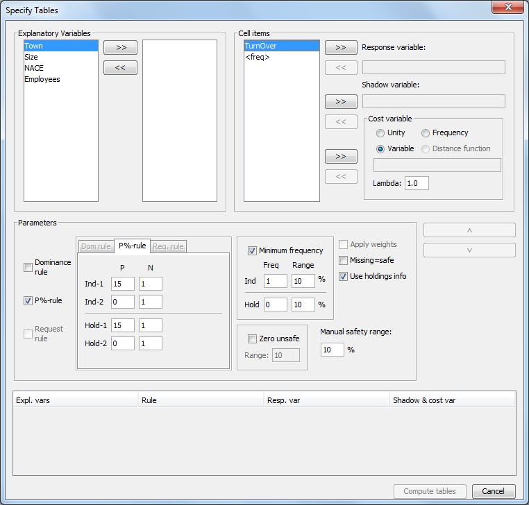

**Supplementary figure OCR (unverified; use the image for exact numbers, labels, and punctuation):**

```text
Specify Tables

Explanatory Variables

Cellitems.

=

Response variable:

i<freq:

3)

Shadow variable:

=|

‘Cost variable

Qnty © Frequency

@ Variable © Distance function

<<

Lambda: [1.0

[A]

Domyule| Peru [Reg rule

‘Minimum frequency

apply weights

a)

Pe

N

Freq. Range

Missing =safe

Use holdings info

Ind-a {15

1

1 |%

Ind2 [0

1

Hold [0

10 |%

Hold-t [15

1

Request

Manual safety range:

Hold-2 [0

1

Zero unsafe

10 |%

pl. vars

Resp. var

‘Shadow & cost var

Compute tables | [[Cancel
```

---

<a id="pdf-page-095"></a>

### PDF page 95 / manual page 94

[Original PDF page](https://research.cbs.nl/casc/Software/TauManualV4.1.pdf#page=95) · [Local source PDF](TauManualV4.1.pdf#page=95)

```text
800                     30                323                       3
800                     30                343                       3
900                     20                  23                      4
900                     20                  43                      5
900                     20                  34                      5
900                     20                  53                      5
900                     30                700                       6
900                     30                200                       6
900                     30                  60                      7
900                     30                  40                      8
900                     30                  10                      9
```

```text
Assume the following safety rules
    •   Threshold rule: At least 3 enterprise groups (higher level units) in a cell
    •   P% rule: The sum of all the reporting units (lower level units) excluding
        the largest 2 must be at least 10% of the value of the largest.
There are 4 cells in the table along with the margins. The cell we are interested in
here is Cellref 900,30: 5 reporting units, 4 enterprise groups
At the reporting unit the values are 700,200,60,40,10
At the enterprise group the values are 900,60,40,10
This rule has been designed so that when the P% rule is applied to this cell:
With reporting units the cell is safe. 10+60+40 = 110. This is greater than 10% of
the largest value (70) so the cell is safe.
With enterprise groups the cell is unsafe. 40+10 = 50. This is less than 10% of the
largest value (90) so the cell is unsafe.
Apply the threshold rule to the enterprise groups (Hold. =3) and P% rule to the
reporting units.
Once again a safety range percentage is required.
The output from the application of this rule is shown below. Two cells fail the
threshold rule with the holding rule applied.
The threshold rule has been applied correctly using the holding indicator as the
correct cells are safe (that would be unsafe if the holding indicator was not being
used).
After all the options have been selected compute the table
When all the necessary information has been given, click '˅' to transport all the
specified parameters to the ‘listwindow’ on the bottom. As many tables as required
can be specified but as the size of the memory of a computer is restricted it is not
advisable to select too many tables. To modify an already made table press the ‘^’
button.
```

---

<a id="pdf-page-096"></a>

### PDF page 96 / manual page 95

[Original PDF page](https://research.cbs.nl/casc/Software/TauManualV4.1.pdf#page=96) · [Local source PDF](TauManualV4.1.pdf#page=96)

Click on ‘Compute Tables’ to compute the tables. In case of an SPSS system file SPSS will first be called to export the necessary microdata automatically to a scratch fixed format ASCII file in the TEMP directory. When the table(s) has been computed, the first table will be shown.

<a id="source-4-4-5"></a>

###### 4.4.5 Specify | Specify tables [for tabular data]

When the ‘Specify|Metafile’ option is followed the ‘Specify|Table metadata’ option is also available and the window is displayed here. This will allow the application of safety rules such as the Dominance Rule and the P% rule. Section 4.4.4 (specifying tables from microdata) will explain these safety rules and other options in detail.

In the safety rule frame, the type of rule can be selected along with the value of the parameters. These are the dominance rule and P% rule. Additionally, the minimum number of contributors can be chosen (threshold rule), via ticking and filling-in the minimum frequency box. If both the status and some information to apply the sensitivity rules have been supplied, both options ‘use given status’ and ‘use safety rules’ are enabled and the user can chose which one to use. Depending one the amount of detail in the table file some options will be disabled. If no top1 and top2 information is provided, the p%-rule cannot be used. There is an option to calculate the possibly missing marginals and totals. This option should be used only as an emergency. It is always better to provide τ-ARGUS with a full, complete table. When τ-ARGUS has to compute these marginals all safety information will be ignored. When all the options have been completed, pressing the ‘OK’ button will invoke τ-ARGUS to actually compute the table requested. Now the process of disclosure control can begin.

#### Original figures on this page

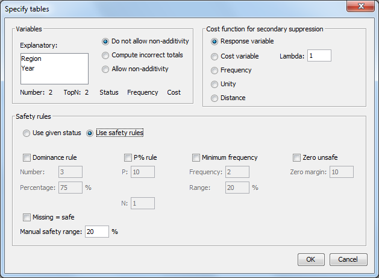

**Supplementary figure OCR (unverified; use the image for exact numbers, labels, and punctuation):**

```text
Specify tables

‘Variables:

‘Cost function for secondary suppression

Do not alow non-additivty

Response variable

Explanatory:

) Compute incorrect totals

Cost variable Lambda: [1

) low non-additvity

) Unity

Number: 2

TopN: 2

Status Frequency Cost

) Distance

‘Safety rules

) Use given status. |

(ie sstetyruieg

[)bominance rule

Ppa rule

[Minimum frequency

[zero unsafe

Number:

a

p: [io

Frequency: [2

Zero margin: [10

Percentage: [75

%

Range:

[20

%

nf

(iMssing = safe

%

Manual safety range: |20

(ati (ncaa)
```

---

<a id="pdf-page-097"></a>

### PDF page 97 / manual page 96

[Original PDF page](https://research.cbs.nl/casc/Software/TauManualV4.1.pdf#page=97) · [Local source PDF](TauManualV4.1.pdf#page=97)

<a id="source-4-5"></a>

##### 4.5 The Modify menu

<a id="source-4-5-1"></a>

###### 4.5.1 Modify | Select Table

This dialog box enables the user to select the table they want to see. If the user has specified only one table, this table will be selected automatically and this option cannot be accessed. In the example window shown here the first table is a 2 dimensional table (Size x Region) followed by a 3 dimensional table (Size x Region x IndustryCode). Select the table to be processed and press the OK-button.

<a id="source-4-5-2"></a>

###### 4.5.2 Modify | Linked Tables

This option is available when the tables specified have at least one explanatory or spanning variable in common and have the same response variable. When the tables are built from micro data, the tables can be specified using the screen below. See also section 4.4.4. An example is shown.

#### Original figures on this page

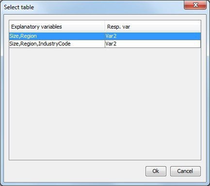

**Supplementary figure OCR (unverified; use the image for exact numbers, labels, and punctuation):**

```text
f Select table

Explanatory variables

Resp. var

‘Sze Region, IndustryCode

Wvar2.

(ati) (mance)
```

---

<a id="pdf-page-098"></a>

### PDF page 98 / manual page 97

[Original PDF page](https://research.cbs.nl/casc/Software/TauManualV4.1.pdf#page=98) · [Local source PDF](TauManualV4.1.pdf#page=98)

When the tables are supplied to τ-ARGUS as tabular input see section 4.3.3 (Open Table set). When supplying a set of ready made tables it should be clear to τ-ARGUS which explanatory variables are in fact the same dimension. They should have the same name, even if the level of detail is different. The next step is to further define the tables. This is similar to the procedure in Specify Tables (see section 4.4.5). The same choices for the parameters etc. are applied to each table. It will be clear that all tables should have the same amount of detail. Otherwise the choices cannot be applied to all tables. So it is not possible that one table just has a Status indicator and another table has the top-2 allowing for applying the p%-rule.

#### Original figures on this page

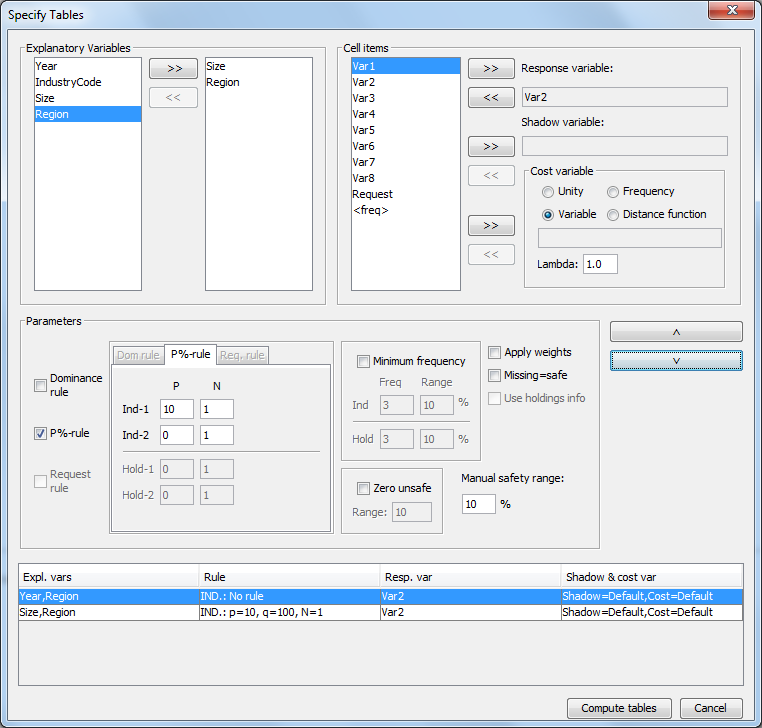

**Supplementary figure OCR (unverified; use the image for exact numbers, labels, and punctuation):**

```text
| Specify Tables

Explanatory Variables:

Callitems.

(ear

Ss

Response variable:

ryCode

lar2

lar3

<<

=] ez

lara

Shadow variable:

lar

=

lar?

‘Cost variable

lar

<<

Unity

\<freq>

jariable © Distance function

<<

Lambda: [1.0

Parameters:

Domyule| Peru [Reg rule

‘Minimum frequency

Apply weights

Pe

N

Freq

Missing=safe

Ind-a {10

1

ind [5

[Huse holdings info

Prue

Ind-2 [0

1

Hold [3

Hold-t [0

E

Request

Manual safety range:

Hold-2 [0

E

Zero unsafe

Range: [10

Expl. vars

Resp. var

‘Shadow & cost var

[Size Region

p=10,

var2

/=Defeult,Cost=Defauit

‘Compute tables

‘Cancel
```

---

<a id="pdf-page-099"></a>

### PDF page 99 / manual page 98

[Original PDF page](https://research.cbs.nl/casc/Software/TauManualV4.1.pdf#page=99) · [Local source PDF](TauManualV4.1.pdf#page=99)

E.g. if a regional variable is an explanatory variable in two tables, but in one table it is at the level of province and in the other at the level of municipality, they should nevertheless have the same name. If not τ-ARGUS will not recognise them as a link. The set of linked tables can be protected using the hypercube (see section 2.8) and the extended modular approach (see section 2.11). When protecting a set of linked tables the restriction is that all tables are a sub-set of a theoretical cover table. The cover table is formed by building a table spanned by all explanatory variable from the individual tables and using the longest code list for each dimension. The dimensions are decided by looking for different names of explanatory variables. As long as the cover table does not have more than 4 dimensions the linked tables approach is possible. In the current implementation there is one restriction. For each of the spanning variables in the cover table the codelist and the hierarchy should be present in one of the linked tables. For all other tables the codelists and the hierarchy should be a subset of this cover hierarchy. And of course the set of linked tables should be consistent. The cells that are logical the same should have exactly the same value and status. If not the protection of the cover table will fail. When tabular data is the starting point, it is the responsibility of the user that the tables are consistent. This means that the cell values of corresponding cells are the same and also the status. If not this is an inconsistent situation. The modular approach is very strict on complete additivity, as the optimisation routines behind modular require this. The hypercube is a bit more relaxed.

#### Original figures on this page

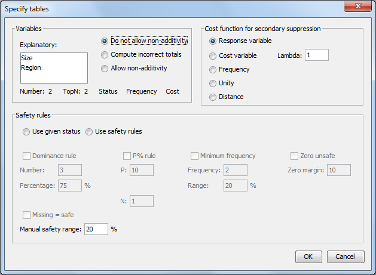

**Supplementary figure OCR (unverified; use the image for exact numbers, labels, and punctuation):**

```text
Specify tables

»-—EEEEEEe

‘Variables:

‘Cost function for secondary suppression

Explanatory:

(© Baiet alow nen adeitvty

© Response variable

© Compute incorrect totals

© Cost variable Lambda: [1

© Alow non-adaitvity

(© Frequency

|

Ovnity

Number: 2

TopN: 2

Status Frequency Cost

© Distance

‘Safety rules

© Use given status © Use safety rules

[dominance rule

(pes rule

[lsinimum frequency

(zero unsafe

Number:

a

p: [io

Frequency: [2

Zero margin: [10

Percentage: [75

%

Range:

[20

%

nf

(Missing = safe

Manual safety range: |20

%

(lo) [eaneet
```

---

<a id="pdf-page-100"></a>

### PDF page 100 / manual page 99

[Original PDF page](https://research.cbs.nl/casc/Software/TauManualV4.1.pdf#page=100) · [Local source PDF](TauManualV4.1.pdf#page=100)

The set of linked tables can now be protected by pressing ‘Suppress via modular’ or ‘suppress via hypercube’. τ-ARGUS will then start an automatic procedure. When the modular approach is selected, the subtables will be loaded in the cover table. The cover table will then be protected via an extra batch-run of τ-ARGUS and in the end the results (suppression pattern) will be transferred to the original subtables. If this procedure might fail, information could be found in the log-file of τ-ARGUS. See also section 5.8. Modular will ask for the selection of the singleton rules as usual.

When making the cover table τ-ARGUS will check for consistencies. E.g cells that are in the overlapping part of a table and who are by definition equal should have the same value status, protection level etc. If τ-ARGUS finds some inconsistencies, it will be reported. In the example the value of cell “Total,Nr” (4373664.0) and “12,Total” (1441228.0) are not correct. In two different input files the status is not equal.

#### Original figures on this page

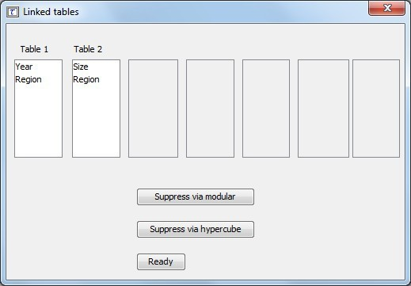

**Supplementary figure OCR (unverified; use the image for exact numbers, labels, and punctuation):**

```text
Table 1

Table 2

rear

Sze

Region

Region

(air)
```

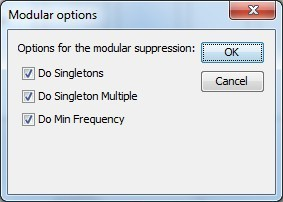

**Supplementary figure OCR (unverified; use the image for exact numbers, labels, and punctuation):**

```text
x

Modular options

Options for the modular suppression

0 Singletons

0 Singleton Multiple

Min Frequency
```

---

<a id="pdf-page-101"></a>

### PDF page 101 / manual page 100

[Original PDF page](https://research.cbs.nl/casc/Software/TauManualV4.1.pdf#page=101) · [Local source PDF](TauManualV4.1.pdf#page=101)

When the hypercube is selected, all the input files for the hypercube will be prepared and the linked table procedure of the hypercube will be started to protect the set of tables. Also the hypercube does not like inconsistencies in e.g. the status. These will be reported in the file PROTO002 in the temp-directory.

If successful the following information will be shown:

#### Original figures on this page

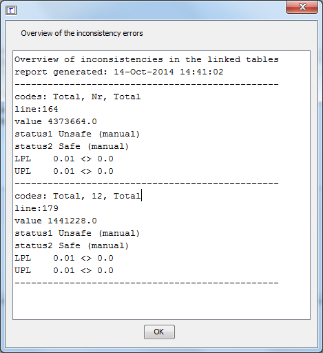

**Supplementary figure OCR (unverified; use the image for exact numbers, labels, and punctuation):**

```text
Overview of the inconsistency errors

overview of inconsistencies in the linked tables

report generated: 14-Oct-2014 14:41:02

codes:

Total,

Nr,

Total

line:164

value 4373664.0

statusi Unsafe (manual)

status? Safe (manual)

LPL

0.01 <> 0.0

UBL

0.01 <> 0.0

-.

codes

Total,

12,

Total

line:179

lvalue 1441228.0

statusi Unsafe (manual)

status? Safe (manual)

LPL

0.01 <> 0.0

UBL

0.01 <> 0.0

-.
```

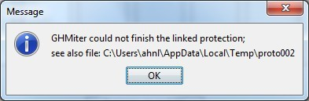

**Supplementary figure OCR (unverified; use the image for exact numbers, labels, and punctuation):**

```text
Message.

GHWMiter could not finish the linked protection;

see also file: C:\Users\ahni\AppData\Local\ Temp\proto002
```

---

<a id="pdf-page-102"></a>

### PDF page 102 / manual page 101

[Original PDF page](https://research.cbs.nl/casc/Software/TauManualV4.1.pdf#page=102) · [Local source PDF](TauManualV4.1.pdf#page=102)

When the protection has been completed, the linked tables procedure can be closed and the individual protected subtables can be inspected and stored as normal tables.

<a id="source-4-6"></a>

##### 4.6 The Output menu

<a id="source-4-6-1"></a>

###### 4.6.1 Output | Save Table

There are six options of saving the tables

As a CSV file. This Comma Separated file can easily be read into Excel. Please note the Excel should interpret the comma as a separator. If your local settings are

#### Original figures on this page

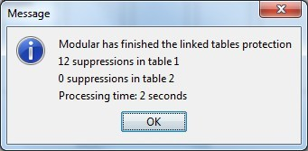

**Supplementary figure OCR (unverified; use the image for exact numbers, labels, and punctuation):**

```text
Message

Modular has finished the linked tables protection

12 suppressions in table1

O suppressions in table 2

Processing time: 2 seconds
```

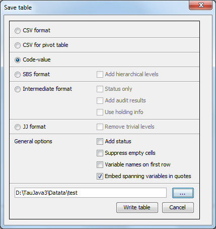

**Supplementary figure OCR (unverified; use the image for exact numbers, labels, and punctuation):**

```text
Save table

(CSV format.

CSV for pivot table

(Code-value

‘SBS format

‘Add hierarchical levels

(© Intermediate format

Status only

Add audit results

Use holding info

23 format

Remove trivial levels

General options

(Ade status

[suppress empty cells

[TVarable names on frst row

[Embed spanning variables in quotes

D:\Taulavas\Datataltest
```

---

<a id="pdf-page-103"></a>

### PDF page 103 / manual page 102

[Original PDF page](https://research.cbs.nl/casc/Software/TauManualV4.1.pdf#page=103) · [Local source PDF](TauManualV4.1.pdf#page=103)

different you could use the Excel option ‘Data|Text to Columns’, This a typical tabular output maintaining the appearance of the table in τ-ARGUS. CSV-file for a pivot table. This offers the opportunity to make use of the facilities of pivot table in Excel. The status of each cell can be added here as an option (Safe, Unsafe or Protected for example). The information for each cell is displayed on a single line unlike standard csv format A text file in the format code-value, this is separated by commas. Here, the cell status is again an option. Also empty cells can be suppressed from the output file if required. The information for each cell is displayed on a single line similar to the CSV file for a pivot table. There are two possibilities. Either the unsafe cells are shown as an ‘x’, as it should be in the final publication or the exact status can be printed in the output file in addition to the cell value. Optionally empty cells can be suppressed. When the status is added to the output file τ-ARGUS can use 14 different statuses. They can also be found in the report file.

```text
Number              Status
1                   Safe
2                   Safe (manual)
3                   Unsafe
4                   Unsafe (request)
5                   Unsafe (Freq)
6                   Unsafe (Zero cell)
9                   Unsafe (manual)
10                  Protected
11                  Secondary
12                  Secondary (from man.)
13                  Empty (non-struct.)
14                  Empty
Note: 7 and 8 are no longer used. But in order to be compatible with older
versions of τ-ARGUS we did not change the numbers.
```

A SBS-format file. This file contains the information required by Eurostat for different surveys like the SBS-survey. Each line describes one cell in the table. First all the spanning variables, with the levels in the hierarchy, then the cell value, the cell frequency, the status and the dominance percentage. If the 2 largest contributors have been computed this percentage is the sum of the largest two, otherwise the largest one. It will be obvious that this output format is not possible if a table has been used as input, with only the status or maybe a cell frequency.

```text
The cell status can be:
A                Frequency unsafe
B                Dominance unsafe with one contributor
```

---

<a id="pdf-page-104"></a>

### PDF page 104 / manual page 103

[Original PDF page](https://research.cbs.nl/casc/Software/TauManualV4.1.pdf#page=104) · [Local source PDF](TauManualV4.1.pdf#page=104)

```text
C                  Dominance unsafe with two contributors
D                  Secondary unsafe
V                  Safe
```

A file in intermediate format for possible input into another program. This contains protection levels and external bounds for each cell. This file could even be read back into τ-ARGUS, using the read tables option

```text
The options are:
        •   Write only the status
        •   Add the results of the audit procedure (realised lower and upper
            bounds)
        •   Write information at the holding level, like the frequency.
        •   Suppress the empty cells.
```

Of course certain options are only available if appropriate.

Finally, a report will be generated to a user specified directory. This report will be shown, when the table has been written. As this is an HTML-file it can be viewed easily later.

A file in JJ-format. This is an intermediate format used in τ-ARGUS. See section 5.5.

Some options are applicable to several output-versions. These are grouped together under “General Options”.

<a id="source-4-6-2"></a>

###### 4.6.2 Output | View Report

Views the report file which has been generated with Output|Save Table. An example of a part of the output HTML file is shown here. As can be seen the essential information, for somebody other than the user, about which rules have been applied to make the data safe is displayed along with details of any recoding.

---

<a id="pdf-page-105"></a>

### PDF page 105 / manual page 104

[Original PDF page](https://research.cbs.nl/casc/Software/TauManualV4.1.pdf#page=105) · [Local source PDF](TauManualV4.1.pdf#page=105)

A nicer view of the report will be obtained if you open the report in a web-browser:

#### Original figures on this page

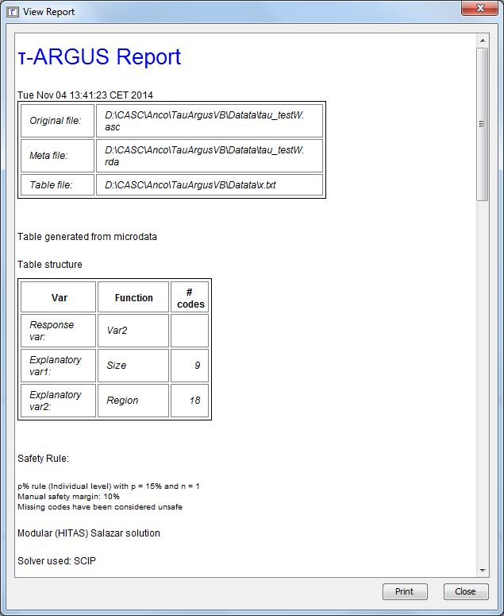

**Supplementary figure OCR (unverified; use the image for exact numbers, labels, and punctuation):**

```text
TE cw Rpt

T-ARGUS Report

Tue Nov 04 13:41:23 CET 2014

DACASC\Anco\TauArgusVB\Datataltau_testlV.

Original file:

asc

DACASC\Anco\TauArgusVB\Datataltau_testlV.

Meta file:

ra

Table file:

DACASC\Anco\TauArgusVBIDatatale bet

Table generated from microdata

Table structure

var

Function

var2

vart:

‘size

18

‘Safety Rule:

p% rule (Individual level) with p = 159% and n= 1

‘Manual safety margin: 10%

‘Missing codes have been considered unsafe

‘Modular (HITAS) Salazar solution

‘Solver used: SCIP

(atti) (cs)
```

---

<a id="pdf-page-106"></a>

### PDF page 106 / manual page 105

[Original PDF page](https://research.cbs.nl/casc/Software/TauManualV4.1.pdf#page=106) · [Local source PDF](TauManualV4.1.pdf#page=106)

<a id="source-4-6-3"></a>

###### 4.6.3 Output | Generate apriori

In many situations it is desirable to coordinate the secondary suppressions between tables. This can be because of links between tables. Suppressions in one table should also be suppressions on the other table. But also when protecting monthly tables it could be a good idea to coordinate suppressions between the different months. A secondary suppression in month 1 could be an ideal candidate for secondary suppression in month 2. This could be achieved by changing the suppression weights for these cells. The apriori option is the way to change the default suppression weights etc. But this leaves the task of generating the apriori file. Via this option the protected file as generated by τ-ARGUS can be converted into an apriori file. The table has to be saved in the format code-value with the ‘Add Status’-option selected.

#### Original figures on this page

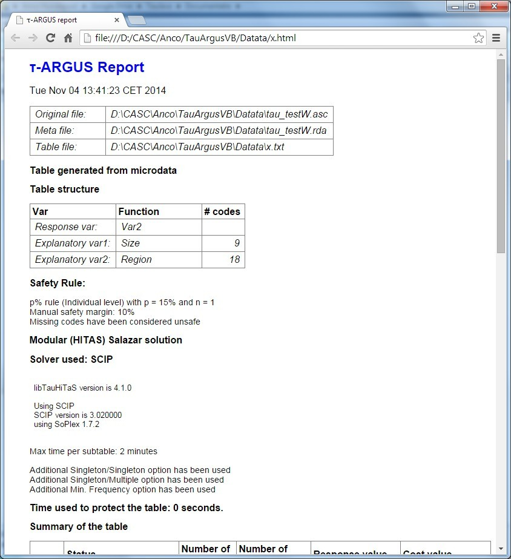

**Supplementary figure OCR (unverified; use the image for exact numbers, labels, and punctuation):**

```text
--

3

Cc ft

(5 file///D:/CASC/Anco/TauArgusVB/Datata/x.htm|

we

T-ARGUS Report

Tue Nov 04 13:41:23 CET 2014

Original file

D:A\CASC\Anco\TavArgusVB\Datata\tau_testW.asc

Meta file.

D:A\CASC\Anco\TavArgusVB\Datata\tau_testW.rda

Table file.

D:A\CASC\Anco\TauArgusVB\Datata\x.txt

Table generated from microdata

Table structure

Var

Function

# codes

Response var:

Var2

Explanatory vart

Size

Explanatory var2: | Region

18

Safety Rule:

% rule (Individual level) with p = 15% and n= 1

Manual safety margin: 10%

Missing codes have been considered unsafe

Modular (HITAS) Salazar solution

Solver used: SCIP

libTauHiTaS version is 4.1.0

Using SCIP

SCIP version is 3.020000

using SoPlex 1.7.2

Max time per subtable: 2 minutes

Additional Singleton/Singleton option has been used

Additional Singleton/Muttiple option has been used

Additional Min. Frequency option has been used

Time used to protect the table: 0 seconds.

Summary of the table

[

a

[Number of [Number of
```

---

<a id="pdf-page-107"></a>

### PDF page 107 / manual page 106

[Original PDF page](https://research.cbs.nl/casc/Software/TauManualV4.1.pdf#page=107) · [Local source PDF](TauManualV4.1.pdf#page=107)

For each status the user can select which action in the apriori file has to be created. This can be a change of the suppression weight, give a new status, or nothing at all. The user has to specify the protected file (written in the right format (saved as code/value plus status) and the apriori file to be generated. Also the correspondence between the variables must be specified. It is not always the case that the first spanning variable is also the first spanning variable in the apriori file. Even the number of variable can be different. If not all variables of the safe file will be available in the newly to be protected file, only the score for the total will be used. This is often the case if the apriori file is generated for a linked tables problem. The separator to be used in the apriori file must be specified as well; a comma is the default. Pressing the ‘Go’-button will generate the apriori file and the ‘ready’-button will bring you back to the main menu of τ-ARGUS.

#### Original figures on this page

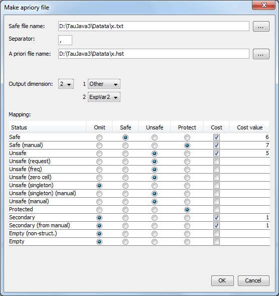

**Supplementary figure OCR (unverified; use the image for exact numbers, labels, and punctuation):**

```text
Safe fle name:

D:\Taudava3\Patatalx.bxt

Separator:

[I

AA priori fle name:

D:\Taulavas\Patatalc hst

Output dimension:

e=

1 [Other

2 [Bear

Status

Omit

safe

Unsafe

Cost Cost value

safe

‘Safe (manual)

Unsafe

Unsafe (request)

Unsafe (frea)

Unsafe (zero cell)

Unsafe (singleton)

Unsafe (Singleton) (manual)

Unsafe (manuel)

‘Secondary (fom manuel)

Empty (non-struct.)

(atic) (nce)
```

---

<a id="pdf-page-108"></a>

### PDF page 108 / manual page 107

[Original PDF page](https://research.cbs.nl/casc/Software/TauManualV4.1.pdf#page=108) · [Local source PDF](TauManualV4.1.pdf#page=108)

<a id="source-4-6-4"></a>

###### 4.6.4 Output | Write Batch File

The commands used in interactive mode can be saved into a file for future use. τ- ARGUS will write a batch file containing the commands necessary to achieve the current situation of the τ-ARGUS run so far. For more information on the batch facility see section 4.3.3 For example the following shows the dominance rule (n=3, k= 75) applied to the Size by Region table with Var2 as the response variable. The threshold value = 5 with a safety range = 30%. Modular secondary suppression was applied. The last line indicates that τ-ARGUS will not stop after these commands but become an interactive program.

```text
<OPENMICRODATA> "C:\Program Files\TauARGUS\data\tau_testW.asc"
<OPENMETADATA> "C:\Program Files\TauARGUS\data\tau_testW.rda"
<SPECIFYTABLE> "Size""Region"|"Var2"|""|""
<SAFETYRULE>    NK(3,75)|NK(0,0)|FREQ(5,30)|
<READMICRODATA>
<SUPPRESS>       MOD(1)
<GOINTERACTIVE>
```

<a id="source-4-7"></a>

##### 4.7 The Help menu

<a id="source-4-7-1"></a>

###### 4.7.1 Help | Contents

This shows the contents page of the help file and from there makes the help available. This program has context-sensitive help.

<a id="source-4-7-2"></a>

###### 4.7.2 Help | News

Information on the latest developments is shown. Old friends can see here which new extensions have been included in this version of τ- ARGUS and information about bugs is shown here as well.

<a id="source-4-7-3"></a>

###### 4.7.3 Help | Options

There are a number of options, which can be changed here. The colours indicating the status of a cell can be altered. In order to make a hierarchical table more readable, the different levels of the hierarchy will be indicated with an increasing grey background. If you like different colours, you can adapt this. For the modular solution the maximum computing time per subtable can be specified. This could speed up the computations, but on the other hand might give a less optimal solution. Also the name of the logfile (see section 5.8) can be changed here. By default it is Logbook.txt in the temp-directory. Finally the solver for the optimisation routines must be specified. The options are: CPLEX or Xpress or a free solver. τ- ARGUS can work with all three solvers.

If the CPLEX optimisation routine is being used, the location of the licence file can be specified here. For Xpress the name of the licence file is prescribed and fixed

---

<a id="pdf-page-109"></a>

### PDF page 109 / manual page 108

[Original PDF page](https://research.cbs.nl/casc/Software/TauManualV4.1.pdf#page=109) · [Local source PDF](TauManualV4.1.pdf#page=109)

(XPAUTH.XPR) The Xpress licence file has to be stored in the τ- ARGUS program directory. τ-ARGUS will store the information of all these options in the registry and will use it in future runs. It is advisable but not necessary to open this window at the start of a τ-ARGUS session to ensure the correct solver has been chosen.

<a id="source-4-7-4"></a>

###### 4.7.4 Help | About

Shows the about box.

#### Original figures on this page

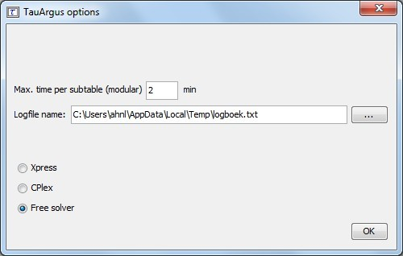

**Supplementary figure OCR (unverified; use the image for exact numbers, labels, and punctuation):**

```text
TauArgus options

Max. time per subtable (modviar) [2

rin

Logfile name:

CC:\sersahnl\AppDataLocal|Temp Vogboek. txt

O Xpress

) Pex

@ Free solver
```

---

<a id="pdf-page-110"></a>

### PDF page 110 / manual page 109

[Original PDF page](https://research.cbs.nl/casc/Software/TauManualV4.1.pdf#page=110) · [Local source PDF](TauManualV4.1.pdf#page=110)

*No extractable body text on this page.*

#### Original figures on this page

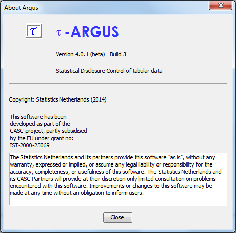

**Supplementary figure OCR (unverified; use the image for exact numbers, labels, and punctuation):**

```text
About Argus

t-ARGUS

Version 4.0.1 (beta) Build 3

Statistical Discosure Control of tabuiar data

Copyright: Statistics Netherlands (2014)

This software has been

developed as part of the

‘CASC-project, party subsidised

by the EU under grant no:

15T-2000-25069

‘The Statistics Netherlands and its partners provide this software “asi, without any

warranty, expressed or implied, or assume any legal lability or responsiblity for the

‘accuracy, completeness, or usefulness of this software. The Statistics Netherlands and

its CASC Partners wil provide at their discretion only limited consultation on problems

encountered with this software. Improvements or changes to this software may be

made at any time without an obligation to inform users.
```

---

<a id="pdf-page-111"></a>

### PDF page 111 / manual page 110

[Original PDF page](https://research.cbs.nl/casc/Software/TauManualV4.1.pdf#page=111) · [Local source PDF](TauManualV4.1.pdf#page=111)

<a id="source-5"></a>

#### 5 FURTHER DESCRIPTIONS

<a id="source-5-1"></a>

##### 5.1 Meta data files

```text
The meta data plays a vital role in τ-ARGUS. The meta data is always specified and
stored in a separate file. As τ-ARGUS can read both micro data as input as tabular
data, the meta data descriptions will be different as well. Nevertheless there are
many similarities, especially between meta data for fixed and free format micro
data.
The meta data can always be changed/adapted/entered via the menu item Specify|
Metadata, see sections 4.4.1, 4.4.2 and 4.4.3.
As no standard meta data system is available which is powerful enough to manage
the complete metadata specification necessary for Statistical Disclosure Control we
had to develop something specially for τ-ARGUS.
The metadata file (default extension .RDA) has globally the same structure for all
the different file types that can be handled by τ-ARGUS. i.e fixed format/free format
microdata, SPSS system files or tabular data.
For each variable the name is specified followed by its position in the file and
possible missing values. Following this specification additional information can be
specified. These specifications always start with a keyword enclosed by “<”and”>”
followed by the specifications.
The metadata is always stored in a plain text file without any tabs or so. If you wish
you could enter/modify the metadata file with e.g. Notepad, but not with Word. It
is then your own risk that the metadata is syntactically correct. τ-ARGUS will check
the meta data file when it is read, but to a certain limit. The best way is to modify
the metadata via the τ-ARGUS program
We will first describe in section 5.1.1the meta data file a fixed format micro data
file. In the subsequent sections the special issues for the other file formats (free
format and SPSS) will be described. In section 5.1.4 the meta data for tabular data
files will be dscribed.
```

<a id="source-5-1-1"></a>

###### 5.1.1 Meta data for fixed format micro data

For fixed format for each variable the starting position and the field length have to be specified. Also the possible missing values must be specified as well as the role that a variable can play in the SDC-analysis, like spanning variable (also known as explanatory variable), cell item, weight, etc. Additional extra specifications can be entered. as well, like codelists and hierarchical structures. The metafile describes the variables in the microdata file, both the record layout and some additional information necessary to perform the SDC-process. Each variable is specified on one main line followed by one or more option lines. The first line gives the name of the variable followed by the starting position for each record, the width of the field and optionally one or two missing value indicators for the record. Missing values are not required in τ-ARGUS, but they can play a role when deciding whether or not a cell is unsafe. For fixed format microdata it is not necessary to specify all the variables in the file. Only the variables used in τ-ARGUS have to be specified. When reading the data

---

<a id="pdf-page-112"></a>

### PDF page 112 / manual page 111

[Original PDF page](https://research.cbs.nl/casc/Software/TauManualV4.1.pdf#page=112) · [Local source PDF](TauManualV4.1.pdf#page=112)

τ-ARGUS will ignore the fields not described. This will improve the speed of processing. The following lines explain specific characteristics of the variable:

```text
• <RECODEABLE>            This variable can be recoded and used as an explanatory variable
                          in a table
• <CODELIST>              This explanatory (or spanning) variable can have an associated
                          codelist which gives labels to the codes for this particular variable.
                          The name of the codelist file follows this <CODELIST>
                          command. The default extension is .CDL. See section 5.3
• <NUMERIC>               This numeric variable can be used as cell-item.
• <DECIMALS>              The number of decimal places specified for this variable
• <WEIGHT>                This variable contains the weighting scheme
• <HIERARCHICAL>          This variable is hierarchical. The codings are structured so that
                          there is a top code such as Region (N,S,E,W) and within each of
                          these are smaller more specific areas (and possibly sub-areas).
                          Tables may be viewed at different levels of hierarchy.
• <HIERLEVELS>            The hierarchy is derived from the digits of the codes itself. The
                          specification is followed by a list of integers denoting the width of
                          each level. The sum of these integers should be the width of the
                          total code. An example is shown beneath the rda file below.
• <HIERCODELIST>          The name of the file describing the hierarchical structure. Default
                          extension .HRC. See section 5.2.
• <HIERLEADSTRING>        The string/character that is used to indicate the depth of a code in
                          the hierarchy. See section 5.2
• <REQUEST>               This variable contains the status denoting whether or not a
                          respondent asked for protection
• <HOLDING>               This variable contains the indication whether a group of records
                          belong to the same group/holding
```

Here is an example of a rda file for microdata. (Note, the dots at the bottom just means that here a shortened version of the file is presented.)

```text
YEAR 1 2 99
  <RECODEABLE>
IndustryCode 4 5 99999
  <RECODEABLE>
  <HIERARCHICAL>
  <HIERLEVELS> 3 1 1 0 0
Size 9 2 99
  <RECODEABLE>
Region 12 2 99
  <RECODEABLE>
  <CODELIST> Region.cdl
  <HIERCODELIST> Region2.hrc
  <HIERLEADSTRING> @
  <HIERARCHICAL>
```

---

<a id="pdf-page-113"></a>

### PDF page 113 / manual page 112

[Original PDF page](https://research.cbs.nl/casc/Software/TauManualV4.1.pdf#page=113) · [Local source PDF](TauManualV4.1.pdf#page=113)

```text
Wgt 14 4
  <NUMERIC>
  <DECIMALS> 1
  <WEIGHT>
Var1 19 9 999999999
  <NUMERIC>
Var2 28 10 9999999999
  <NUMERIC>
  <DECIMALS> 2
…………
```

Explanation of the details of the variables ‘Year’: For this explanatory/spanning variable each record begins on position 1, is 2 characters long and missing values are represented by 99. It is also recodeable implicitly stating that it is an explanatory or spanning variable used to create the tables. ‘IndustryCode’: For this variable each record begins on position 4 and is 5 characters long. Missing values are represented by 99999. As well as being recodeable this variable is hierarchical and the hierarchy structure is specified. The first 3 characters are in the top hierarchy level, the 4 th character in the second level and the 5th character in the lowest level. As ‘Industry’ is a 5 digit variable there are 5 digits specified for the hierarchical structure. This is the reason for the 2 zeros at the end. ‘Size’: For this variable each record begins on position 9 and is 2 characters long, and missing values are represented by 99. It is also recodeable. ‘Region’: For this variable each record begins on position 12 and is 2 characters long. Missing values are represented by 99. Region has a codelist. See section 5.3. Region is also a hierarchical variable. As the hierarchical structure cannot be derived from the structure of the coding scheme itself the hierarchical structure is described in a special .HRC file. See section 5.2. The hierarchical structure is described with an indentation structure. Therefore the indentation character (HIERLEADSTRING) has to be specified. Here an @ was chosen. ‘Wgt’: For this variable each record begins on position 14 and is 4 characters in length. There is 1 decimal place for these values and the variable is defined as a weight. A missing value is not allowed here. Two numeric variables are also shown in the above rda file. These numeric variables (not defined as weights) are those to be used as cell items i.e. response variables used in creating the table. ‘Var1’: This variable begins on position 19 and is 9 characters long. Missing values are represented by 999999999 and it is numeric. However the missing values for numerical variables will be ignored. The missing values problem should have been solved by e.g. imputation techniques, but it is outside of the scope of τ-ARGUS. ‘Var2’: This variable begins on position 28 and is 10 characters long. Missing values are represented by 9999999999 and it is numeric. This variable has 2 decimal places. The representation in an rda file for the Request rule and Holding Indicator are shown here for completeness. Request rule

---

<a id="pdf-page-114"></a>

### PDF page 114 / manual page 113

[Original PDF page](https://research.cbs.nl/casc/Software/TauManualV4.1.pdf#page=114) · [Local source PDF](TauManualV4.1.pdf#page=114)

```text
  Request 99 1
    <REQUEST> "1" "2"
Here the request indicator is in column 99 and is one character long. Individuals (or
companies) wishing to make use of this rule are represented by 1 or 2, Any other
value will be interpreted as ‘no request’. Two different parameters-sets for the
request rule can be specified, the first set will be applied to the companies where
the first code has been specified, the second set to the companies with the second
code. The request rule is further explained in section 4.4.4.
This rule is used in foreign trade statistics and based on a special regulation..
Holding Indicator
  entgroup 101 4
     <HOLDING>
Here the variable ‘entgroup’ is in column 101 and is four characters long. This
variable is to act as the holding indicator (see section 4.3.1 for further explanation).
The records of a holding should be grouped together in the input datafile. τ-ARGUS
will not search through the whole file to try to find all records for a holding. Before
applying the sensitivity rules all records of one holding are grouped together and
treated as one contribution.
```

<a id="source-5-1-2"></a>

###### 5.1.2 Meta data for free format micro data

For a free-format datafile the RDA is a little bit different. Notably the first line specifies the separator used. This indicates to τ-ARGUS that the record description is for a free-format file. And for each variable the starting position is no longer specified, as this is meaningless in a free-format datafile. For the rest there are no differences compared to the fixed format version. The example given above for a fixed format file will now looks as:

```text
<SEPARATOR> ","
YEAR    2 99
   <RECODEABLE>
Sbi    5 99999
   <RECODEABLE>
   <HIERARCHICAL>
   <HIERLEVELS> 3 1 1 0 0
GK    2 99
   <RECODEABLE>
Regio    2 99
   <RECODEABLE>
   <CODELIST>   REGION.CDL
   <HIERARCHICAL>
   <HIERCODELIST>   region2.hrc
   <HIERLEADSTRING> @
Wgt 4 9999
   <NUMERIC>
   <DECIMALS> 1
   <WEIGHT>
Var1    9 999999999
   <NUMERIC>
Var2    10 9999999999
   <NUMERIC>
```

---

<a id="pdf-page-115"></a>

### PDF page 115 / manual page 114

[Original PDF page](https://research.cbs.nl/casc/Software/TauManualV4.1.pdf#page=115) · [Local source PDF](TauManualV4.1.pdf#page=115)

```text
   <DECIMALS>        2
..
..
```

<a id="source-5-1-3"></a>

###### 5.1.3 Meta data for SPSS system files

```text
When the microdata is stored in a SPSS System file τ-ARGUS can also read this
data. However some special rules have to be taken into account. It is assumed that
a valid license for SPSS is available on the computer, because τ-ARGUS will call
SPSS to read the data from the systemfile. Also part of the metadata will be
retrieved from SPSS. However not all meta data needed for τ-ARGUS is available in
SPSS, so the user has to enter the additional metadata himself. See section 4.4.2
In fact τ-ARGUS will call SPSS to export the data and will create a fixed format
scratch file in the temp-directory. After that τ-ARGUS will work similar to working
with fixed format ASCII files.
The first time you open a SPSS systemfile, no metadata file can and has to be
specified.
After opening the SPSS system file in this menu option SPSS will be called and the
meta data (Variable names, field length, missing values) available in SPSS will be
read. This is a process that takes a bit of time and should not be interrupted by
pressing any key or so. However no progress information can be showed on the
screen.
If you reopen an SPSS system file with a meta data file, τ-ARGUS will check
whether all the variables in the RDA file are really available in the system file.
The RDA file is very similar to the RDA file for a fixed format ASCII file. One
exception is that the first line will read
 <SPSS>
```

<a id="source-5-1-4"></a>

###### 5.1.4 Meta data for tabular data files

```text
  When a tabular datafile has been selected, the metadata file will have a different
  structure. Clicking on ‘Specify|Metafile’ gives the opportunity to either edit the
  metafile already read in or to enter the metafile information directly at the
  computer.
  As tabular input is always expected to be free format, first the separator has to be
  specified.
  The variables can have the following role:
• <RECODEABLE>                       The spanning variables used to produce the
                                     table. The same as for microdata input files,
                                     like hierarchical structures and codelist
• <TOTCODE>                          Code for the total of a codelist
• <NUMERIC>                          Response Variable – The variable used to
                                     calculate the cell total.
• <NUMERIC> <SHADOW>                 Shadow variable – The variable is used as a
                                     shadow variable.
```

---

<a id="pdf-page-116"></a>

### PDF page 116 / manual page 115

[Original PDF page](https://research.cbs.nl/casc/Software/TauManualV4.1.pdf#page=116) · [Local source PDF](TauManualV4.1.pdf#page=116)

```text
• <NUMERIC> <COST>.                 Cost variable – The variable is used as the
                                    cost-variable
• <NUMERIC>                         Lower protection level – The lower protection
  <LOWERPL>                         level
• <NUMERIC> <UPPERPL>               Upper protection level – The upper protection
                                    level
• <FREQUENCY>.                      Frequency – This indicates the number of
                                    observations making up the cell total. If there
                                    is no frequency variable each cell is assumed
                                    to consist of a single observation
• <MAXSCORE>                        ‘topN variable’ – This shows if this variable is
                                    defined as one of the top N contributors to the
                                    cell. The pre-defined value for TopN is 1. The
                                    first variable declared as ‘topN’ will contain
                                    the largest values in each cell, the second
                                    variable so declared will contain the second
                                    largest values etc.
• <STATUS>                          >‘Status Indicator’ – allows a variable in the
                                    left-hand pane to be declared as a Status
                                    Indicator. Typically cells can be declared as
                                    Safe, Unsafe or Protected
• <SAFE>                            The code used for indicating that a cell is safe
• <UNSAFE>                          The code used for indicating that a cell is
                                    unsafe
• <PROTECT>                         The code used for indicating that a cell is
                                    protected and cannot be used for secondary
                                    suppression
```

For explanatory variables the code for the total has to be specified. We recommend strongly that the user also provides the values for the totals himself, but if needed he can ask τ-ARGUS to compute these totals. In any case, τ-ARGUS needs these totals as they play an important role is the structure of a table and also are important for the suppression models.

```text
<SEPARATOR>    “,”
<SAFE> s
<UNSAFE> u
<PROTECT> p
expvar1
   <RECODABLE>
   <TOTCODE> T
expvar2
   <RECODABLE>
   <TOTCODE> T
respvar
  <NUMERIC>
freq
  <FREQUENCY>
```

---

<a id="pdf-page-117"></a>

### PDF page 117 / manual page 116

[Original PDF page](https://research.cbs.nl/casc/Software/TauManualV4.1.pdf#page=117) · [Local source PDF](TauManualV4.1.pdf#page=117)

```text
top1
  <MAXSCORE>
top2
  <MAXSCORE>
top3
  <MAXSCORE>
stat
   <STATUS>
```

<a id="source-5-2"></a>

##### 5.2 Hierarchy file

Hierarchical structures play an important role in τ-ARGUS. The hierarchical structures can often be derived from the code itself. E.g. the NACE classification is an example of this. In other situations the structure is not so clear. In that case the whole structure has to be specified. A hierarchical structure is in fact a tree. And a tree can be described easily by indentation. In τ-ARGUS a hierarchical structure can be described in a simple text-file, using Notepad or something similar. The default extension is .HRC. One level deeper means a new sub-node in the tree. In the example given below only two levels are shown, but many more levels are allowed. The indentation (an @ in this example) character has to be specified separately in the RDA file. Note that the total code is never specified in these .HRC files, as τ-ARGUS always assumes that the total will be computed. Note also that in this situation the codes 1 to 9 in a fixed format file have a leading space. This space should be used in the HRC-file as well.

region2.hrc Nr @ 1 @ 2 @ 3 Os @ 4 @ 5 @ 6 @ 7 Ws @ 8 @ 9 @10 Zd @11 @12

---

<a id="pdf-page-118"></a>

### PDF page 118 / manual page 117

[Original PDF page](https://research.cbs.nl/casc/Software/TauManualV4.1.pdf#page=118) · [Local source PDF](TauManualV4.1.pdf#page=118)

<a id="source-5-3"></a>

##### 5.3 Codelist file

```text
Codelists can be specified for explanatory variables. The codes are stored in a
separate file (default extension .CDL).
However the codes are only used to enhance certain windows during the
processing. τ-ARGUS itself will create the coding schemes for the variables used
during the processing of the datafile. So a code not specified in the .CDL-file will
not cause any problem, only the label is not available. Also codes specified but not
found in the data file will be ignored.
The structure of the file is simple. Each line contains a code and a label separated
by a “,”
region.cdl
    1,Groningen
    2,Friesland
    3,Drenthe
    4,Overijssel
    5,Flevoland
    6,Gelderland
    7,Utrecht
    8,Noord-Holland
    9,Zuid-Holland
  10,Zeeland
  11,Noord-Brabant
  12,Limburg
  Nr,North
  Os,East
  Ws,West
  Zd,South
```

<a id="source-5-4"></a>

##### 5.4 Global recode file

```text
Global recoding is a powerful method to reduce the number of primary unsafe
cells. It reduces the size of the table, but the advantage is also that the number of
primary unsafe cells is reduced. It is a classical balance to decide how far you
should go when applying global recodes, but often the resulting table contains
much more information, compared to a table with many, but suppressed cells.
For a hierarchical coding scheme τ-ARGUS allows recoding via collapsing the tree
structure of the hierarchy. But for non-structured codelists the global recode must
be specified manually
The structure is always: A new code is assigned to a set of old codes. So all the old
codes are collapsed into the new code. A set can be either a list of individual codes,
separated by a comma, or an interval indicated by a lower code, dash upper code. If
the upper or lower code is not specified an open interval is assumed.
Examples:
For a variable with the categories 1,…,182 a possible recode is then:
 1: - 49
 2: 50 - 99
 3: 100 – 149
```

---

<a id="pdf-page-119"></a>

### PDF page 119 / manual page 118

[Original PDF page](https://research.cbs.nl/casc/Software/TauManualV4.1.pdf#page=119) · [Local source PDF](TauManualV4.1.pdf#page=119)

```text
 4: 150 –
This implies that every code below 49 will be recoded into the new code 1,all
codes between 50 and 99 will be the new code 2 etc.
For a variable with the categories 01 till 10 a possible recode is:
 1: 01 , 02
 2: 03 , 04
 3: 05 – 07
 4: 08 , 09 , 10
```

An important point is not to forget the colon (:) if it is forgotten, the recode will not work. Recoding 3: 05,06,07 can be shortened to 3: 05-07. And the two different schemes can be combined as well 1: 02 - 06, 09 is a valid recode as well.

<a id="source-5-5"></a>

##### 5.5 The JJ-file format

```text
The JJ-file format has been introduced to establish a link between the (hierarchical)
tables and the structures required for the optimisation routines used in Cell-
suppression etc.
Basically it is a set of table-cells and a set of relations between them. The layout is
free-format separated by one or more spaces.
The first line is a zero
The second line is the number of cells.
Then all cells are described. The entries on a line are:
       A sequence number
       The cell value
       The value of the cost-function
       The status (s = safe, m = secondary suppression, u = primary unsafe,
        z = protected cell or empty)
       The lower bound
       The upper bound
       The lower protection level
       The upper protection level
       The sliding protection level (never used in τ-ARGUS)
Then the number of relations
Then follow all the relations.
Each relation starts with a ‘0’followed by the number of cells in that relations and a
colon (‘:’). Then the sequence-number of the total cell (followed by a (-1) and all
the sub-cells (followed by a (1).
```

---

<a id="pdf-page-120"></a>

### PDF page 120 / manual page 119

[Original PDF page](https://research.cbs.nl/casc/Software/TauManualV4.1.pdf#page=120) · [Local source PDF](TauManualV4.1.pdf#page=120)

```text
           Example of a part of a JJ-file:
0
162
  0 16847646.84 20000 s 0.00  25271470.26 0.0100 0.0100 0.00
  1 4373664.00 5192 s 0.00    25271470.26 0.0100 0.0100 0.00
  2 1986129.00 2358 s 0.00    25271470.26 0.0100 0.0100 0.00
  3 1809246.00 2148 s 0.00    25271470.26 0.0100 0.0100 0.00
  4   578289.00   686 s 0.00  25271470.26 0.0100 0.0100 0.00
  5 3703896.00 4397 s 0.00    25271470.26 0.0100 0.0100 0.00
...
...
...
...
63
0 9 : 0 (-1) 18 (1) 36 (1) 54 (1) 72 (1) 90 (1) 108 (1) 126 (1) 144 (1)
0 9 : 1 (-1) 19 (1) 37 (1) 55 (1) 73 (1) 91 (1) 109 (1) 127 (1) 145 (1)
0 9 : 2 (-1) 20 (1) 38 (1) 56 (1) 74 (1) 92 (1) 110 (1) 128 (1) 146 (1)
0 9 : 3 (-1) 21 (1) 39 (1) 57 (1) 75 (1) 93 (1) 111 (1) 129 (1) 147 (1)
0 9 : 4 (-1) 22 (1) 40 (1) 58 (1) 76 (1) 94 (1) 112 (1) 130 (1) 148 (1)
...
...
...
...
```

<a id="source-5-6"></a>

##### 5.6 The apriori file

```text
The apriori file can be used to modify the characteristics of a cell before the
secondary cell suppression routines are called. You can modify the following
characteristics:
    •       Cell status
    •       Cost-function
    •       Protection levels
The apriori file is a simple text-file that can be created with notepad and similar
programs. The layout of the apriori file is simple. First the codes of the spanning
variables are given, separated by a semicolon (“;”), then the code indicating the
change requested and the depending on the code some additional parameters
```

```text
Code     Parameters                           Description
S        -                                    Status becomes safe
U        -                                    Status become (manually) unsafe
P        -                                    Status becomes protected
C        New cost value                       A low cost-value will make it more
                                              likely that this cell becomes a
                                              candidate        for    secondary
                                              suppressions. A high value will
                                              decrease this chance.
                                              This can be used to coordinate
                                              suppression     patterns     between
                                              successive years of a certain table
```

---

<a id="pdf-page-121"></a>

### PDF page 121 / manual page 120

[Original PDF page](https://research.cbs.nl/casc/Software/TauManualV4.1.pdf#page=121) · [Local source PDF](TauManualV4.1.pdf#page=121)

```text
PL      New protection level                   If smaller or larger protection is
                                               required, this can be indicated here
 Note: changing the status of a cell is of course limited. E.g. a primary unsafe cell
 cannot become protected, nor can a protected cell become unsafe.
 The cost function must always be positive.
 It is recommended to restrict the use of setting a cell status to protected. If you
 want to prevent that a cell will become a secondary suppression, give it a high cost
 value. If this cell is nevertheless suppressed, there will be a good reason for this.
 Putting a cell to protected, might lead to infeasible problems with all the
 consequences of that.
 An example:
    Nr, 4, u
    Zd, 6, p
      5, 5, c, 1
```

The apriori file allows you to feed τ-ARGUS a list of cells where the status of the standard rules can be overruled. E.g. a cell must be kept confidential or not for other reasons that just because of the sensitivity rules. By modifying the cost- function you can influence the selection of the secondaries. E.g. the cells suppressed last year can get a preference for the suppression this year by giving this cell a small value for the cost-function. The option ‘trivial levels’ is important. Often in a table with hierarchies, some levels in a hierarchy break down in only one lower level. This implies that there are different cells in a table which are implicitly the same. Changing the status of one

#### Original figures on this page

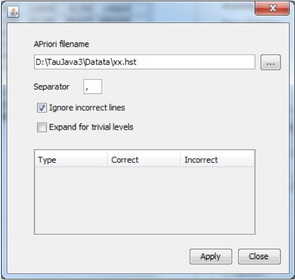

**Supplementary figure OCR (unverified; use the image for exact numbers, labels, and punctuation):**

```text
APriori filename

[D:\Teulava3\Datata pox hst

Separator

Ignore incorrect lines

[Expand for trivial levels

Type

Correct

Incorrect
```

---

<a id="pdf-page-122"></a>

### PDF page 122 / manual page 121

[Original PDF page](https://research.cbs.nl/casc/Software/TauManualV4.1.pdf#page=122) · [Local source PDF](TauManualV4.1.pdf#page=122)

of them might lead to inconsistencies and serious problems. E.g. one of the two is unsafe and the other is protected, the solution is impossible. If you select the option ‘Expand for trivial levels’, τ-ARGUS will always modify all cells that are the same if you modify one of them.

<a id="source-5-7"></a>

##### 5.7 The Batch command file

τ-ARGUS has originally been designed as an interactive program. A complete menu- driven design guides you through all steps of the process. However a growing need for a batch version emerged after that. Since then τ-ARGUS has been extended with a batch version. The batch commands are sores in a separate text-file. These commands can be executed from the command line or via the menu (File|Open Batch process. See section 4.3.4. Alternatively the batch file can be used in a real batch environment as well. Just invoke τ-ARGUS with the command Taupath\TAUARGUS param1 param2 param3 where Taupath is the name of the directory where you installed τ-ARGUS, param1 is the name of the file with batch commands; see below. Param2 is optional, and is the name of the logfile. If omitted τ-ARGUS will write a logbook in the file LOGBOOK.TXT in the temp-directory. See also section 5.8. Param3 is the parameter specifying the temp-directory. If omitted the default temp-directory will be used. When using τ-ARGUS interactively a batch file can be generated via the menu Output|Write Batch file. See section 4.6.4. But we advise you to inspect the results of this action before using this generated batch-file. Layout of the batch-file A file can be written in a text editor and called from this command. Lines starting with “//” will be considered as comment and will be ignored. The possible commands are shown here.

```text
Command                     Parameters
LOGBOOK                     Name of the logbook file; If not specified the default
                            logbook file will be used.
OPENMICRODATA               Data file name with microdata
OPENTABLEDATA               File name containing tabular data
OPENMETADATA                Metadata file name
```

---

<a id="pdf-page-123"></a>

### PDF page 123 / manual page 122

[Original PDF page](https://research.cbs.nl/casc/Software/TauManualV4.1.pdf#page=123) · [Local source PDF](TauManualV4.1.pdf#page=123)

```text
SPECIFYTABLE    "ExpVar1""ExpVar2""ExpVar3"|"RespVar"|
                    "ShadowVar"|"Costvar"|Lambda
                ShadowVar, Costvar and Lambda are optional. If not
                specified then ShadowVar, Costvar equal the Response
                Variable. For lambda the default is 1.
                If the cost variable is specified either a numerical
                variable is specified or ‘-1’ is chosen for frequency or ‘-
                2’ for unity or -3 for the distance function.
                (See section 4.4.4 for the explanation for the use of
                lambda)
CLEAR           Clears all and starts a new session.
SAFETYRULE      This command is used for primary suppression.
                All these parameters are described in the section Specify
                tables, 4.4.4
                A set of safety rule specifications separated by a “|”
                Each safety spec starts with "P", "NK" "ZERO",
                "FREQ", "REQ","WGT","MIS" or "MAN" and between
                brackets the parameters
                P: (p,n) with the n optional. (default = 1). So (20,3).
                 A p% rule with p=20% and n=3
                NK: (n,k). A n,k-dominance rule with n = the size of the
                coalition and k the max. percentage.
                ZERO: (ZeroSafetyRange)
                FREQ:(MinFreq, FrequencySafetyRange)
                REQ: (Percent1, Percent2, SafetyMargin)
                All rules can appear several times,
                The first two P, NK are for the individual level; the
                following two for the holding level,
                The first FREQ and REQ are at the individual level the
                second one is for the holding.
                ZERO, the zero safety range parameter, can be given
                only once for each safety rule.
                MIS: 0 = cells with a missing code are unsafe if the
                safety-rules are violated; 1 = these cells are always safe.
                (Default = 0.)
                WGT: 0 no weights are used, 1 = apply weights for
                computing the tables and in the safety rules Default = 0
                MAN: (Manual safety margin). This margin is used e.g.
                of a table with only the status is read, or if via the apriori
                option a cell is set to manually unsafe. The default value
                = 20.
READMICRODATA   Just reads the microdata file and calculates the table(s),
                no parameters are required
```

---

<a id="pdf-page-124"></a>

### PDF page 124 / manual page 123

[Original PDF page](https://research.cbs.nl/casc/Software/TauManualV4.1.pdf#page=124) · [Local source PDF](TauManualV4.1.pdf#page=124)

```text
READTABLE   Just reads the tabular inputfile;
            If the only parameter = 1 the “compute missing totals”
            procedure will be used. Default = do not compute this.
APRIORI     This reads an a-priori file
            The parameters are: Filename, Table number, the
            separator, IgnoreError, ExpandTrivial
            IgnoreError: if 1 then lines causing an error will be
            ignored.
            ExpandTrivial: if 1 then a line will be applied to all
            trivial levels in the hierarchy; see also section 5.6
SUPPRESS    This command applies the secondary suppression.
            The possible options are:
            GH: Hypercube
            MOD: Modular
            OPT: Optimal
            NET: Network
            RND: Controlled rounding
            CTA: Controlled Tabular Adjustment
            The parameters are a few parameters between brackets;
            The first parameter is always the table number.
```

```text
GH(TabNo, A priori Bounds Percentage, ModelSize,
  ApplySingleton)
   ModelSize 0 = normal, 1 indicates the large model.
   ApplySingleton: 1 = yes,0 = no; default = yes if the
   table has frequency-information, no if not.
MOD(TabNo, MaxTimePerSubtable,               SingleSingle,
 SingleMultiple, MinFreq)
   The last 3 parameters are the singleton options. Each
   parameter can be 0 or 1. If 1 the option is activated.
OPT(TabNo, MaxComputingTime)
NET(TabNo)
RND(TabNo, RoundingBase, Steps, MaxTime,
  Partitions, StopRule)
  - Steps: number of steps allowed, normally 0
  (default)
  - MaxTime: Max computing time (10 = default)
  - Partitions: 0, 1 (0 = no partitioning (default), 1 =
    apply the partitioning procedure)
  - StopRule: 1 = Rapid only, 2 = First feasible
    solution, 3 = optimal solution (3 =default)
CTA(TabNo)
```

---

<a id="pdf-page-125"></a>

### PDF page 125 / manual page 124

[Original PDF page](https://research.cbs.nl/casc/Software/TauManualV4.1.pdf#page=125) · [Local source PDF](TauManualV4.1.pdf#page=125)

```text
SOLVER                    Indicate whether you will be using CPLEX, Xpress or a
                          Free solver. Only needed when the type of solver has
                          not yet been specified on the computer during a
                          previous interactive session of τ-ARGUS or if you want to
                          use a different solver.. The only parameter allowed is
                          CPLEX, XPRESS or FREE.
```

```text
                          Note: the name of the CPLEX licence file should have
                          been made known already to τ-ARGUS in a previous
                          interactive session.
WRITETABLE                TabNo, P1, P2,Filename
                          P1: Output type:
                          1. CVS-file
                          2. CSV file for pivot table
                          3. Code, value file
                          4. SBS-output format
                          5. Intermediate file
                          6. JJ format file
                          P2: Options String. This string contains a series of 3
                          letter combinations, the first two are the option and the
                          third one can only be + or -, indicating whether or not
                          this option is selected or not
                          The options are:
                          AR: write the audit results in an intermediate file
                          AS: write additionally the status; i.e. do not replace the
                              cell value by an x for unsafe cells, but give the
                              value and a status indicator. This is a number
                              between 1 and 14 see section 4.6.1.
                              For CTA and rounding this means that the original
                              and the modified value are written.
                          FL: write variable names on the first line
                          HI: write holding level information in an intermediate
                              file
                          HL: write also the hierarchical levels in a SBS file
                          QU: embed codes in quotes
                          SE: Suppress empty cells
                          SO: write only the status in an intermediate file
                          TR: remove trivial levels in the output file.
                          Note: not all options can be used in all situations. Such
                          options will simply be ignored and do not cause an
                          error. See the Save Table option in the interactive mode
                          to see which options are valid in which situation or
                          section 4.6.1.
GOINTERACTIVE             This will start the GUI of τ-ARGUS and allows to
                          continue interactively.
 A typical batch file would look like this: (note that everything after a // will be
 treated as comment)
```

---

<a id="pdf-page-126"></a>

### PDF page 126 / manual page 125

[Original PDF page](https://research.cbs.nl/casc/Software/TauManualV4.1.pdf#page=126) · [Local source PDF](TauManualV4.1.pdf#page=126)

```text
           A batch file using micro data
//datafile
<OPENMICRODATA> "C:\Program Files\TauARGUS\data\tau_testW.asc"
//metafile
<OPENMETADATA> "C:\Program Files\TauARGUS\data\tau_testW.rda"
//Exp|resp|shadow|cost -1=unit -2=freq -3=dist
<SPECIFYTABLE>    "Size""region"|"var2"|"var3"|"var3"
<SAFETYRULE>      P(15,3)|FREQ(3,20)|ZERO(10)
<SPECIFYTABLE>    "Size""Year"|"var2"|"var3"|"var3"
<SAFETYRULE>      NK(3,70)|FREQ(3,20)|ZERO(20)
<READMICRODATA>
<SUPPRESS>     GH(1,75)
<WRITETABLE> (1,1,AS+,"D:\TauJava3\Datata\x1.csv")
<SUPPRESS>      GH(2,75)
<WRITETABLE> (2,2,QU+,"D:\TauJava3\Datata\y11.csv")
<SUPPRESS>     MOD(1)
<WRITETABLE> (1,3,AS-,"D:\TauJava3\Datata\x20.txt")
<SUPPRESS>     MOD(2)
<WRITETABLE> (2,4,SE+,"D:\TauJava3\Datata\y20.tab")
<SUPPRESS>     OPT(1,5)
<WRITETABLE> (1,1,AS+,"D:\TauJava3\Datata\x3.csv")
<GOINTERACTIVE>
```

```text
A batch file using tabular data
 <OPENTABLEDATA> "E:\TauArgusVB\Datata\Nace3Size.tab"
 <OPENMETADATA> E:\TauArgusVB\Datata\Nace3Size.RDA"
 <SPECIFYTABLE>
 "IndustryCode""Size"|"Var2"|"Var2"|"Var2"
 //<SAFETYRULE>
 <READTABLE>
 <SUPPRESS>     MOD(1)
 <WRITETABLE>
 (1,3,3,"E:\TauArgusVB\Datata\Nace3SizeSafe.txt")
 <GOINTERACTIVE>
```

```text
In the above example the <SAFETYRULE> command was disabled as in this
example it is assumed that that table already containes the status of each cell.
However if the tabular input contains more information (frequency, TopN) the
safety rule command could easily be used here as well.
If more than one table has to be processed, the <CLEAR> command could make a
new start in a session.
```

<a id="source-5-8"></a>

##### 5.8 Log file

τ-ARGUS will write a log-file. This describes among others the commands used during the runs of τ-ARGUS. If gives a log of the use of τ-ARGUS. Especially for the batch process this file could give some information about the progress of the process. Notably is some error has occurred, as a batch version cannot inform the user interactively. Below is given a small example. Please note that new information is always added to this file. So from time to time the user should delete this file to clean his computer. By default the logfile is the file TAULOGBOOK.TXT in the temp-directory. In the options window the name of the logfile can be changed for the remainder of the current session and future sessions.

---

<a id="pdf-page-127"></a>

### PDF page 127 / manual page 126

[Original PDF page](https://research.cbs.nl/casc/Software/TauManualV4.1.pdf#page=127) · [Local source PDF](TauManualV4.1.pdf#page=127)

The Temp directory is normally something like C:\Documents and Settings\USER\Local Settings\Temp where USER is the name of the current user. Of course in specific circumstances the network administrator might have a chosen different location. When running in batch-mode it is possible to change the name of the log-file with a batch command in the batch-file or as the second parameter on the commandline. See section 4.3.4

```text
23-Oct-2014 16:17:27 : Start of TauArgus run
23-Oct-2014 16:17:27 : Version 4.0.1 (beta) build 3
23-Oct-2014 16:17:27 : --------------------------
23-Oct-2014 16:17:35 : Start of batch procedure; file: D:\TauJava3\Datata\manual.arb
23-Oct-2014 16:17:35 : <OPENMICRODATA> "C:\Program Files\TauARGUS\data\tau_testW.asc"
23-Oct-2014 16:17:35 : <OPENMETADATA> "C:\Program Files\TauARGUS\data\tau_testW.rda"
23-Oct-2014 16:17:35 : <SPECIFYTABLE>    "Size""region"|"var2"|"var3"|"var3"
23-Oct-2014 16:17:35 : <SAFETYRULE>      P(20,3)|FREQ(3,30)|ZERO(20)
23-Oct-2014 16:17:35 : <SPECIFYTABLE>    "Size""Year"|"var2"|"var3"|"var3"
23-Oct-2014 16:17:35 : <SAFETYRULE>      NK(3,70)|FREQ(3,30)|ZERO(20)
23-Oct-2014 16:17:35 : <READMICRODATA>
23-Oct-2014 16:17:35 : Start explore file: C:\Program Files\TauARGUS\data\tau_testW.asc
23-Oct-2014 16:17:35 : Start computing tables
23-Oct-2014 16:17:36 : Table: Size x Region | Var2 has been specified
23-Oct-2014 16:17:36 : Table: Size x Year | Var2 has been specified
23-Oct-2014 16:17:36 : Tables have been computed
23-Oct-2014 16:17:36 : Micro data file read; processing time 1 seconds
23-Oct-2014 16:17:36 : Tables from microdata have been read
23-Oct-2014 16:17:36 : <SUPPRESS>     GH(1,75)
23-Oct-2014 16:17:36 : Start of the hypercube protection for table Size x Region | Var2
23-Oct-2014 16:17:37 : End of hypercube protection. Time used 1 seconds
                       Number of suppressions: 10
23-Oct-2014 16:17:37 : The hypercube procedure has been applied
                       10 cells have been suppressed
23-Oct-2014 16:17:37 : <WRITETABLE> (1,1,AS+,"D:\TauJava3\Datata\x1.csv")
23-Oct-2014 16:17:37 : Table: Size x Region | Var2 has been written
                       Output file name: D:\TauJava3\Datata\x1.csv
23-Oct-2014 16:17:37 : <SUPPRESS>      GH(2,75)
23-Oct-2014 16:17:37 : Start of the hypercube protection for table Size x Year | Var2
23-Oct-2014 16:17:39 : End of hypercube protection. Time used 1 seconds
                       Number of suppressions: 5
23-Oct-2014 16:17:39 : The hypercube procedure has been applied
                       5 cells have been suppressed
23-Oct-2014 16:17:39 : <WRITETABLE> (2,2,QU+,"D:\TauJava3\Datata\y11.csv")
23-Oct-2014 16:17:39 : Table: Size x Year | Var2 has been written
                       Output file name: D:\TauJava3\Datata\y11.csv
23-Oct-2014 16:17:39 : <SUPPRESS>     MOD(1)
23-Oct-2014 16:17:39 : Start of the modular protection for table Size x Region | Var2
23-Oct-2014 16:17:39 : End of modular protection. Time used 0 seconds
                       Number of suppressions: 10
23-Oct-2014 16:17:40 : <WRITETABLE> (1,3,AS-,"D:\TauJava3\Datata\x20.txt")
23-Oct-2014 16:17:40 : Table: Size x Region | Var2 has been written
                       Output file name: D:\TauJava3\Datata\x20.txt
23-Oct-2014 16:17:40 : <SUPPRESS>     MOD(2)
23-Oct-2014 16:17:40 : Start of the modular protection for table Size x Year | Var2
23-Oct-2014 16:17:40 : End of modular protection. Time used 0 seconds
                       Number of suppressions: 5
23-Oct-2014 16:17:41 : <WRITETABLE> (2,4,SE+,"D:\TauJava3\Datata\y20.tab")
23-Oct-2014 16:17:41 : Table: Size x Year | Var2 has been written
                       Output file name: D:\TauJava3\Datata\y20.tab
23-Oct-2014 16:17:41 : <SUPPRESS>     OPT(1,5)
23-Oct-2014 16:17:41 : End of Optimal protection. Time used 0 seconds
                       Number of suppressions: 12
23-Oct-2014 16:17:42 : <WRITETABLE> (1,1,AS+,"D:\TauJava3\Datata\x3.csv")
23-Oct-2014 16:17:42 : Table: Size x Region | Var2 has been written
                       Output file name: D:\TauJava3\Datata\x3.csv
23-Oct-2014 16:17:42 : <GOINTERACTIVE>
```

---

<a id="pdf-page-128"></a>

### PDF page 128 / manual page 127

[Original PDF page](https://research.cbs.nl/casc/Software/TauManualV4.1.pdf#page=128) · [Local source PDF](TauManualV4.1.pdf#page=128)

<a id="source-6"></a>

#### 6 INDEX

```text
A                                                                                         JJ-file.........................................................51, 103, 118
    Apriori.......................................................58, 105, 119        M
B                                                                                         Magnitude table..........................................................9
    Batch.......................................................................126       meta data.................................................................110
C                                                                                         missing....................37p., 61, 84, 92, 96, 110, 112, 122
    Controlled Tabular Adjustment.................................68                      Modular....................................................................19
    Cplex.......................7, 11, 18, 35, 49, 65, 88, 107, 124                   N
D                                                                                         negative values....................................................17, 22
    dominance rule..............9, 11, 41, 88, 91, 95, 107, 122                       P
F                                                                                         p % rule...............................9pp., 41, 88, 91, 94p., 122
    Free solver................................................................65     R
    Frequency table.........................................................11            Request rule.....................................42p., 84, 92, 111p.
G                                                                                     S
    global recoding.............................10p., 34, 59, 62, 117                     Sensitive cell.............................................9, 11, 31, 64
H                                                                                         Singleton.............................................................20, 32
    Holding............................42, 57, 83, 93, 111, 113, 122                  X
J                                                                                         Xpress........................7, 11, 18, 35, 49, 65, 69, 88, 124
```

---

